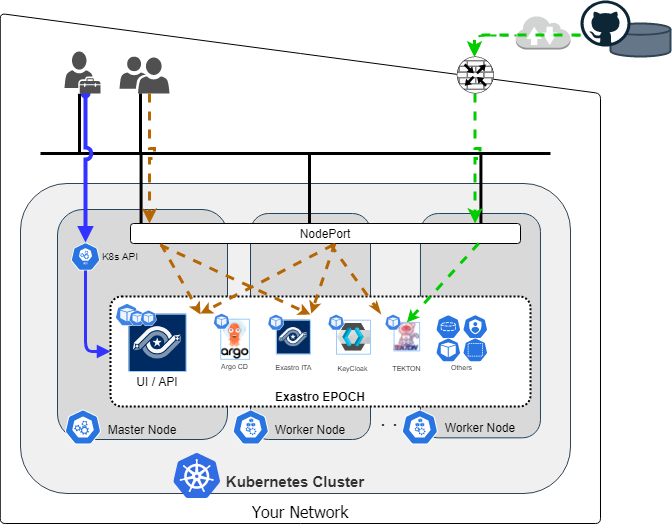

## Introduction
This document describes the cluster requirements for installing **Exastro EPOCH** (hereinafter referred to as EPOCH) on an Kubernetes cluster using the Deploy tool.
This includes the following contents:

- [`kubectl` installation and permission settings](#kubectl-installation-and-permission-settings)
- [Kubernetes cluster configuration nodes requirements](#Configuration-node-requirements)
- [Network configuration requirements](#Network-configuration-requirements)


### Target reader
This document is aimed at users who wants to install EPOCH on to a Kubernetes **deployed on Cloud/ On premise data center** using Kubernetes deploy tools([kubeadm](https://kubernetes.io/docs/reference/setup-tools/kubeadm/), [kops](https://kubernetes.io/docs/setup/production-environment/tools/kops/), [kubespray](https://kubernetes.io/docs/setup/production-environment/tools/kubespray/)).

If you are using a cloud provided managed Kubernetes(Amazon EKS, Azure Kubernetes Service, Google Kubernetes Engine, etc.), we recommend that you see our other documents in the [Learn].(https://exastro-suite.github.io/epoch-docs/learn_en.html)

### Configuration
The following image illustrates a configuration of EPOCH installed on a Kubernetes cluster.
The blue arrows represents the EPOCH installation procedure. 
For more information regarding the other arrows, see the "[Network configuration requirements](#Network-configuration-requirements)" section later in this document.


{:width="1344" height="1048"}

|Legend|Description|
|:--|:--|
|{:width="37" height="43"}|Cluster administrator. The one who will install EPOCH|
|{:width="37" height="43"}|User who accesses to EPOCH's UI|
|{:width="33" height="35"}|EPOCH installation procedure|
|{:width="33" height="35"}|EPOCH user's access to GUI|
|{:width="33" height="35"}|Webhook sent from Github|

## Kubernetes cluster requirements

### `kubectl` installation and permission settings
`kubectl`is a command line tool which allows us to operate Kubernetes clusters.
It will be used later for installing EPOCH and management purposes, meaning that we need to install `kubectl` to the machine who will be accessing the Kubernetes cluster.


#### Install `kubectl`
##### Check for command installation
If `kubectl` is already installed, we will not need to start any installation procedure.
If the command below runs succesfully, we can see that the command is installed. 

**`kubectl` installation confirmation command**
```bash
kubectl version --client --short
```
{: .line .d}

**Output example(If installed)**
```
Client Version: v1.21.1
```

##### Start installation process
The following command installs `kubectl v1.21` on Linux environments.
If you want to install to a non-Linux environment, please see the [Kubernetes official installation documents](https://kubernetes.io/docs/tasks/tools/).


**Command (for installing`kubectl v1.21` on Linux)**
```bash
# Download binary file
curl -LO https://storage.googleapis.com/kubernetes-release/release/v1.21.0/bin/linux/amd64/kubectl

# Allow binary execution access
chmod +x ./kubectl

# Copy binary to the PATH folder
sudo mv ./kubectl /usr/local/bin/kubectl
```
{: .line .d}

##### Check `kubectl` and Kubernetes cluster version
The version difference between the Kubernetes cluster and the `kubectl` can **only be x.x1 or less.**
For example, if the Kubernetes cluster is on v1.20, `kubectl` can be one of the following versions: 1.19, 1.20, 1.21.

※The Kubernetes cluster versions currently supported by EPOCH are v1.18 ～ v1.21 (2022/03)
{: .info}

**Command**
```bash
kubectl version --short
```
{: .line .d}

**Output example(If both are version v.1.21)**
```bash
Client Version: v1.21.1
Server Version: v1.21.8
```

#### Permission settings
When installing EPOCH, the Cluster administrator will have to run multiple `kubectl` commands.
It is therefore the important that the user who will be using the `kubectl` commands has the default ClusterRole, `cluster-admin`(or a ClusterRole resource with the same access permissions) assigned.

Use the following command to see the different user's execution permission settings.

**Command**
``` bash
kubectl auth can-i --list
```
{: .line .d}

If permission settings similar to the ones shown below are displayed, the user has all the permissions needed in order to install EPOCH.

**Output example(If the user has the required permissions)**
```
Resources  Non-Resource URLs   Resource Names     Verbs
*.*          []                  []                 [*]
             [*]                 []                 [*]
```

If the user does not have the required permissions, see the [Official Kubernetes document about RBAC Authorization](https://kubernetes.io/docs/reference/access-authn-authz/rbac/)and configure the required `kubectl` and user permissions.

The `cluster-admin` ClusterRole has permission to manage all the resources inside the clusters, including all Namespaces. We recommend users to be very carefull with assigning this role.
{: .info}

### Configuration node requirements

#### Server resources

For information regarding the server resources required by the Kubernetes cluster, please see the "Requirement specs" section in the [installation guide](https://exastro-suite.github.io/epoch-docs/Learn_ja/installation_guide/installation_guide_ja.html#%E3%82%A4%E3%83%B3%E3%82%B9%E3%83%88%E3%83%BC%E3%83%AB%E8%A6%81%E4%BB%B6)

#### CPU architecture
At the time of this guide (2022/03), The only CPU architecture supported by the EPOCH Container image is `amd64`. There is currently no support for Multi CPU architecture.
**It is therefore required that the CPU architecture of the Kubernetes configuration node is `amd64`**

Use the following command to see the CPU Architecture of the different nodes. Make sure that they all display `amd64`.

**Command**
```bash
kubectl get nodes -o=jsonpath='{range .items[*]}{.metadata.name}{": "}{.status.nodeInfo.architecture}{"\n"}{end}'
```
{: .line .d}

**Output example(If there are 2 cluster construction nodes)**
```
sample-k8s-master: amd64
sample-k8s-worker: amd64
```

### Network configuration requirements
The following image illustrates a configuration of EPOCH installed on a Kubernetes cluster.
{:width="1344" height="1048"}


|Legend|Description|
|:--|:--|
|{:width="37" height="43"}|Cluster administrator. The one who will install EPOCH|
|{:width="37" height="43"}|User who accesses to EPOCH's UI|
|{:width="33" height="35"}|EPOCH installation procedure|
|{:width="33" height="35"}|EPOCH user's access to GUI|
|{:width="33" height="35"}|Webhook sent from Github|

***
#### NodePort used to access the EPOCH UI
EPOCH encompasses softwares such as **ArgoCD**, **Exastro ITA** and **TEKTON** as pods and uses Kubernetes' Nodeport to access these UIs.(See the [Brown arrow](#Network-configuration-requirements))
NodePort is also used to access **Keycloak**, which EPOCH uses for it's authentication process

Therefore, after we have installed EPOCH, we will need a network environment that can access the **Kubernetes cluster Nodeport** from the **user's browser**.
Check that the following NodePorts can be used by the Kubernetes clusters and that the users can access them.


- `30443`
- `31183`


Running the following command will display a list of Nodeports corrently used by the Kubernetes cluster.
The output will contain Service names and NodePort numbers. 
Make sure that the NodePorts`30443` and `31183` are not included.

**Command**
```bash
kubectl get svc -A -o jsonpath='{range .items[?(@.spec.type=="NodePort")]}{.metadata.name}{": "}{.spec.ports[
*].nodePort}{"\n"}{end}'
```
{: .line .d}

**Output example**

```
example-Nodeport1: 31189
example-Nodeport2: 32714
```

***

#### NodePort used to access EPOCH from Github Webhook
EPOCH let's its TEKTON execute CI Pipelines by recieving webhooks from the Code repositories via Nodeports.

If you are using Github as code repository, you will need a network environment **that allows NodePorts to recieve POST requests from Github Webhook.**(See the [Green arrow](#Network-configuration-requirements))

Check that the following Nodeport can be used by Kubernetes clsuters and that it allows requests from Github Webhook. Please see the aformentioned [NodePort used to access the EPOCH UI](#epochのuiへのアクセスに用いるnodeport) section for what commands to use.

- `30443`

For information regarding Github Webhook, please see the following documents.<br>ーーー<br>
Github Webhook: [Github Docs / About Webhooks](https://docs.github.com/ja/developers/webhooks-and-events/webhooks/about-webhooks)<br>
Github IP address information: [Github Docs / GitHub's IP addresses](https://docs.github.com/ja/authentication/keeping-your-account-and-data-secure/about-githubs-ip-addresses)
{: .info}


## Install EPOCH
See the following document for a guide on how to install EPOCH.

-  [Learn「EPOCH Install」](https://exastro-suite.github.io/epoch-docs/Learn_ja/installation_guide/installation_guide_en.html)

This conludes the EPOCH Cluster requirements document.
{: .check}