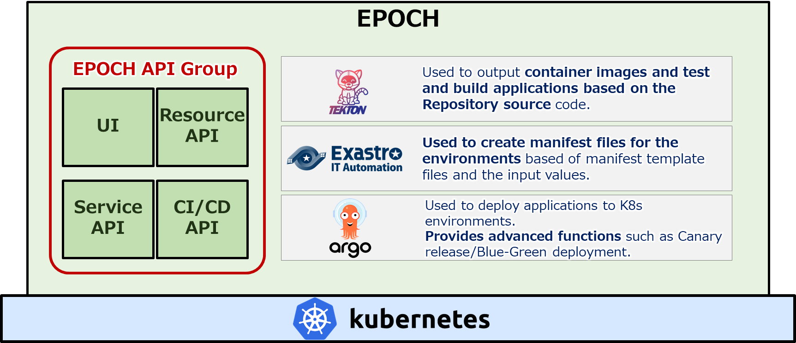
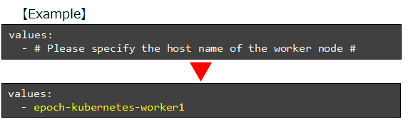
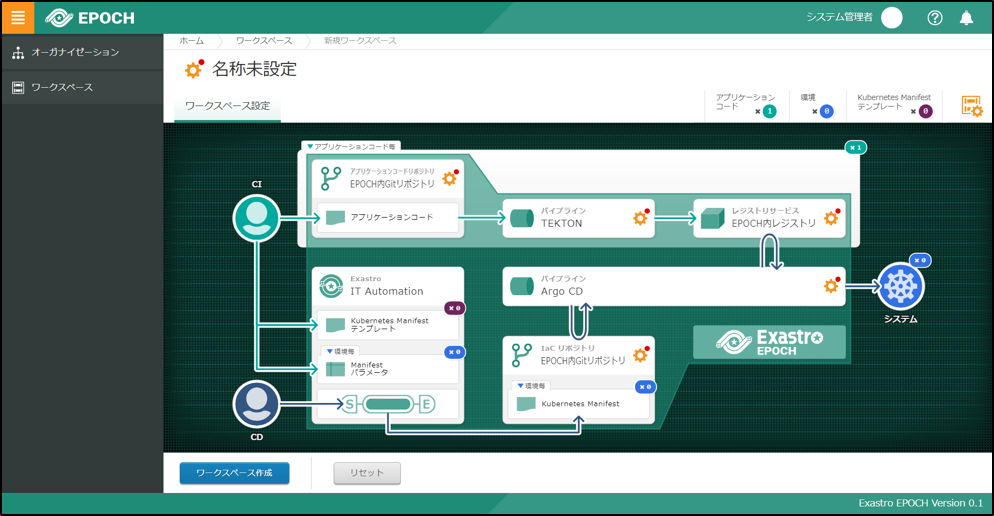

## Introduction
### Overview
This document serves as a guide to installing Exastro EPOCH (Hereinafter referred to as EPOCH).<br>

- For information regarding the processes after installing EPOCH, please refer to the other documents in the ["Install section"]().
- This guide does not include information regarding Kubernetes constructions.
  
## System configuration

### System configuration diagram
EPOCH is installed by deploying different resources on Kubernetes. The figure below illustrates the overview of an installed EPOCH construction.

{:width="1725" height="745"}


### Installation requirements
Make sure that the following requirements are me before installing EPOCH on Kubernetes.

- The Kubernetes environment is running on version v1.18 or later.
- The ServiceAccount used in Kubernetes must have the cluster-admin role.
- The user must be able to connect to external ineternet from Kubernetes.
- The Kubernetes environment must be able to use the following port numbers:
  - 30080
  - 30081
  - 30443
  - 30801
  - 30805
  - 30901～30907

The port numbers are defined in the epoch-install.yaml file shown later in the guide. Make sure to install after changing the files.
{: .info}

### Minimum required specs
The minimum server specs for the Kubernetes cluster are as following.<br>
The following specs are for**1 master node and 1 worker node.**

**Master node**

|:--|:--|
|CPU|2 Core (3.0 GHz)|
|Memory|8GB|
|Disc space|10GB|

**Worker node**

|:--|:--|
|CPU|2 Core (3.0 GHz)|
|Memory|8GB|
|Disc space|32GB|

These specs are values for reference. The final specifications should be determined by considering factors such as the requirements of the final system and whether or not the deployed Kubernetes is different from EPOCH.
node.
{: .info}

## Installation process
### Installation process overview
The EPOCH installation process proceeds by deploying resources on Kubernetes.

#### Manifest file list
The following list displays the manifest files used when extracting resources.

|Manifest file URL|Overview|
|:--|:--|
|[https://github.com/exastro-suite/epoch/releases/latest/download/epoch-install.yaml](https://github.com/exastro-suite/epoch/releases/latest/download/epoch-install.yaml)|Extracts the EPOCH API group and Tekton. <br>Acquired from the EPOCH repository.|
|[https://github.com/exastro-suite/epoch/releases/latest/download/epoch-pv.yaml](https://github.com/exastro-suite/epoch/releases/latest/download/epoch-pv.yaml)|Extracts persistent volume used by Tekton pipeline.Acquired from the EPOCH repository.|
|[https://github.com/argoproj/argo-rollouts/releases/latest/download/install.yaml](https://github.com/argoproj/argo-rollouts/releases/latest/download/install.yaml)|Extracts Argo Rollouts.<br>Acquired from Argo Project's official repository.|

### EPOCH Install process
#### Installing EPOCH

##### ① Login to an environment with SSH where kubectl can be run, and run the following command to install EPOCH.

```bash
kubectl apply -f https://github.com/exastro-suite/epoch/releases/latest/download/epoch-install.yaml
```
{: .line .d}

##### ② Run the following command and check that all the Pods are running(EPOCH).
Press ctrl + c to stop monitoring.

```bash
kubectl get pod -n epoch-system --watch
```
{: .line .d}

###### Output example
``` sh
NAME                                                READY   STATUS              RESTARTS        AGE
epoch-cicd-api-*********-*****                      1/1     Running             0               **s
epoch-control-tekton-api-*********-*****            1/1     Running             0               **s
epoch-rs-organization-api-*********-*****           1/1     Running             0               **s
epoch-rs-workspace-api-*********-*****              1/1     Running             0               **s
epoch-service-api-*********-*****                   1/1     Running             0               **s
epoch-ui-*********-*****                            1/1     Running             0               **s
organization-db-*********-*****                     1/1     Running             0               **s
tekton-pipeline-db-*********-*****                  1/1     Running             0               **s
workspace-db-*********-*****                        1/1     Running             0               **s

```

##### ③ Run the following command and check that all the Pods are running(Tekton).
Press ctrl + c to stop monitoring.

``` bash
kubectl get pod -n tekton-pipelines --watch
```
{: .line .d}

###### Output example
``` sh
NAME                                                READY   STATUS              RESTARTS        AGE
tekton-dashboard-*********-*****                    1/1     Running             0               **s
tekton-pipelines-controller-*********-*****         1/1     Running             0               **s
tekton-pipelines-webhook-*********-*****            1/1     Running             0               **s
tekton-triggers-controller-*********-*****          1/1     Running             0               **s
tekton-triggers-core-interceptors-*********-*****   1/1     Running             0               **s
tekton-triggers-webhook-*********-*****             1/1     Running             0               **s
```

【If the resources were not created correctly】<br>
If the resources could not be created correctly due to duplicate port numbers, etc, <br>
use the command below to delete the resources and do step 1 once you have found the problem.
{: .warning}

###### If the resources were not created correctly
``` bash
kubectl delete -f https://github.com/exastro-suite/epoch/releases/latest/download/epoch-install.yaml
```
{: .line .d}

#### Create persistent volume
Configure persistent volume that configures the Tekton pipeline

##### ① Acquire the manifest files with the command below:

###### 【For Linux, macOS】

``` bash
curl -OL https://github.com/exastro-suite/epoch/releases/latest/download/epoch-pv.yaml
```
{: .line .d}

###### 【For Windows(Powershell)】
``` bash
Invoke-WebRequest https://github.com/exastro-suite/epoch/releases/latest/download/epoch-pv.yaml -OutFile epoch-pv.yaml
```
{: .line .d}

##### ② Check the Worker node's host name with the command below:

``` bash
kubectl get node
```
{: .line .d}

###### Output example
``` sh
NAME                      STATUS   ROLES                  AGE   VERSION
epoch-kubernetes-master   Ready    control-plane,master   **d   v1.**.*
epoch-kubernetes-worker1  Ready    worker                 **d   v1.**.*
```

##### ③ Input the Worker node's host name in the downloaded epoch-py.yaml file.
Change the last line, "# Please specify the host name of the worker node #", with the worker node's host name you checked earlier and save the file.

{:width="441" height="144"}

【If there are multiple worker nodes】<br>
It is possible to set the host names for the other nodes.<br>
Specifying hosts for multiple nodes is optional. If more than 1 is specified, the persistent volume will be scheduled for multiple worker nodes.
{: .info}

##### ④ Create persistent volume with the command below:

```bash
kubectl apply -f epoch-pv.yaml
```
{: .line .d}

##### ⑤ Check that the persistent volume ,"epoch-pv", has been created with the command below:
```bash
kubectl apply -f epoch-pv.yaml
```
{: .line .d}

###### Output example
``` sh
NAME       CAPACITY   ACCESS MODES   RECLAIM POLICY   STATUS      CLAIM   STORAGECLASS                    REASON   AGE
epoch-pv   500Mi      RWO            Retain           Available           epoch-tekton-pipeline-storage            **s
```

【If the resources were not created correctly】<br>
If the persistent volume was not created correctly,
use the command below to revert any changes and do step 4 after you have found the problem.
{: .warning}

###### If the resources were not created correctly
``` bash
kubectl delete -f epoch-pv.yaml
```
{: .line .d}

#### ArgoRollout installation

##### ① Install ArgoRollout with the command below:

```bash
kubectl create namespace argo-rollouts
kubectl apply -n argo-rollouts -f https://github.com/argoproj/argo-rollouts/releases/latest/download/install.yaml
```
{: .line .d}

##### ② Check that the Manifest file is being displayed correctly with the command below: 

```bash
kubectl get pod -n argo-rollouts --watch
```
{: .line .d}

###### Output example
```sh
NAME                             READY   STATUS    RESTARTS   AGE
argo-rollouts-xxxxxxxxxx-xxxxx   1/1     Running   0          **m
```


【If the resources were not created correctly】<br>
If the resources were not created correctly、
use the command below to delete the resource and run the「kubectl apply ~」command from step 1 after you have found the problem.
{: .warning}

###### If the resources were not created correctly
```bash
kubectl delete -n argo-rollouts -f https://github.com/argoproj/argo-rollouts/releases/latest/download/install.yaml
```
{: .line .d}

### Connection test
After you have finnished installing EPOCH, connect to the EPOCH workspace screen from your browser. 
A screen similar to the picture below should be displayed.

{:width="994" height="516"}

This concludes the EPOCH install guide.
{: .check}