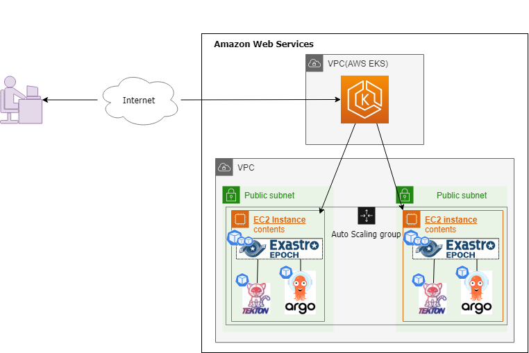

## Introduction
This document teaches the reader how to install **Exastro EPOCH**(Hereafter written as “EPOCH”) on **Amazon Elastic Kubernetes Service**.This guide includes the following sections:

- [Implementing required command line tools](#Preparation)
- [Configuring and constructing EKS cluster with `eksctl`](#Construct/Configure-EKS-cluster)
- [Configuring setting groups needed in order to use EPOCH](#Security-group-settings)
- [Configuring IAM user permissions](#Permissions-needed-in-order-to-follow-this-guide)

### Configuration
{:width="762" height="509"}


## Install on Amazon EKS
### Preparation
Before going to the [EKS cluster creation section](#Construct/Configure-EKS-cluster), we must install/configure the following resources in order to manage and create Amazon EKS clusters.

- [kubectl](#Install-kubectl)
- [AWS-CLI version2](#install/configure-AWS-CLI-version2)
- [eksctl](#install-eksctl)


#### Install `kubectl`
Kubectl is a command line tool which allows us to operate Kubernetes clusters.
It will be used later for installing EPOCH and management purposes.

Run the Linux command below to install `kubectl v1.21`.
If you want to install a different version, please see [this URL](https://docs.aws.amazon.com/eks/latest/userguide/install-kubectl.html)

The version difference between the Kubernetes cluster and the `kubectl` can only be x.x1 or less.
For example, if the Kubernetes cluster is on v1.20, `kubectl` can be one of the following versions: 1.19, 1.20, 1.21.
※The Kubernetes cluster versions currently supported by EPOCH are v1.18 ～ v1.21 (2022/02)
{: .info}

**Commands(For installing `kubectl v1.21` on Linux)**
```bash
# Download binary file
curl -o kubectl https://amazon-eks.s3.us-west-2.amazonaws.com/1.21.2/2021-07-05/bin/linux/amd64/kubectl

# Grant access to Binary file
chmod +x ./kubectl

# Copy the binary file to the PATH folder
mkdir -p $HOME/bin && cp ./kubectl $HOME/bin/kubectl && export PATH=$PATH:$HOME/bin
```
{: .line .d}

#### Install/Configure `AWS CLI version2`
AWS CLI version2 is a command line tool that is used to manage AWS services.


##### Install commands
The command bellow installs the newest version of `AWS CLI version2` on Linux environments.
For non-Linux environments, see [this URL](https://docs.aws.amazon.com/cli/latest/userguide/getting-started-install.html).

**Commands(For installing the newest version of`AWS CLI version2`on Linux)**
```bash
# Download install file
curl "https://awscli.amazonaws.com/awscli-exe-linux-x86_64.zip" -o "awscliv2.zip"

# Unzip install folder
unzip awscliv2.zip

# Start installer
sudo ./aws/install

# Check installation
aws --version
```
{: .line .d}

##### Settings commands
The commands below configures the IAM user access key to AWS CLI.
This authentication information will also be used when running the `eksctl` command later in this document.

The configured IAM user**must have access to EKS and the other different services**
For information regarding configuring IAM policies, please see [Appendix Permissions needed in order to follow this guide](#Permissions-needed-in-order-to-follow-this-guide)
{: .info}

**Commands**
```bash
aws configure
# AWS Access Key ID [None]: <IAM user access ID>
# AWS Secret Access Key [None]: <IAM user secret access keyー>
# Default region name [None]: ap-northeast-1
# Default output format [None]: json
```
{: .line .d}

#### Install `eksctl`
`eksctl` is a command line tool that the same credentials as AWS CLI to run various operations on EKS, such as creating clusters.

##### Install commands
The following commands installs the latest version of `eksctl` on Linux environments.
For non-Linux environments, see [this URL](https://docs.aws.amazon.com/eks/latest/userguide/eksctl.html)

**Commands**
```bash
# Download the latest eksctl release and unpack the files
curl --silent --location "https://github.com/weaveworks/eksctl/releases/latest/download/eksctl_$(uname -s)_amd64.tar.gz" | tar xz -C /tmp

# Move the unpacked binary files to /usr/local/bin
sudo mv /tmp/eksctl /usr/local/bin

# Check installation
eksctl version
```

This concludes the command line tool preparation.
{: .check}

### Construct/Configure EKS cluster
#### Run `eksctl create cluster` 
After finnishing the [Preparation](#Preparation) section, we can create EKS clusters.
The following command, `eksctl create cluster`, creates a CloudFormation stack(This might take a couple of minutes).

The CloudFormation stack has resources for VPC, EC2, IAM and other related services defined and will create the resources automatically.


**Command**
```bash
# Create EKS cluster
eksctl create cluster \
--name my-epoch-cluster \
--nodegroup-name my-epoch \
--region ap-northeast-1 \
--zones ap-northeast-1a,ap-northeast-1c,ap-northeast-1d \
--node-type c5.xlarge \
--node-volume-size 32 \
--managed \
--nodes 2
```

If you want to change the name of the EKS cluster resource name or change other options, please see the section below.
{: .info}

**Options**

This section explains the different options for the `eksctl create cluster` command. 


|Option name|Explanation|
|:--|:--|
|name|Name of the EKS cluster resource.|
|nodegroup-name|EKS cluster node(= EC2 instance) group resource name.|
|region|Name of the AWS region where the resource(s) are created.|
|zones|Specify at least one availability zone. <br>The EKS cluster nodes and subnets are created distributed across the specified zones.|
|node-type|EKS cluster node instance family.<br>E.g. c5.xlarge|
|node-volume-size|Size of the volume (GB) attached to the EKS cluster node.|
|managed|Makes it so the EKs cluster node is created as a part of the EC2 autoscaling group.|
|nodes|Number of EKS cluster nodes that will be created.|


#### Check EKS cluster
After running the `eksctl create cluster` command, run the following commands to check that the EKS cluster node(s) has been created correctly.

**Commands**
```bash
# Display Kubernetes cluster nodes
kubectl get nodes
```
{: .line .d}

**Output example**

```bash
NAME                                                STATUS   ROLES    AGE   VERSION
ip-xxx-xxx-xxx-xxx.ap-northeast-1.compute.internal   Ready    <none>   15m   v1.21.5-eks-xxxxxxx
ip-xxx-xxx-xxx-xxx.ap-northeast-1.compute.internal   Ready    <none>   15m   v1.21.5-eks-xxxxxxx
```

This concludes the EKS cluster creation section.
{: .check}

### Security group settings
Now that we have finnished the [EKS cluster creation section](#Construct/Configure EKS cluster), the EKS cluster and it's related resources has been created.

In this section, we will edit the Security group permissions, so we can use it in EPOCH.


{: .info}

#### Configure Environment variables
We will use AWS CLI to configure the Security group.
First, we will register the EKS cluster information to Environment variables.

***

##### Security group ID
The EC2 that creates the EKS cluster are __allocated by the automatically created security group.__ The next section will explain how to configure said security group.<br> 
Use the following command to check the `Security group ID`.

**Commands**
```bash
# Check Security group ID
EKS_SECURITY_GROUP_ID=`aws eks describe-cluster --name <Name of created EKS cluster resource name> --query cluster.resourcesVpcConfig.clusterSecurityGroupId | sed 's/"//g'`

# Display values
echo $EKS_SECURITY_GROUP_ID
```
{: .line .d}

**Output example (Security group ID)**
```bash
sg-123z1234567890123
```

***

##### Public IP address of EKS cluster node
Run the following commands to check the `Public IP address of the EKS cluster node`.

In order for the EPOCH user authentication function to correctly operate,
**The EKS cluster nodes must be able to communicate with each other with their Public IP Addresses.**
{: .info}

**Commands**
```bash
# Check Public IP Address
EKS_NODE_EXTERNAL_IP_LIST=`kubectl get nodes -o=jsonpath='{range .items[*].status.addresses[?(@.type=="ExternalIP"
)]}{.address}{" "}{end}'`

# Display values
echo $EKS_NODE_EXTERNAL_IP_LIST
```
{: .line .d}

**Output example (Public IP address)**
```bash
9.87.65.*** 123.45.67.**
```

#### Access permission to NodePort used by EPOCH

##### Permit acecss from EPOCH user devices.
In order to allow users to access EPOCH and it's related software from their browsers,
 we will need to permit acess from the user devices to the port below.

- `30000-32767/tcp`

Run the commands below and permitt access to the NodePort used by EPOCH.

**Commands**

```bash
# Environment variable definition
SOURCE_CIDR=<CIDR range you want to permit. (E.g.)10.23.45.XX/32>

# Security group settings
aws ec2 authorize-security-group-ingress --group-id ${EKS_SECURITY_GROUP_ID} --protocol tcp --port 30000-32767 --cidr ${SOURCE_CIDR}
```
{: .line .d}

If you want to permit access from multiple CIDR ranges, change the `SOURCE_CIDR` environment variable and run the command again.
{: .info}
***

##### Allow connection between EKS Cluster nodes
In this section, we will configure the Security group settings so the EKS clusters can communicate with each other with their Public IP Adresses.

```bash
# Security group settings
for EXTERNAL_IP in ${EKS_NODE_EXTERNAL_IP_LIST}
do
aws ec2 authorize-security-group-ingress --group-id ${EKS_SECURITY_GROUP_ID} --protocol tcp --port 0-65535 --cidr ${EXTERNAL_IP}/32
done
```
{: .line .d}

***

##### Allow access from Github Webhook to EPOCH
In this section, we will allow Github Webhook to access EPOCH.

For information regarding the Github IP address, please see [Github Docs](https://docs.github.com/en/authentication/keeping-your-account-and-data-secure/about-githubs-ip-addresses)

```bash
# Security group settings
for WEBHOOK_SOURCE_IP in 143.55.64.0/20 140.82.112.0/20 192.30.252.0/22 185.199.108.0/22
do
aws ec2 authorize-security-group-ingress --group-id ${EKS_SECURITY_GROUP_ID} --protocol tcp --port 30443 --cidr ${WEBHOOK_SOURCE_IP}
done
```

This concludes the EKS cluster security group settings section.
{: .check}

### Install EPOCH
In the previous section, we completed configuring the EKS settings needed when using EPOCH.

 Please see [Learn docs「EPOCH Install」](https://exastro-suite.github.io/epoch-docs/Learn_en/installation_guide/installation_guide_en.html) for information on how to install EPOCH.

This concludes this guide.
{: .check}

## Appendix 
### Permissions needed in order to follow this guide
#### IAM policy settings
The following 4 points are the IAM policies needed in order to follow this guide.

- [AmazonEC2FullAccess](#amazonec2fullaccess-aws-managed-policy)
- [AWSCloudFormationFullAccess](#awscloudformationfullaccess-aws-managed-policy)
- [EKSFullAccess](#eksfullaccess)
- [IAMLimitedAccess](#iamlimitedaccess)


**These policies or policies that gives better access to the items above** must be assigned to the IAM users.

##### AmazonEC2FullAccess (AWS managed policy)
This is an AWS managed policy that gives access to all EC2 actions.
Make sure to attach this policy to the user/user group you want to use.

```json
{
    "Version": "2012-10-17",
    "Statement": [
        {
            "Action": "ec2:*",
            "Effect": "Allow",
            "Resource": "*"
        },
        {
            "Effect": "Allow",
            "Action": "elasticloadbalancing:*",
            "Resource": "*"
        },
        {
            "Effect": "Allow",
            "Action": "cloudwatch:*",
            "Resource": "*"
        },
        {
            "Effect": "Allow",
            "Action": "autoscaling:*",
            "Resource": "*"
        },
        {
            "Effect": "Allow",
            "Action": "iam:CreateServiceLinkedRole",
            "Resource": "*",
            "Condition": {
                "StringEquals": {
                    "iam:AWSServiceName": [
                        "autoscaling.amazonaws.com",
                        "ec2scheduled.amazonaws.com",
                        "elasticloadbalancing.amazonaws.com",
                        "spot.amazonaws.com",
                        "spotfleet.amazonaws.com",
                        "transitgateway.amazonaws.com"
                    ]
                }
            }
        }
    ]
}
```

##### AWSCloudFormationFullAccess (AWS managed policy)
This is an AWS managed policy that gives access to all CloudFormation actions.
Make sure to attach this policy to the user/user group you want to use.

```json
{
    "Version": "2012-10-17",
    "Statement": [
        {
            "Effect": "Allow",
            "Action": [
                "cloudformation:*"
            ],
            "Resource": "*"
        }
    ]
}
```

##### EKSFullAccess
This is an IAM policy that gives access to all EKS actions.
Make sure to change `<account_id>` with your desired AWS account ID and create/attach the policy.

```json
{
    "Version": "2012-10-17",
    "Statement": [
        {
            "Effect": "Allow",
            "Action": "eks:*",
            "Resource": "*"
        },
        {
            "Action": [
                "ssm:GetParameter",
                "ssm:GetParameters"
            ],
            "Resource": [
                "arn:aws:ssm:*:<account_id>:parameter/aws/*",
                "arn:aws:ssm:*::parameter/aws/*"
            ],
            "Effect": "Allow"
        },
        {
             "Action": [
               "kms:CreateGrant",
               "kms:DescribeKey"
             ],
             "Resource": "*",
             "Effect": "Allow"
        },
        {
             "Action": [
               "logs:PutRetentionPolicy"
             ],
             "Resource": "*",
             "Effect": "Allow"
        }        
    ]
}
```

##### IAMLimitedAccess
this is an IAM policy that gives access to some IAM actions.
Make sure to change `<account_id>` with your desired AWS account ID and create/attach the policy.

```json
{
    "Version": "2012-10-17",
    "Statement": [
        {
            "Effect": "Allow",
            "Action": [
                "iam:CreateInstanceProfile",
                "iam:DeleteInstanceProfile",
                "iam:GetInstanceProfile",
                "iam:RemoveRoleFromInstanceProfile",
                "iam:GetRole",
                "iam:CreateRole",
                "iam:DeleteRole",
                "iam:AttachRolePolicy",
                "iam:PutRolePolicy",
                "iam:ListInstanceProfiles",
                "iam:AddRoleToInstanceProfile",
                "iam:ListInstanceProfilesForRole",
                "iam:PassRole",
                "iam:DetachRolePolicy",
                "iam:DeleteRolePolicy",
                "iam:GetRolePolicy",
                "iam:GetOpenIDConnectProvider",
                "iam:CreateOpenIDConnectProvider",
                "iam:DeleteOpenIDConnectProvider",
                "iam:TagOpenIDConnectProvider",                
                "iam:ListAttachedRolePolicies",
                "iam:TagRole"
            ],
            "Resource": [
                "arn:aws:iam::<account_id>:instance-profile/eksctl-*",
                "arn:aws:iam::<account_id>:role/eksctl-*",
                "arn:aws:iam::<account_id>:oidc-provider/*",
                "arn:aws:iam::<account_id>:role/aws-service-role/eks-nodegroup.amazonaws.com/AWSServiceRoleForAmazonEKSNodegroup",
                "arn:aws:iam::<account_id>:role/eksctl-managed-*"
            ]
        },
        {
            "Effect": "Allow",
            "Action": [
                "iam:GetRole"
            ],
            "Resource": [
                "arn:aws:iam::<account_id>:role/*"
            ]
        },
        {
            "Effect": "Allow",
            "Action": [
                "iam:CreateServiceLinkedRole"
            ],
            "Resource": "*",
            "Condition": {
                "StringEquals": {
                    "iam:AWSServiceName": [
                        "eks.amazonaws.com",
                        "eks-nodegroup.amazonaws.com",
                        "eks-fargate.amazonaws.com"
                    ]
                }
            }
        }
    ]
}
```