## Introduction
### QuickStart
#### Introduction

This document aims to introduce the reader to Exastro EPOCH(Hereafter written as “EPOCH”), how to install it while also guiding the reader through a simple tutorial.

#### QuickStart diagram

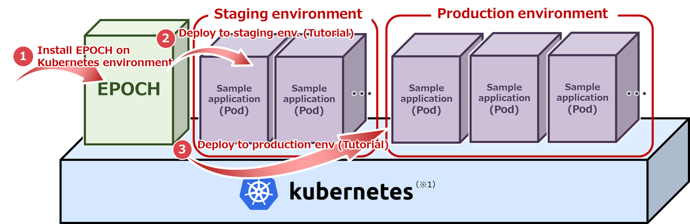{:width="1959" height="633"}

(※1)In order to keep the tutorial simple, everything will be constructed on a single Kubernetes cluster.

### Quickstart PC environment

The following figure illustrates the PC software necessary for following this guide. 

{:width="1864" height="855"}

## Install

Install EPOCH and prepare the CI/CD environment

### Install EPOCH
#### EPOCH diagram

The following diagram illustrates EPOCH and the Workspace configuration after it has been created.

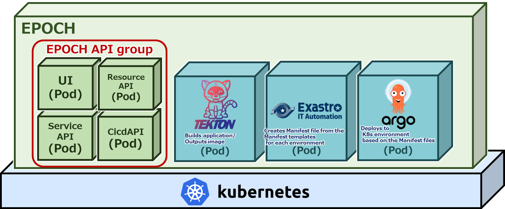{:width="1671" height="694"}

##### Prerequisites
###### Environment

- A Kubernetes environment must be created
- The ServiceAccount must have the cluster-admin role
- The user must be able to connect to external internet from the Kubernetes environment
- The PC environment must be able to connect to external internet
- "Git for Windows” must be installed in the PC environment
- The following port numbers must be usable: (30080, 30081, 30443, 30801 , 30804, 30805, 30901～30907)
(The port numbers are written in the epoch-install.yaml file. Run the installer in order to have the changes take effect）

###### Account

- Must have a GitHub account that can register application code
- Must have a GitHub account that can register Kubernetes Manifests
- Must have a GitHub account that can register Container images

For more information regarding the workspace, please see 
[Create Workspace](#Create_Workspace)
{: .check}

#### Install EPOCH
##### Use a terminal to SSH login to an environment that can run kubectl. Run the following command and install.

``` sh
kubectl apply -f https://github.com/exastro-suite/epoch/releases/download/v0.1.0/epoch-install.yaml
```
{: .line .d}

The following command checks the installation progress.

``` sh
kubectl get pod -n epoch-system
```
{: .line .d}

Check that the command result "STATUS" column displays "Running".

###### Configure persistent volume

```
NAME                                        READY   STATUS    RESTARTS   AGE
epoch-cicd-api-*********-*****              1/1     Running   0          **s
epoch-rs-organization-api-*********-*****   1/1     Running   0          **s
epoch-rs-workspace-api- *********-*****     1/1     Running   0          **s
～
```

#### Persistent volume settings

Configure persistent volume. This will be used for configuring the pipelines.

##### Run the following command and acquire the manifest from GitHub.

``` sh
curl -OL https://github.com/exastro-suite/epoch/releases/download/v0.1.0/epoch-pv.yaml
```
{: .line .d}

##### The following command checks the Worker nodes and host names.

``` sh
kubectl get node
```
{: .line .d}

###### Comand result image

```
NAME                      STATUS   ROLES                  AGE   VERSION
epoch-kubernetes-master1  Ready    control-plane,master   **d   v1.**.*
epoch-kubernetes-worker1  Ready    worker                 **d   v1.**.*
```

##### Modify the epoch-pv.yaml file.（The last line of the epoch-pv.yaml file）

Change the “# Please specify the host name of the worker node #” text with the worker node and the host name acquired from the last command and save the file.

###### Before

```
values:
  - # Please specify the host name of the worker node #
```

###### After

```
values:
  - epoch-kubernetes-worker1
```

##### Use the following command to reflect it to the kubernetes environment.

``` sh
kubectl apply -f epoch-pv.yaml
```
{: .line .d}

#### Install ArgoRollout
##### Run the following command to install ArgoRollout.

``` sh
kubectl create namespace argo-rollouts
```
{: .line .d}

``` sh
kubectl apply -n argo-rollouts -f https://github.com/argoproj/argo-rollouts/releases/latest/download/install.yaml
```
{: .line .d}

This concludes the steps to installing EPOCH.
Let us prepare for the tutorial!
{: .check}

### Prepare repositories 
#### About the repositories
##### The repositories used in this document are as following

- Repository for application codes
- Repository for IaC (Staging environment)
- Repository for IaC (Production environment)

###### Repository diagram

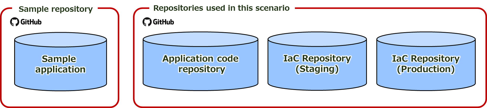{:width="1853" height="412"}

#### Prepare repositories 
##### Prepare 3 Git repositories.

1. Use your browser to sign into GitHub with your own GitHub account.
2. Go to the account menu and press “Your repositories”.
3. Press the “New” button in the upper right corner and follow the diagram below to fill in the values and create the repository. 


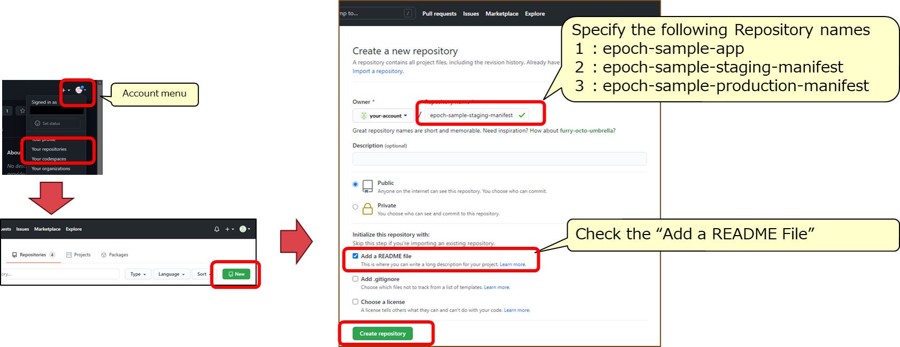{:width="1689" height="654"}

#### Prepare repository for application code.
##### Clone the Application code repository

Clone the Application code repository to the PC environment.
The commando prompt should look something like this:

```
cd "[clone folder]"
git clone https://github.com/[Github account name]/epoch-sample-app.git
cd epoch-sample-app
git config user.name "[GitHub username]"
git config user.email "[GitHub e-mail address]"
```
{: .line .g}

The next part of the tutorial will use the cloned local repository.

#### Pay out Git token

1. Use your browser to sign into GitHub with your own GitHub account.
2. Go to the account menu and press “Settings”.
3. Go to the Account settings and then to the “Developer settings” menu.
4. Go to the “Personal access tokens” menu and press “Generate new token”. 
5. Input a name om the “Note” field and select all the scoped before pressing the “Generate token” 
6. The token (ghp_***) will be used later , so make sure to save it somewhere.

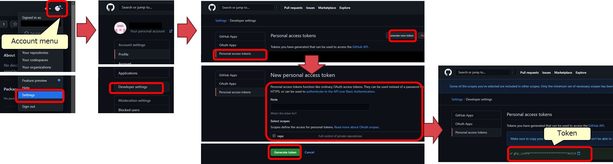{:width="1912" height="513"}

### Manifest template files
#### Download Manifest template files

Download the 2 Manifest template files we will upload to EPOCH. 

##### Access the files from the following URLs.

1. [https://raw.githubusercontent.com/exastro-suite/epoch-sample-app/master/manifest-template/api-app.yaml](https://raw.githubusercontent.com/exastro-suite/epoch-sample-app/master/manifest-template/api-app.yaml)
2. [https://raw.githubusercontent.com/exastro-suite/epoch-sample-app/master/manifest-template/ui-app.yaml](https://raw.githubusercontent.com/exastro-suite/epoch-sample-app/master/manifest-template/ui-app.yaml)

##### The Manifest template will be displayed in the browser window. Save the template to the PC.

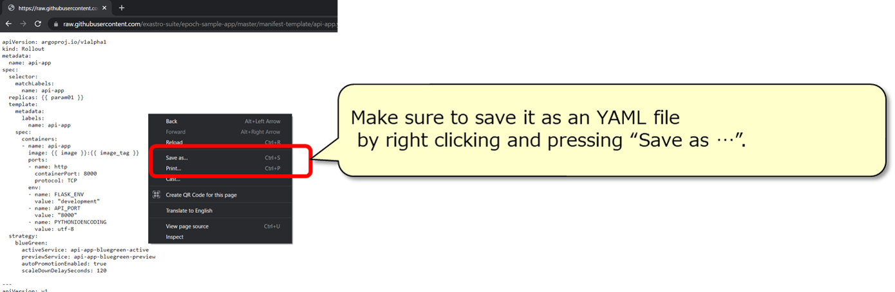{:width="1433" height="456"}

That concludes the preparation. 
In the next part, we will create our workspace.
{: .check}

## Create Workspace

Create Workspace and prepare CI/CD.

### Workspace
#### Workspace

In EPOCH, the word “Workspace” specifies a workspace for 1 development environment.
A workspace can be created by inputting the necessary information on the EPOCH screen. 

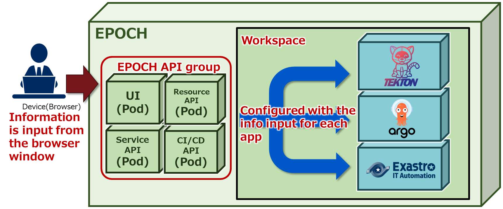{:width="1702" height="717"}

### CI/CD
#### What is CI\CD?

CI/CD is a method for developers to increase the frequency of app delivery by automating the tasks from app development to release.

##### CI（Continuous Integration）

CI is the name of the process of automated building and testing application code whenever there has been a change to it.

##### CD（Continuous Delivery）

CD is the name of the process of automating the tasks of releasing the code to the runtime environment.

##### CI/CD　

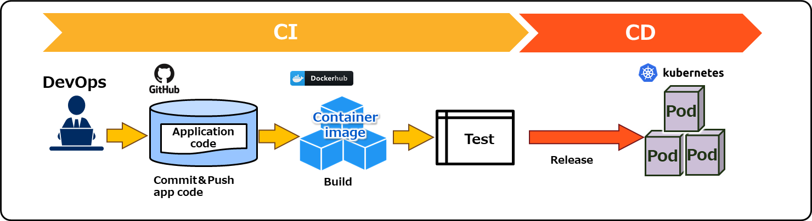{:width="1480" height="404"}

DevOps is a set of practices that combines software development (Dev) and IT operations (Ops).
It aims to shorten the systems development life cycle and provide continuous delivery with high software quality.  
Source：[Wikipedia](https://en.wikipedia.org/wiki/DevOps) 
{: .check}

### CI/CD in EPOCH
#### CI/CD in EPOCH

The following diagram illustrates the CI/CD used in EPOCH.

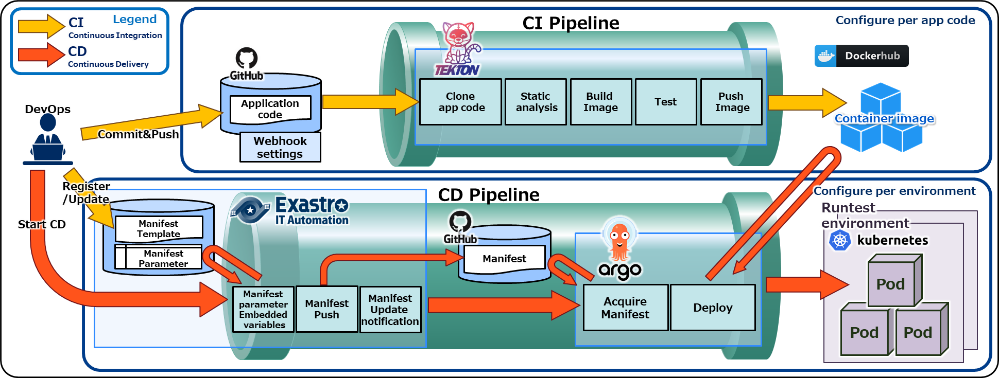{:width="1940" height="735"}

### Start EPOCH
#### Use the following URL to access the EPOCH environment.

```
https://[IP Address or Host name]:30443/workspace.html
```

{:width="1446" height="720"}

In the next step, we will input all the necessary information and create a Workspace!
{: .check}

### Create Workspace
#### Workspace information

Input the Workspace name.

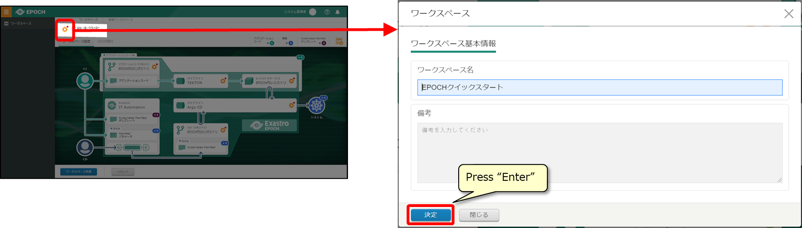{:width="1710" height="488"}

| Item | Input・Select values | Description |
| --- | --- | --- |
| Workspace name| EPOCH Quickstart | Name of the workspace |
| Remarks | Blank | Free space for describing the workspace |

#### App code repository

Input information for the application code repository.

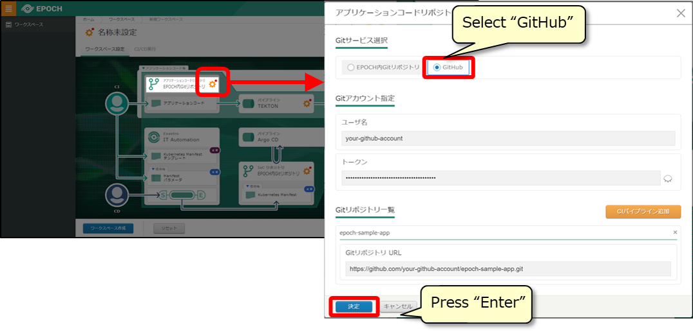{:width="1075" height="517"}

| Item | Input/Select | Description |
| --- | --- | --- |
| User name | (GitHub account name) | Name of personaly Github account |
| Token | (GitHub token) | GitHub tokenン<br>（See the Git token we created earlier） |
| Git repository URL | https://github.com/_\[GitHub account name]_/epoch-sample-app.git | Input the URL for the application code repository you created earlier. |
{: .row-h1}

#### TEKTON pipeline

Input information for the pipeline that will be set to TEKTON.

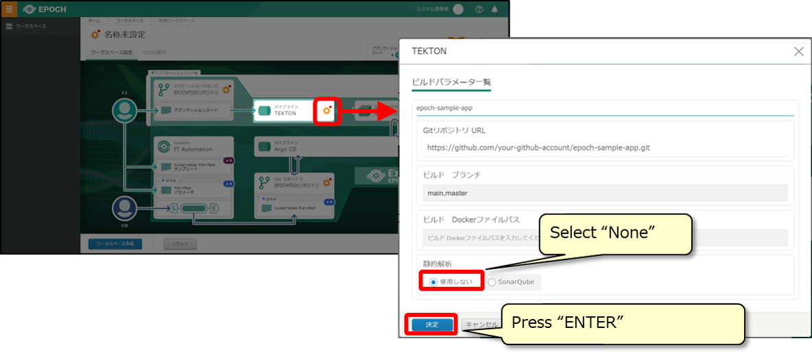{:width="1183" height="516"}

| Item | Input/Select | Description |
| --- | --- | --- |
| Build branch | main,master | The build's target GitHub application branch |
| Docker build file path | ./api-app/Dockerfile | Application Docker file path
 |

#### Registry service

Input the image registration destination (Registry).

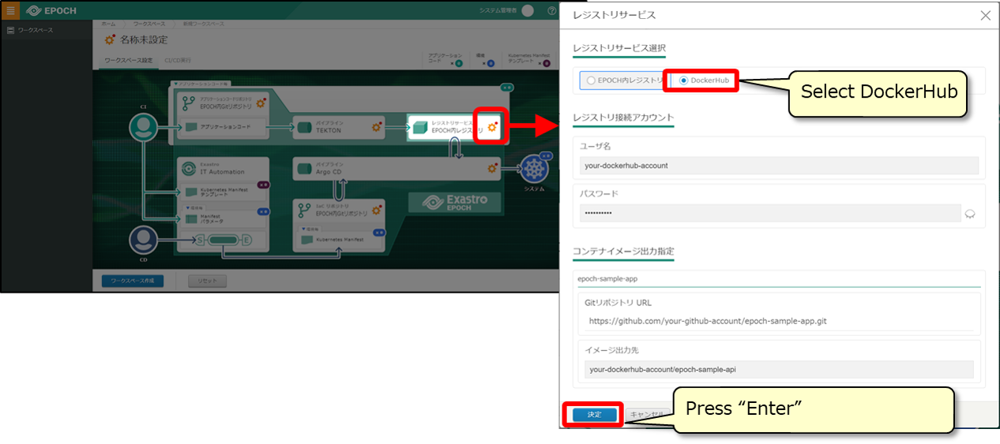{:width="1265" height="562"}

| Item | Input/Select | Description |
| --- | --- | --- |
| Username | （Your personal DockerHub account name） | DockerHub account name |
| Password | （Your personal DockerHub password） | DockerHub password |
| Image output destination | _\[DockerHub account name]_/epoch-sample-**api**<br>_※Modify the text that displays after inputing the user name._ | DockerHub image output destination |

#### Argo CD pipeline

Input the Deploy information that will be set to ArgoCD.

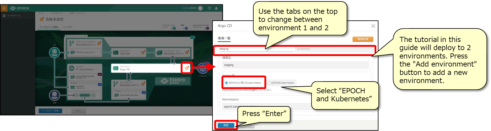{:width="1637" height="512"}

#####  Environment 1：Staging environment

| Item | Input/Select | Description |
| --- | --- | --- |
| Environment name | staging | Name of the environment |
| Namespace | epoch-sample-app-staging | Deploy destination Namespace |

##### Envrionment2：Production environment

| Item | Input/Select | Description |
| --- | --- | --- |
| Environment name | production | Name of the environment |
| Namespace | epoch-sample-app-production | Deploy destination Namespace |

#### IaC repository

Input the repository information. 
This will determine where the manifest will be registered to.


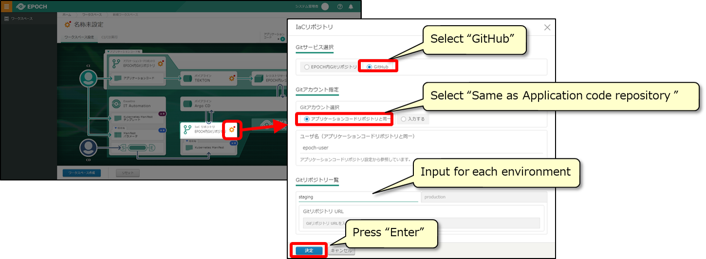{:width="1450" height="553"}

| Item | Input/Select | Description |
| --- | --- | --- |
| Git repository URL | https://github.com/_\[GitHub account name]_/_\[Environment repository]_.git | Environment's Manifest repository<br>（See the IaC repository we prepared earlier） |

#### Create Workspace

After you have input all the necessary information, press “Create Workspace”.

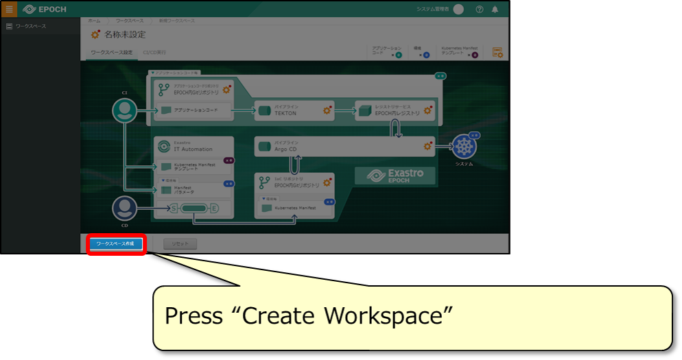{:width="993" height="525"}

You have now created the CI/CD pipeline!
The next tutorial will guide you through a scenario of using the CI/CD pipeline!
{: .check}

## Tutorial

Let’s use the CD/CD workflow

### Tutorial overview

#### CI/CD development scenario

This tutorial uses the following scenario as a base to guide the reader through a CI/CD workflow.
In this tutorial, the reader will create an EC site by using a prepared sample application.

{:width="1940" height="800"}


{:width="1940" height="800"}


### Sample application configuration
#### Sample application configuration

The sample application is created by UI and API.

{:width="1940" height="860"}


### Tutorial (CI/CD workflow)
#### CI/CD workflow

In this scenario, the user will deploy the sample code to both the Staging and the Production environment.
After that, they will modify the sample code and proceed to deploy it to both the Staging and the Production environment.


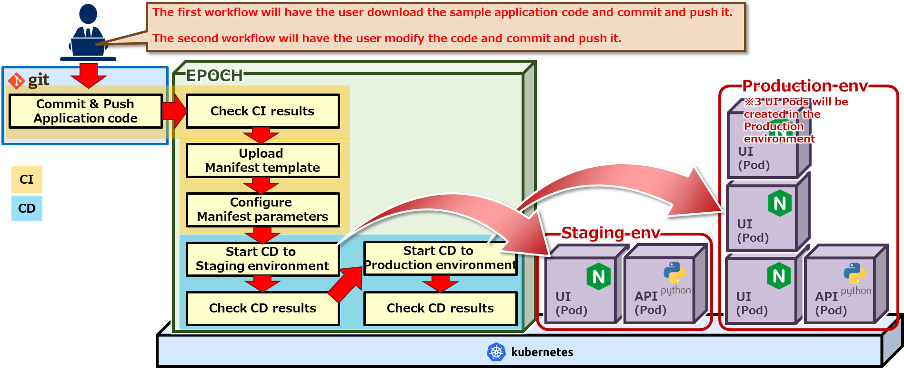{:width="1940" height="830"}


### Manifest template file
#### Manifest template file

There are two Manifest template files for the sample application. One for UI and one for API.
They are template files that have modifiable variables for matching environments.

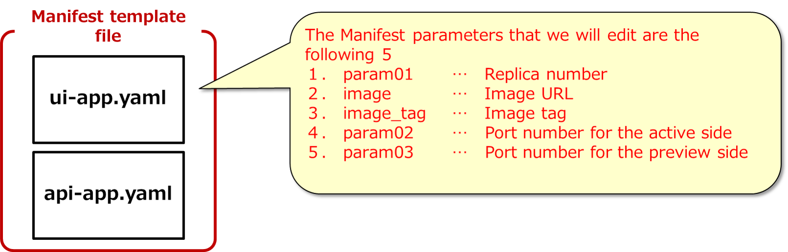{:width="1940" height="635"}

※The following variable names can be used: image, image tag, param01~param20


In the next section, we will start the first CI/CD workflow!
{: .check}

### CI/CD Workflow No.1
#### Deploy to Staging environment

The first CI/CD workflow will have the user commit and push the application code, deploy it to the Staging environment, as well as checking the results of the CD.

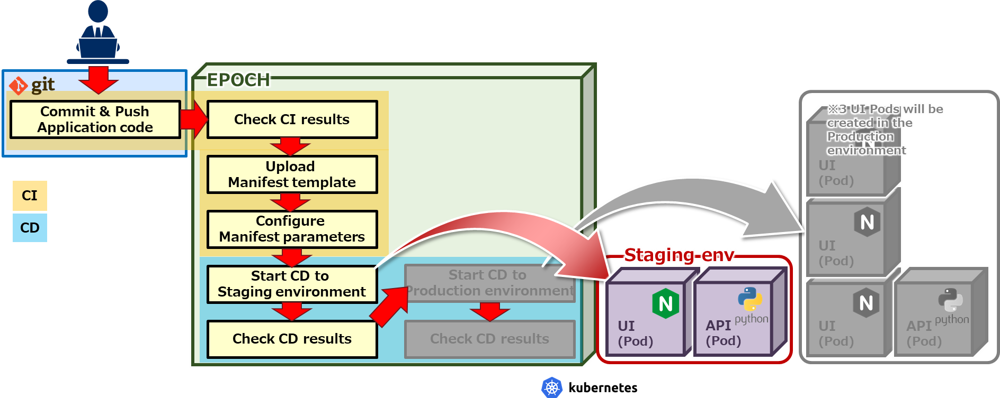{:width="1940" height="835"}


#### Commit & Push Application code
Run the CI Pipeline in order to create the container image we will deploy.

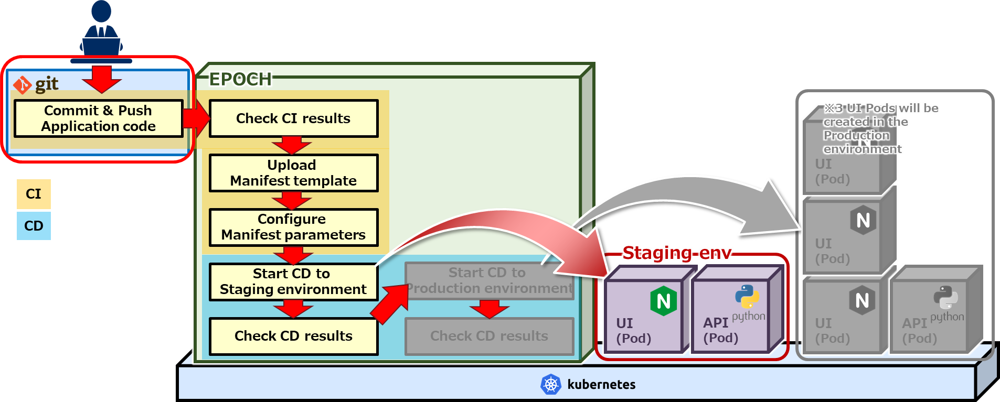{:width="1940" height="835"}


##### Access the following URL to download the sample app.
[https://github.com/exastro-suite/epoch-sample-app](https://github.com/exastro-suite/epoch-sample-app)

##### From the GitHub page, press the "Code" button and "Download ZIP" in order to download the code.

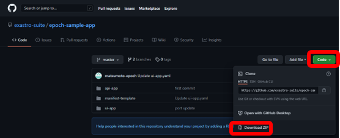{:width="1940" height="835"}


##### Extract the zip file and copy it to the cloned application code repositories.

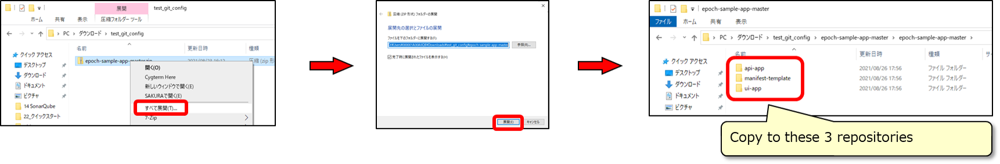{:width="1940" height="335"}

##### Commit and Push to the Cloned application code repository.
The commando prompt should look something like this:
```
git add .
git commit -m "first build"
git push origin main
```
{: .line .g}

※ If you are asked to authenticate yourself when you are running the git push command, input the necessary GitHub account information.

When you have successfully run the Push command, The CI Pipeline set by the TEKTON Pipeline should automatically start.
　Now we need to check the CI Pipeline results.


#### CI/CD Execution screen
Press the CI/CD Tab in the Workspace screen to go to the CI/CD Execution screen.

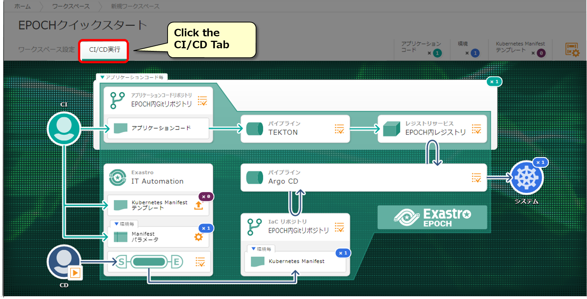{:width="1940" height="980"}


#### Check CI results

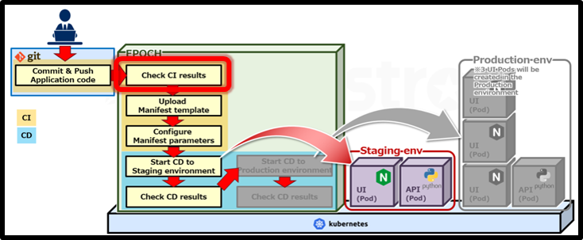{:width="1940" height="880"}

##### Check the build results of the Application code.

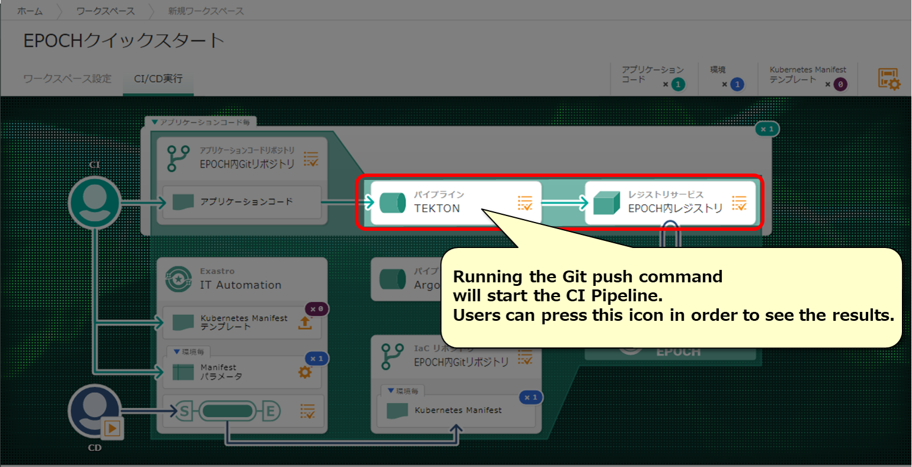{:width="1940" height="980"}

Let us check out the CI results!
{: .check}

#### Check the TEKTON Pipeline
##### Check the TEKTON pipeline that the build has ended successfully.

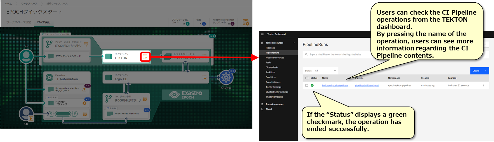{:width="1940" height="580"}


#### Check the Container image tag name
##### Open the registry service screen and check the tag of the built container image.

{:width="1940" height="780"}

※We plan to make it possible for users to select the image_tag created in the Pipeline.


#### Upload Manifest template

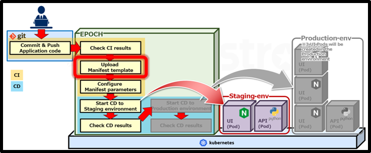{:width="1940" height="880"}

##### Upload the Manifest template we downloaded earlier.

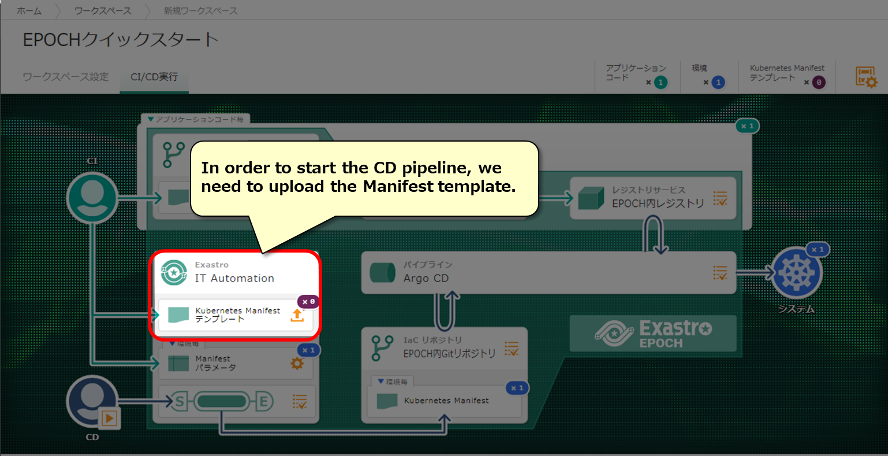{:width="1940" height="1000"}


##### Upload the Manifest template file we prepared earlier.

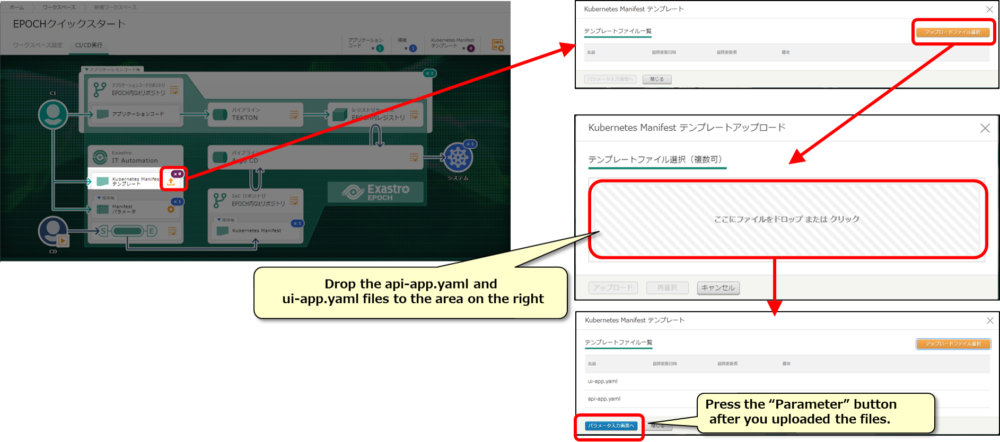{:width="1940" height="900"}


#### Manifest parameters

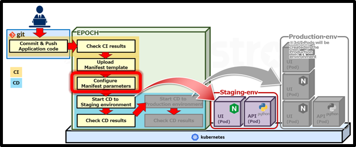{:width="1940" height="800"}


##### Input the Manifest parameters needed for deploying.

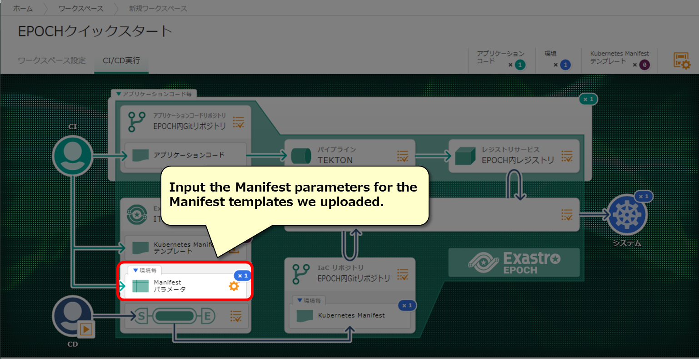{:width="1940" height="1000"}


#### Input Manifest parameters
##### Follow the table below and input the Manifest parameters

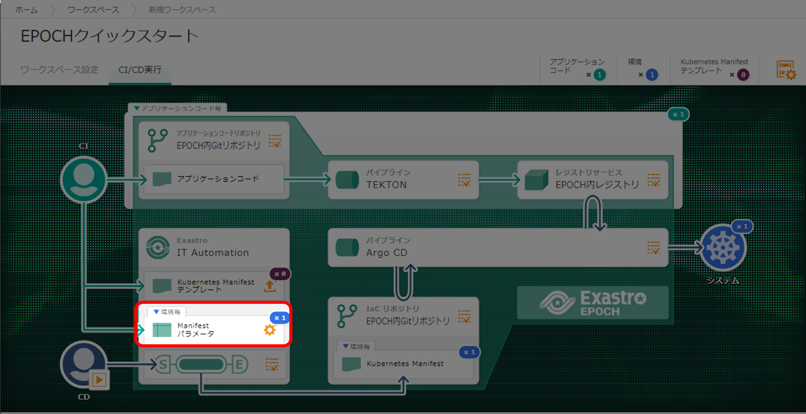{:width="1940" height="1000"}

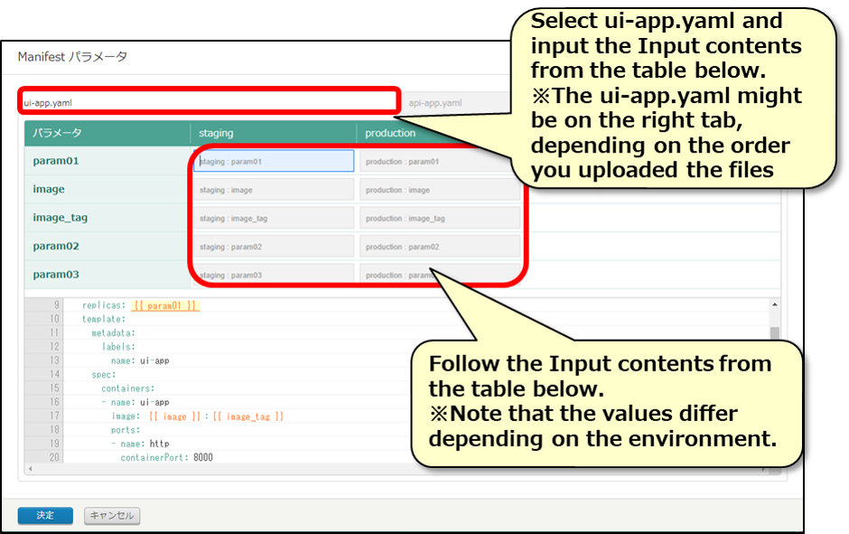{:width="1240" height="800"}

###### ui-app.yaml

| Item | Input contents(staging) |Input contents(production)| Description |
| --- | --- | --- | --- |
| \{\{ param01 \}\} | 1 | 3 | Replica numbers |
| \{\{ image \}\}  | exastro/epochsampleappui | exastro/epochsampleappui | Container image |
| \{\{ image_tag \}\} | master.20210708183910 | master.20210708183910 | Container image tag |
| \{\{ param02 \}\} | 31001 | 31003 | Port number for the blue side (Blue-Green deployment) |
| \{\{ param03 \}\} | 32001 | 32003 | Port number for the green side (Blue-Green deployment) |

※The image_tag for ui-app.yaml is the same one from the container image we built earlier.
※We plan to make "image" and "image_tag" selection items in the future.

##### Change to the api-app.yaml tab and repeat.

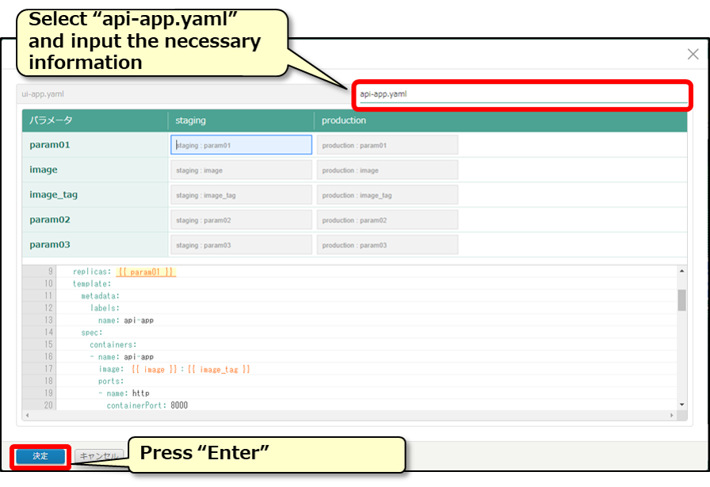{:width="1040" height="700"}

###### api-app.yaml

| Item | Input contents(staging) |Input contents(production)| Description |
| --- | --- | --- | --- |
| \{\{ param01 \}\} | 1 | 1 | Replica number |
| \{\{ image \}\} | [Dockerhub_Account_name]/epoch-sample-api | [Dockerhub_Account_name]/epoch-sample-api | Container image | 
| \{\{ image_tag \}\} | [Image_tag_name]  | [Image_tag_name] | Container image tag |
| \{\{ param02 \}\}  | 31002 | 31004 | Port number for the blue side (Blue-Green deployment) |
| \{\{ param03 \}\}  | 32002 | 32004 | Port number for the green side (Blue-Green deployment)|

#### Deploy to Staging environment

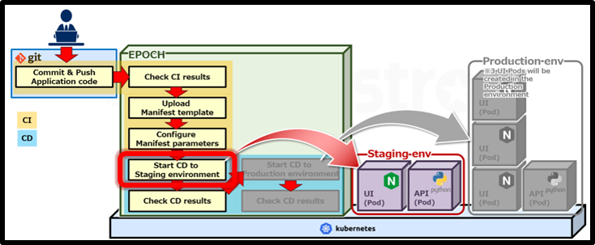{:width="1940" height="800"}
##### Start CD and deploy to the Staging environment.

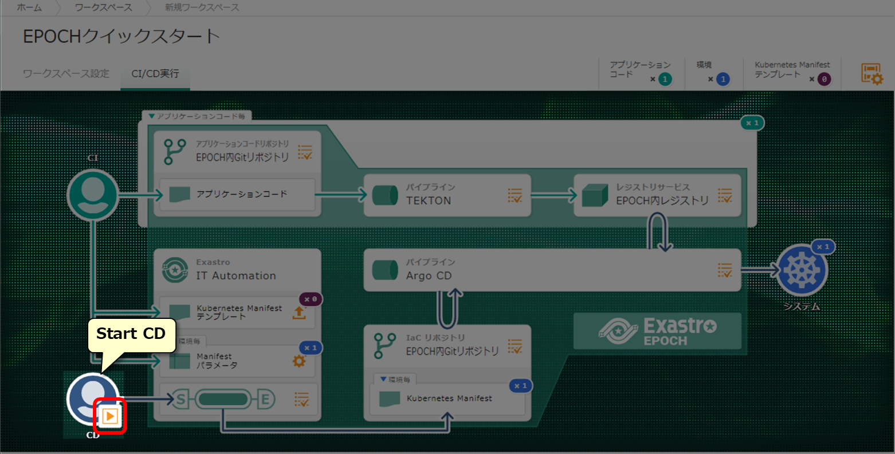{:width="1940" height="1000"}


#### Start CD for the Staging environment
##### Select the environment you want to deploy to.

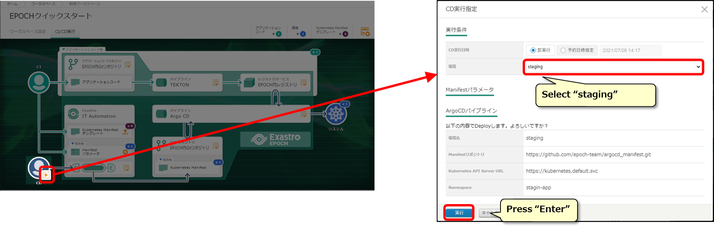{:width="1940" height="700"}


The CD process for the Staging environment has started. 
Let us check that it is working as it should.
{: .check}


#### Check the CD results 

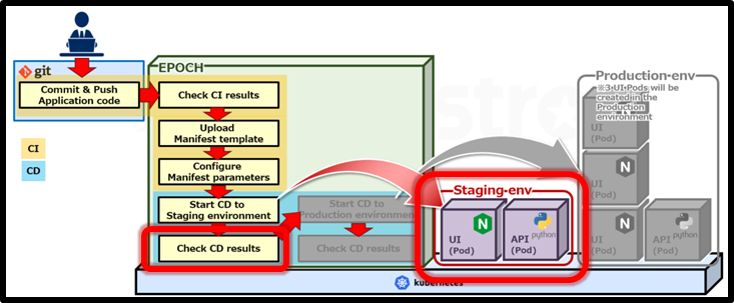{:width="1940" height="800"}

##### We can check the CD execution results from Exastro IT-Automation and ArgoCD.

{:width="1940" height="1000"}

#### Check that the Manifest file has been created (Staging environment)
##### Open Exastro IT-Automation and check that the Manifest file has been registered to the IaC repository.

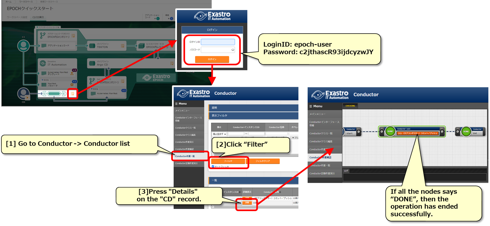{:width="1940" height="900"}


#### Check the results of the ArgoCD Pipeline (Staging environment)
##### Check that the Manifest shows up on Kubernetes

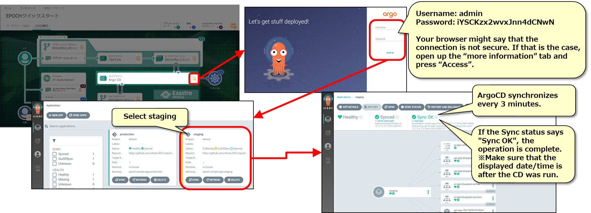{:width="1940" height="750"}


If the settings value are incorrect, the following error icon will be displayed.
{: .warning}

{:width="1940" height="1100"}


Let us check the deployed sample application.
{: .check}


#### Check the Staging environment sample code.
##### Access the sample application from the URL below.

```
http://[Kubernetes masternode IP address/host name]:31001/front-end.html
```

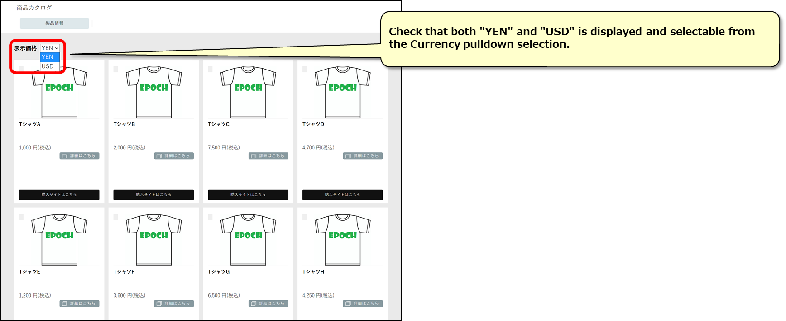{:width="1940" height="800"}


Now let's deploy to the Production environment.
{: .check}


#### Deploy to Production environment
Now that we have deployed to the Staging environment and checked that everything functions as it should, we can now deploy to the Production environment.

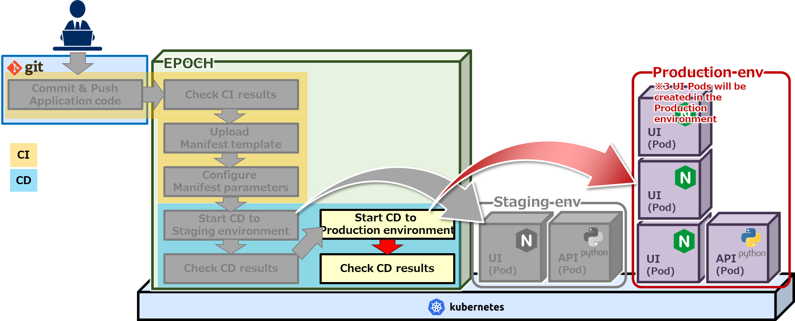{:width="1940" height="800"}


#### Deploy to the Production environment

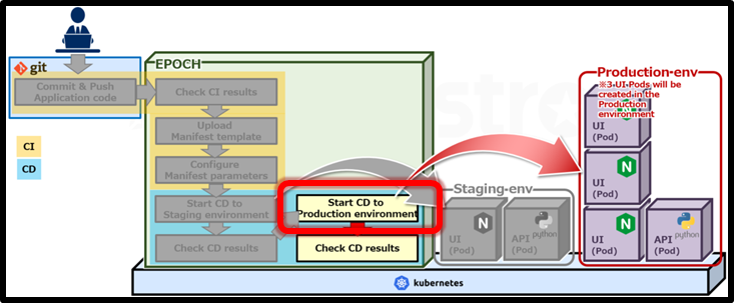{:width="1940" height="800"}

##### Start the CD and deploy to the Production environment.

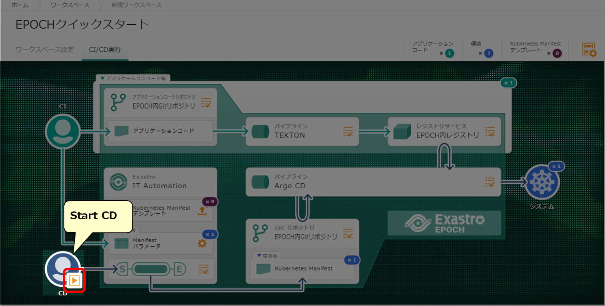{:width="1940" height="1000"}


#### Start CD for the Production environment
##### Select the environment you want to deploy to.

{:width="1940" height="700"}

The CD process for the Production environment has started. 
Let us check that it is working as it should.
{: .check}


#### Check the CD results (Production)

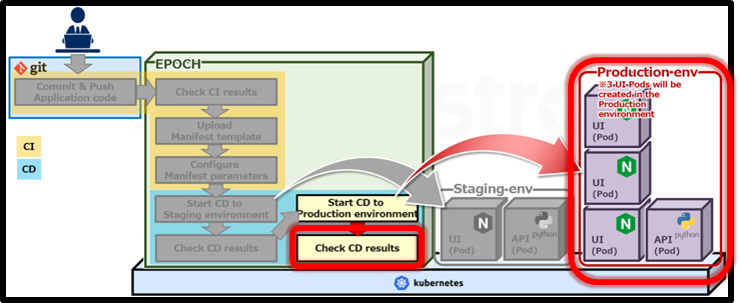{:width="1940" height="800"}

##### We can check the CD execution results from Exastro IT-Automation and ArgoCD.

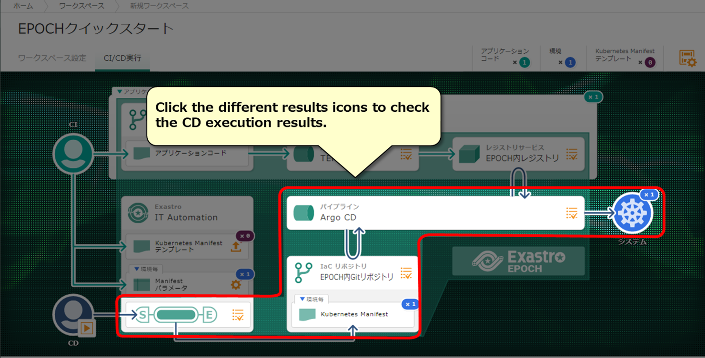{:width="1940" height="1000"}


#### Check that the Manifest file has been created (Production environment)
##### Open Exastro IT-Automation and check that the Manifest file has been registered to the IaC repository.

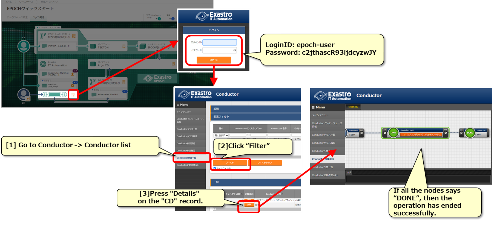{:width="1940" height="900"}


#### Check the results of the ArgoCD Pipeline (Production environment)
##### Check that the Manifest shows up on Kubernetes

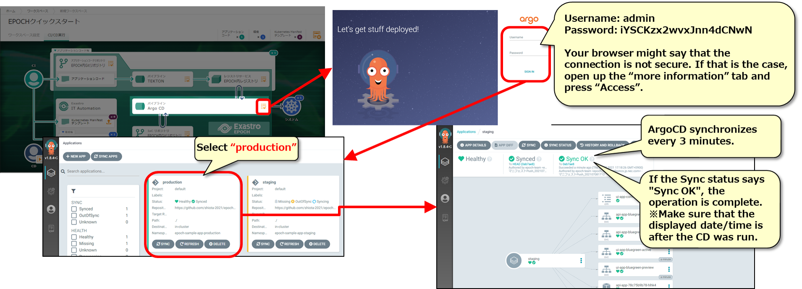{:width="1940" height="750"}


Let us check the deployed sample application
{: .check}

#### Check the Production environment sample code.
##### Access the sample application from the URL below.

```
http://[Kubernetes master node IP address/Host name]:31003/front-end.html
```

{:width="1940" height="900"}


This concludes the first CI/CD Workflow.
In the next section, CI/CD Workflow No.2, we will modify the application code and deploy it once more.
{: .check}


### CI/CD Workflow No.2

#### Deploy to the Staging environment
In the second CI/CD Workflow, the user will modify the application code, commit and push it to the Staging environment and finally deploy it.


{:width="1940" height="800"}


#### Modify application code

Modify the application code and start the second CI/CD process.
In this part of the tutorial, we will make it so Euro can be selected as an currency.

Use your code editor and open the following files from the cloned application code repository and modify them.

##### File ①：api-app/data/currency.json
```js
    "USD": {
        "symbol"    :   "$",
        "formatter" :   "{symbol} {price:,.2f} (Tax Included)"
    },
    "EUR": {
        "symbol"    :   "€",
        "formatter" :   "{symbol} {price:,.2f}"
    }
}
```
{: .line .g}

Add line 9~12
{: .check}


##### File 2②：api-app/data/rate.json
```js
{
    "USD": 110.56,
    "EUR": 134.15
}
```
{: .line .g}

Add a comma to the end of line 2.
Add line 3.
{: .check}


#### Commit and push the application code
Take the modified application code and commit and push it.

{:width="1940" height="800"}

Run the following Git commands.
```
cd "[clone destination folder]"
cd epoch-sample-app
git add .
git commit -m "addcurrency(EUR)"
git push origin main
```
{: .line .g}

※ If you are asked to authenticate yourself when you are running the git push command, input the necessary GitHub account information.


#### Check CI results

{:width="1940" height="800"}

##### Check the build results of the Application code.

{:width="1940" height="1000"}


#### Check the TEKTON Pipeline
##### Check the TEKTON pipeline that the build has ended successfully.

{:width="1940" height="580"}


#### Check the Container image tag name
##### Open the registry service screen and check the tag of the built container image.

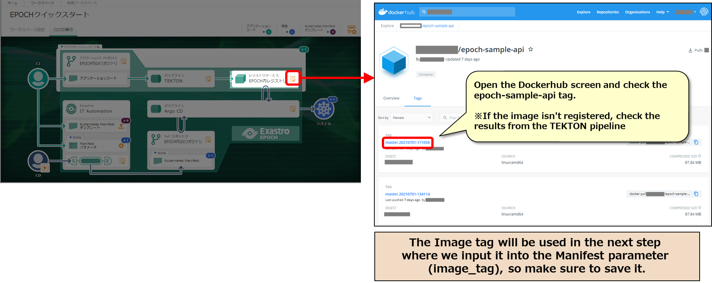{:width="1940" height="830"}

※We plan to make it possible for users to select the image_tag created in the Pipeline.

#### Configure Manifest parameters
#####  Update the Manifest parameter setting's image tag.

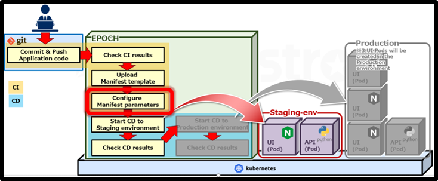{:width="1940" height="830"}

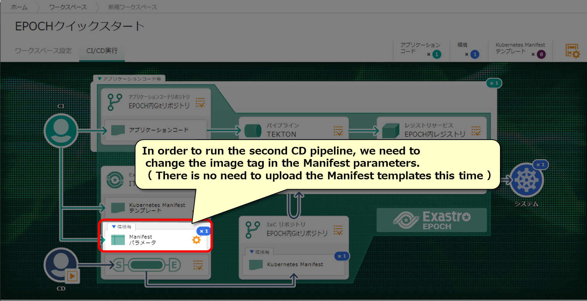{:width="1940" height="1000"}


#### Modify Manifest parameter(image_tag)
##### Change the image tag name for both the staging and the production environment Manifest parameters.

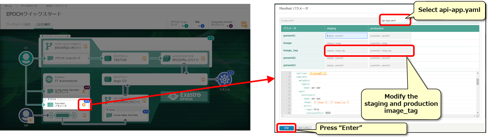{:width="1940" height="580"}

###### api-app.yaml

| Item | Input contents(staging) |Input contents(production)| Description |
| --- | --- | --- | --- |
| \{\{  image_tag \}\} | [The most recent image tag checked in the registry service] | [The most recent image tag checked in the registry service]  | Container image tag |


#### Deploy to Staging environment
##### Start CD and deploy to the Staging environment.

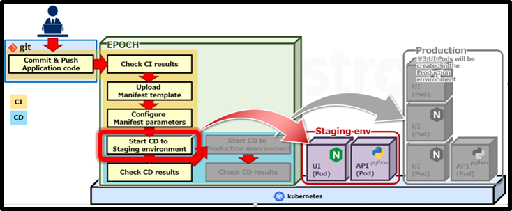{:width="1940" height="830"}

{:width="1940" height="980"}


#### Start CD for the Staging environment
##### Select your desired environment and start deploying.

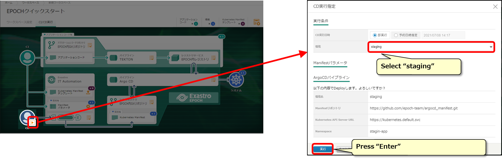{:width="1940" height="680"}


The CD process for the Staging environment has started. 
Let us check that it is working as it should.
{: .check}


#### Check the CD results 

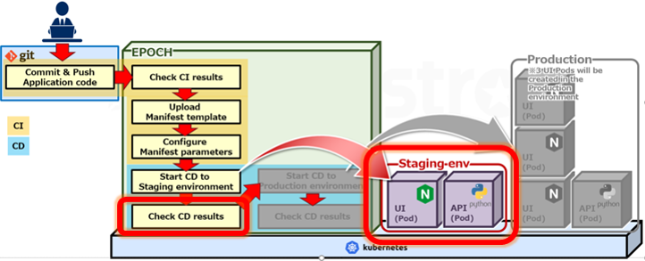{:width="1940" height="800"}

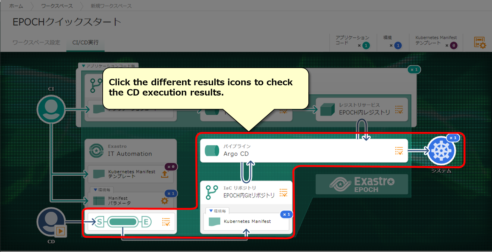{:width="1940" height="1000"}


#### Check that the Manifest file has been created (Staging environment)
##### Open Exastro IT-Automation and check that the Manifest file has been registered to the IaC repository.

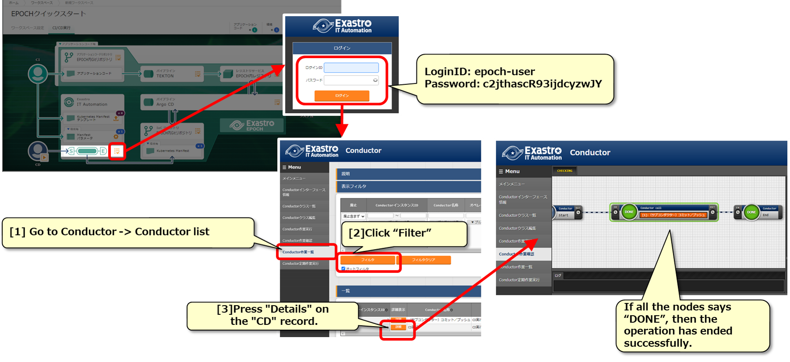{:width="1940" height="880"}


#### Check the results of the ArgoCD Pipeline (Staging environment)
##### Check that the Manifest shows up on Kubernetes.


{:width="1940" height="780"}


Let us check the deployed sample application
{: .check}


#### Check the Staging environment sample code
##### Access the sample application from the URL below:

```
http://[Kubernetes master node IP address/Host name]:31001/front-end.html
```

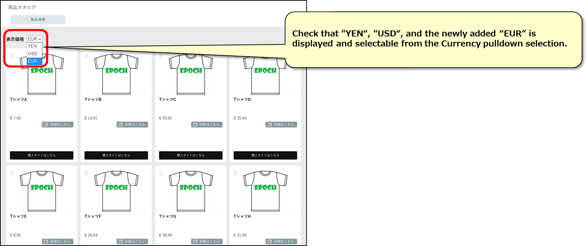{:width="1940" height="780"}


Now let's deploy to the Production environment
{: .check}


#### Deploy to Production environment
Now that we have deployed to the Staging environment and checked that everything functions as it should, we can now deploy to the Production environment.

{:width="1940" height="780"}


#### Start CD for the Production environment
##### Start the CD and deploy to the Production environment.

{:width="1940" height="860"}


{:width="1940" height="960"}


#### Specify CD
##### Select the environment you want to deploy to.

{:width="1940" height="660"}


The CD process for the Production environment has started. 
Let us check that it is working as it should.
{: .check}


#### Check the CD results (Production)
##### We can check the CD execution results from Exastro IT-Automation and ArgoCD.


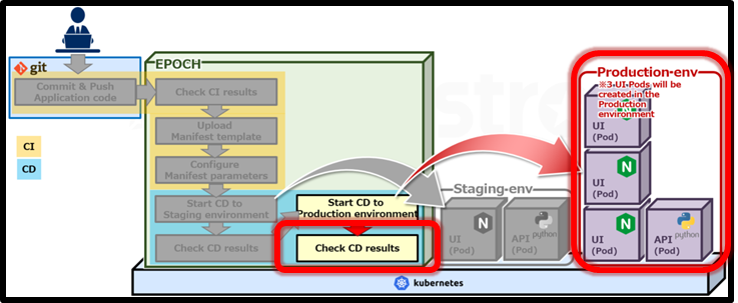{:width="1940" height="860"}


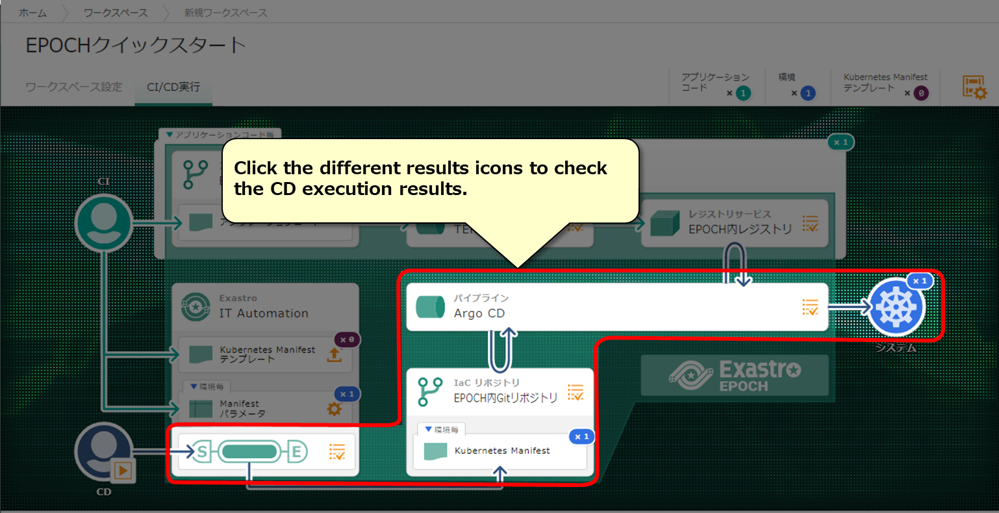{:width="1940" height="1000"}

#### Check that the Manifest file has been created (Production environment)
##### Open Exastro IT-Automation and check that the Manifest file has been registered to the IaC repository.

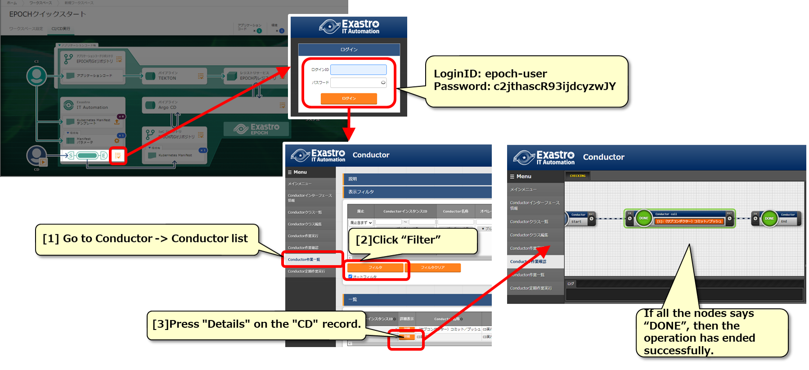{:width="1940" height="900"}


#### Check the results of the ArgoCD Pipeline (Production environment)
##### Check that the Manifest shows up on Kubernetes

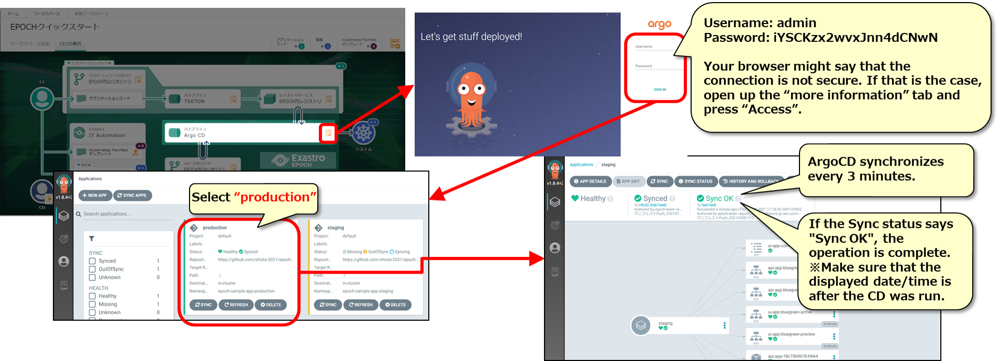{:width="1940" height="800"}


Let us check the deployed sample application
{: .check}


#### Check the Production environment sample code.
##### Access the sample application from the URL below:

```
http://[Kubernetes master node IP address/Host name]:31003/front-end.html
```

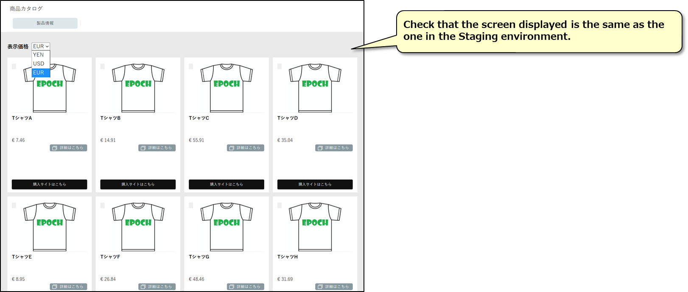{:width="1940" height="900"}


This concludes the tutorial.  
{: .check}


## Appendix
The next section contains supplementary information for the tutorial.

### Restrictions
The following are the restrictions that are present in the current Exastro EPOCH version and may be subject to change.

#### Restrictions（Planned to be fixed in the future）
- Only 1 application code repository is supported at the moment.
- You can only have one collective Git account for the application codes.
- An option for selecting Git service is planned to be added in future releases. Only Git repository URLs are supported in this version.
- Support for build branches is planned to be added in future releases. Only pushed contents is supported in this version.
- Support for Static response analysis is planned to be added in future releases. This does currently not work if SonarQube is selected.
- The only registry service supported is the internal registry service.
- Items other than the image output destination is planned to be added in future releases.
- Support for Authentication tokens and Base64 encoded certificates is planned to be added in future releases.
- The variables that can be specified in the template are fixed. Please see "Column" for more information.


#### Points to note
- Installing EPOCH will also install TEKTON.
- The ”{{ Variable name }}” variables are specified contents.


#### Column：Manifest templates and their variable names
When a Manifest template is uploaded to EPOCH, the system will analyze pre-defined text and make them into modifiable parameters.


{:width="1740" height="900"}

Strings that are described in this format \{\{ Variable Name \}\}will be recognized as user-inputable variables.
The variables that can be used in the current version of EPOCH are the following:


| Variable name | Description |
| --- | --- |
| \{\{ image \}\}  | Container image |
| \{\{ image_tag \}\}  | Container image tag |
| \{\{ param01 \}\}  | Fixed variables that users can use freely. |
| ～ |  |
| \{\{ param20 \}\}  | Fixed variables that users can use freely.（Can use max 20） |

※Support for user-specified variable names is planned to be added in future releases.


