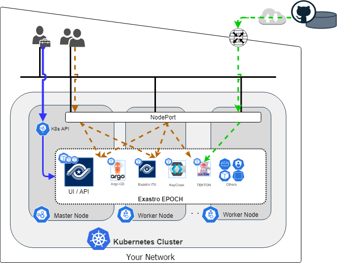

## はじめに
本書ではデプロイツールを用いて構築されたKuberneteクラスタ上へ**Exastro EPOCH**(以下EPOCH)をインストールする場合に、クラスタに求められる要件を扱います。これには以下の内容が含まれます。

- [`kubectl`のインストールと権限設定](#kubectlのインストールと権限設定)
- [Kubernetesクラスタ構成ノードの要件](#構成ノードの要件)
- [ネットワーク構成の要件](#ネットワーク構成の要件)


### 本書の対象読者
[kubeadm](https://kubernetes.io/ja/docs/reference/setup-tools/kubeadm/)、[kops](https://kubernetes.io/ja/docs/setup/production-environment/tools/kops/)、[kubespray](https://kubernetes.io/ja/docs/setup/production-environment/tools/kubespray/)その他のKubernetesデプロイツールを用いて、**クラウドもしくはオンプレミス上のデータセンタにデプロイされたKubernetes**上へEPOCHをインストールする方が対象です。

クラウドプロパイダーが提供するマネージドKubernetes(Amazon EKS, Azure Kubernetes Service, Google Kubernetes Engineなど)を利用する場合、別途[Learn一覧](https://exastro-suite.github.io/epoch-docs/learn_ja.html)からそれらのサービス向けのドキュメントを参照してください。

### 構成イメージ
下記はKubernetesクラスタへEPOCHをインストールした場合の構成イメージです。
青の矢印はEPOCHのインストール作業を表しています。EPOCHのインストールではマニフェストファイルをクラスタに適用し、各種リソースを作成します。
その他の矢印の詳細については本書「[ネットワーク構成の要件](#ネットワーク構成の要件)」項で説明します。

{:width="1344" height="1048"}

|凡例|意味|
|:--|:--|
|{:width="37" height="43"}|EPOCHのインストールを実行するクラスター管理者|
|{:width="37" height="43"}|EPOCHのUIにアクセスする利用者|
|{:width="33" height="35"}|EPOCHのインストール作業|
|{:width="33" height="35"}|EPOCHの利用者からGUIへのアクセス|
|{:width="33" height="35"}|Github から送出されたWebhook|

## Kubernetesクラスタの要件

### `kubectl`のインストールと権限設定
`kubectl`はKubernetesクラスターを操作するためのコマンドラインツールです。
EPOCHのインストールやその後の管理作業に利用されます。したがって、Kubernetesクラスタにアクセス可能なマシンに`kubectl`がインストールされている必要があります。


#### `kubectl`のインストール
##### コマンドの有無を事前に確認する
既に`kubectl`がインストールされている場合、インストール作業を実行する必要はありません。下記のコマンドが成功する場合、コマンドがインストール済みであることが確認できます。

**`kubectl`のインストール確認コマンド**
```bash
kubectl version --client --short
```
{: .line .d}

**出力例(インストール済みの場合)**
```
Client Version: v1.24.11
```

##### インストールを実行する
下記はLinux環境に`kubectl v1.24`をインストールする場合のコマンドです。
Linux環境以外の場合においては、[Kubernetes公式のインストール手順](https://kubernetes.io/ja/docs/tasks/tools/install-kubectl/)を参考に、`kubectl`をインストールしてください。

**コマンド(Linuxに`kubectl v1.24`をインストールする場合)**
```bash
# バイナリファイルのダウンロード
curl -LO https://storage.googleapis.com/kubernetes-release/release/v1.24.0/bin/linux/amd64/kubectl

# バイナリへの実行アクセス許可
chmod +x ./kubectl

# バイナリを PATH のフォルダにコピーする
sudo mv ./kubectl /usr/local/bin/kubectl
```
{: .line .d}

##### `kubectl`とKubernetesクラスタのバージョンを確認する
Kubernetesクラスタと、ここでインストールした`kubectl`は**マイナーバージョンの差が1以内である必要があります。**
たとえばKubernetesクラスタがv1.20である場合、`kubectl`は1.19,1.20,1,21のいずれかでなければなりません。

※2023年5月現在、EPOCHが対応しているKubernetesクラスターバージョンは1.21 ～ 1.24です。
{: .info}

**コマンド**
```bash
kubectl version --short
```
{: .line .d}

**出力例(バージョンが共にv1.21である場合)**
```bash
Client Version: v1.21.1
Server Version: v1.21.8
```

#### 権限設定
EPOCHのインストールを実行するとき、クラスタ管理者は複数の`kubectl`コマンドを実行する必要があります。
その際`kubectl`コマンドが利用するユーザーには、デフォルトのClusterRoleである`cluster-admin`(もしくは同等の権限を持つClusterRoleリソース)が割り当てられている必要があります。

下記のコマンドで`kubectl`コマンドを利用するユーザの実行権限を確認することができます。

**コマンド**
``` bash
kubectl auth can-i --list
```
{: .line .d}

下記のような権限設定が表示に含まれている場合、EPOCHのインストールに必要な権限を有していることが確認できます。

**出力例(必要な権限を有している場合)**
```
Resources  Non-Resource URLs   Resource Names     Verbs
*.*          []                  []                 [*]
             [*]                 []                 [*]
```

適切な権限がない場合、[RBAC認可についてのKubernetes公式のドキュメント](https://kubernetes.io/ja/docs/reference/access-authn-authz/rbac/)を参照し、`kubectl`やユーザ権限の必要な設定を行ってください。

`cluster-admin`ClusterRoleは全Namespaceを含むクラスタ内の全てのリソースを管理可能な権限です。扱いには十分な注意を払ってください。
{: .info}

### 構成ノードの要件

#### サーバリソース
Kubernetesクラスタに要求されるサーバリソースについては、
[インストール手順](https://exastro-suite.github.io/epoch-docs/Learn_ja/installation_guide/installation_guide_ja.html#%E3%82%A4%E3%83%B3%E3%82%B9%E3%83%88%E3%83%BC%E3%83%AB%E8%A6%81%E4%BB%B6)より、「要求スペック」項を参照してください。

#### CPUアーキテクチャ
2023年5月現在、EPOCHを構成するコンテナイメージが対応しているCPUアーキテクチャは`amd64`のみであり、マルチCPUアーキテクチャには未対応です。
したがって、**Kubernetes構成ノードのCPUアーキテクチャは`amd64`である必要があります。**

下記のコマンドを実行すると、ノード毎のCPUアーキテクチャが表示されます。表示が全て`amd64`であることを確認してください。

**コマンド**
```bash
kubectl get nodes -o=jsonpath='{range .items[*]}{.metadata.name}{": "}{.status.nodeInfo.architecture}{"\n"}{end}'
```
{: .line .d}

**出力例(クラスタ構成ノードが2台の場合)**
```
sample-k8s-master: amd64
sample-k8s-worker: amd64
```

### ネットワーク構成の要件
下記はKubernetesクラスタへEPOCHをインストールした場合の構成イメージです。
{:width="1344" height="1048"}


|凡例|意味|
|:--|:--|
|{:width="37" height="43"}|EPOCHのインストールを実行するクラスター管理者|
|{:width="37" height="43"}|EPOCHのUIにアクセスする利用者|
|{:width="33" height="35"}|EPOCHのインストール作業|
|{:width="33" height="35"}|EPOCHの利用者からGUIへのアクセス|
|{:width="33" height="35"}|Github から送出されたWebhook|

***
#### EPOCHのUIへのアクセスに用いるNodePort
EPOCHは**ArgoCD**、**Exastro ITA**、**TEKTON**などのソフトウェアをPodとして内包しており、これらのUIへのアクセスにはKubernetesのNodePortを利用します。(図内[茶色の矢印](#ネットワーク構成の要件)を参照)また、EPOCHの認証プロセスには**Keycloak**を利用しており、同様にNodePortを利用してアクセスします。

したがって、インストール後にEPOCHを利用するためには、**利用者のブラウザ**から**KubernetesクラスタのNodePort**へアクセスできるネットワーク環境が必要となります。
下記のNodePortがKubernetesクラスタで利用可能であり、利用者からアクセス可能であることを確認してください。

- `30443`
- `31183`


下記のコマンドを実行すると、Kubernetesクラスタが既に利用しているNodeportの一覧が表示されます。出力はService名とNodePortの番号で構成されています。
NodePort`30443`と`31183`が含まれていないことを確認してください。

**コマンド**
```bash
kubectl get svc -A -o jsonpath='{range .items[?(@.spec.type=="NodePort")]}{.metadata.name}{": "}{.spec.ports[
*].nodePort}{"\n"}{end}'
```
{: .line .d}

**出力例**

```
example-Nodeport1: 31189
example-Nodeport2: 32714
```

***

#### Github WebhookからEPOCHへのアクセスに用いるNodePort
EPOCHはコードリポジトリからのWebhookをNodeportで受信し、EPOCH内のTEKTONにCIパイプラインを実行させます。

Githubをコードリポジトリとして利用する場合、**Github Webhookから送出されるPOSTリクエストをNodePortが受け取ることのできる**ネットワーク環境が必要となります。(図内[緑色の矢印](#ネットワーク構成の要件)を参照)

下記のNodePortがKubernetesクラスタで利用可能であり、Github Webhookのリクエストを受け取り可能であることを確認してください。確認方法のコマンドは[EPOCHのUIへのアクセスに用いるNodePort](#epochのuiへのアクセスに用いるnodeport)を参照してください。

- `30443`

Github Webhookの詳細については下記をご参照ください。<br>ーーー<br>
Github Webhookの詳細: [Github Docs / About Webhooks](https://docs.github.com/ja/developers/webhooks-and-events/webhooks/about-webhooks)<br>
Githubが利用するIPアドレス情報: [Github Docs / GitHub's IP addresses](https://docs.github.com/ja/authentication/keeping-your-account-and-data-secure/about-githubs-ip-addresses)
{: .info}


## EPOCHのインストール
インストール手順は下記の記事を参照してください。

-  [Learn資料「EPOCH Install」](https://exastro-suite.github.io/epoch-docs/Learn_ja/installation_guide/installation_guide_ja.html)

本書の内容は以上です。
{: .check}
