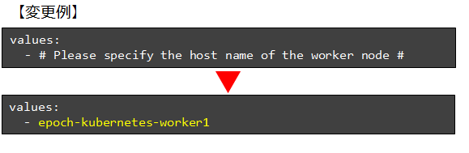

## はじめに
### 本資料の概要
本書は Exastro EPOCH(以後EPOCHと表記) をインストールする手順を扱ったガイドです。<br>

- インストール完了後の手順については、別紙[「導入手順編」]()をご覧ください。
- Kubernetesの構築についての情報は本資料に含まれません。
  
## システム構成

### システム構成図
EPOCHはKubernetes上に各種リソースを展開してインストールします。EPOCHをインストールした直後の構成(概要)は、下図の通りです。

{:width="1725" height="745"}


### インストール要件
kubernetesにEPOCHをインストールする前に、下記の事項を満たしていることを確認してください。

- v1.18以上のKubernetes環境が構築されていること。
- Kubernetesで使用するServiceAccountにcluster-adminロールが付与されていること。
- Kubernetesから外部インターネットに接続できること。
- kubernetesが下記のポート番号を利用できること。
  - 30080
  - 30081
  - 30443
  - 30801
  - 30805
  - 30901～30907

ポート番号は後述するepoch-install.yamlに定義されています。ポート番号を変更する場合は、ファイルを変更した後にインストールを実行してください。
{: .info}

### 要求スペックの参考値
EPOCHをインストールするKubernetesクラスタの、サーバスペックの参考値です。<br>
**Masterノード1台、Workerノード1台の場合**の値を記載しています。

**Masterノード**

|:--|:--|
|CPU数|2 Core (3.0 GHz)|
|メモリ|8GB|
|ディスク容量|10GB|

**Workerノード**

|:--|:--|
|CPU数|2 Core (3.0 GHz)|
|メモリ|8GB|
|ディスク容量|32GB|

これらは参考値です。最終的なスペック値はEPOCHを利用して構築するシステムの要件や、展開先のKubernetesがEPOCHと別のものになるか否か、等の要素を検討して決定してください。
{: .info}

## インストール手順
### インストール手順の概要
EPOCHのインストールは、Kubernetes上に各種リソースを展開して進めます。

#### マニフェストファイル一覧
リソース展開に利用するマニフェストファイルの一覧です。

|利用するマニフェストファイルのURL|概要|
|:--|:--|
|[https://github.com/exastro-suite/epoch/releases/latest/download/epoch-install.yaml](https://github.com/exastro-suite/epoch/releases/latest/download/epoch-install.yaml)|EPOCHのAPI群やTektonを展開します。<br>EPOCHのリポジトリから取得します。|
|[https://github.com/exastro-suite/epoch/releases/latest/download/epoch-pv.yaml](https://github.com/exastro-suite/epoch/releases/latest/download/epoch-pv.yaml)|Tektonパイプラインが利用する永続ボリュームを展開します。EPOCHのリポジトリから取得します。|
|[https://github.com/argoproj/argo-rollouts/releases/latest/download/install.yaml](https://github.com/argoproj/argo-rollouts/releases/latest/download/install.yaml)|Argo Rolloutsを展開します。<br>Argo Project公式リポジトリから取得します。|

### EPOCHのインストール手順
#### EPOCHのインストール

##### ① kubectlが実行できる環境にSSHログインし、下記のコマンドを実行してEPOCHをインストールします。

```bash
kubectl apply -f https://github.com/exastro-suite/epoch/releases/latest/download/epoch-install.yaml
```
{: .line .d}

##### ② 下記のコマンドですべてのPodがRunning状態になっていることを確認します(EPOCH)
ctrl + c で監視を終了できます。

```bash
kubectl get pod -n epoch-system --watch
```
{: .line .d}

###### 出力例
``` sh
NAME                                                READY   STATUS              RESTARTS        AGE
epoch-cicd-api-*********-*****                      1/1     Running             0               **s
epoch-control-tekton-api-*********-*****            1/1     Running             0               **s
epoch-rs-organization-api-*********-*****           1/1     Running             0               **s
epoch-rs-workspace-api-*********-*****              1/1     Running             0               **s
epoch-service-api-*********-*****                   1/1     Running             0               **s
epoch-ui-*********-*****                            1/1     Running             0               **s
organization-db-*********-*****                     1/1     Running             0               **s
tekton-pipeline-db-*********-*****                  1/1     Running             0               **s
workspace-db-*********-*****                        1/1     Running             0               **s

```

##### ③ 下記のコマンドですべてのPodがRunning状態になっていることを確認します(Tekton)
ctrl + c で監視を終了できます。

``` bash
kubectl get pod -n tekton-pipelines --watch
```
{: .line .d}

###### 出力例
``` sh
NAME                                                READY   STATUS              RESTARTS        AGE
tekton-dashboard-*********-*****                    1/1     Running             0               **s
tekton-pipelines-controller-*********-*****         1/1     Running             0               **s
tekton-pipelines-webhook-*********-*****            1/1     Running             0               **s
tekton-triggers-controller-*********-*****          1/1     Running             0               **s
tekton-triggers-core-interceptors-*********-*****   1/1     Running             0               **s
tekton-triggers-webhook-*********-*****             1/1     Running             0               **s
```

【正常にリソースを作成できなかった場合】<br>
ポート番号の重複などで正しくリソースを作成できなかった場合、<br>
下記コマンドでリソースを削除し、原因を取り除いたうえで再度 ① を実行してください。
{: .warning}

###### 正常にリソースを作成できなかった場合
``` bash
kubectl delete -f https://github.com/exastro-suite/epoch/releases/latest/download/epoch-install.yaml
```
{: .line .d}

#### 永続ボリュームの作成
Tektonパイプライン設定用の永続ボリュームを設定します。

##### ① 下記のコマンドでマニフェストファイルを取得します。

###### 【Linux, macOSの場合】

``` bash
curl -OL https://github.com/exastro-suite/epoch/releases/latest/download/epoch-pv.yaml
```
{: .line .d}

###### 【Windows(Powershell) の場合】
``` bash
Invoke-WebRequest https://github.com/exastro-suite/epoch/releases/latest/download/epoch-pv.yaml -OutFile epoch-pv.yaml
```
{: .line .d}

##### ② 下記のコマンドでWorkerノードのホスト名を確認します。

``` bash
kubectl get node
```
{: .line .d}

###### 出力例
``` sh
NAME                      STATUS   ROLES                  AGE   VERSION
epoch-kubernetes-master   Ready    control-plane,master   **d   v1.**.*
epoch-kubernetes-worker1  Ready    worker                 **d   v1.**.*
```

##### ③ ダウンロードしたepoch-py.yamlに、 Workerノードのホスト名を記入します。
最終行の「# Please specify the host name of the worker node #」を確認したWorkerノードのホスト名に置き換え、保存します。

{:width="441" height="144"}

【Workerノードが複数台ある場合】<br>
続けて2台目以降のホスト名を指定することも可能です。<br>
2台目以降の指定は任意です。2台目移行を指定した場合、永続ボリュームが複数のWokerノードにスケジューリングされます。
{: .info}

##### ④ 下記のコマンドで永続ボリュームを作成します。

```bash
kubectl apply -f epoch-pv.yaml
```
{: .line .d}

##### ⑤ 下記のコマンドで永続ボリューム「epoch-pv」が作成されていることを確認します。
```bash
kubectl apply -f epoch-pv.yaml
```
{: .line .d}

###### 出力例
``` sh
NAME       CAPACITY   ACCESS MODES   RECLAIM POLICY   STATUS      CLAIM   STORAGECLASS                    REASON   AGE
epoch-pv   500Mi      RWO            Retain           Available           epoch-tekton-pipeline-storage            **s
```

【正常にリソースを作成できなかった場合】<br>
ファイル編集のミスなどにより永続ボリュームを作成できなかった場合、
下記コマンドで変更を削除し、原因を取り除いたうえで再度 ④ を実行してください。
{: .warning}

###### 正常にリソースを作成できなかった場合
``` bash
kubectl delete -f epoch-pv.yaml
```
{: .line .d}

#### ArgoRolloutのインストール

##### ① 下記のコマンドを実行し、ArgoRolloutをインストールします。

```bash
kubectl create namespace argo-rollouts
kubectl apply -n argo-rollouts -f https://github.com/argoproj/argo-rollouts/releases/latest/download/install.yaml
```
{: .line .d}

##### ② 下記のコマンドでマニフェストファイルが反映されていることを確認します。

```bash
kubectl get pod -n argo-rollouts --watch
```
{: .line .d}

###### 出力例
```sh
NAME                             READY   STATUS    RESTARTS   AGE
argo-rollouts-xxxxxxxxxx-xxxxx   1/1     Running   0          **m
```


【正常にリソースを作成できなかった場合】<br>
正しくリソースを作成できなかった場合、
下記コマンドでリソースを削除し、原因を取り除いた上で再度 ① の 「kubectl apply ~」コマンド を実行してください。
{: .warning}

###### 正常にリソースを作成できなかった場合
```bash
kubectl delete -n argo-rollouts -f https://github.com/argoproj/argo-rollouts/releases/latest/download/install.yaml
```
{: .line .d}

### 接続確認
インストール作業終了後、ブラウザからEPOCHのワークスペース画面にアクセスしてください。
下のような画面が表示されることを確認します。

{:width="994" height="516"}

以上でEPOCHのインストール手順は終了です。
{: .check}