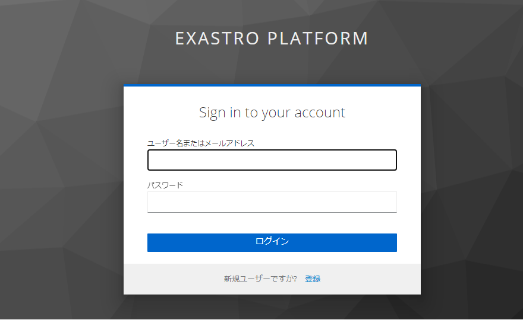
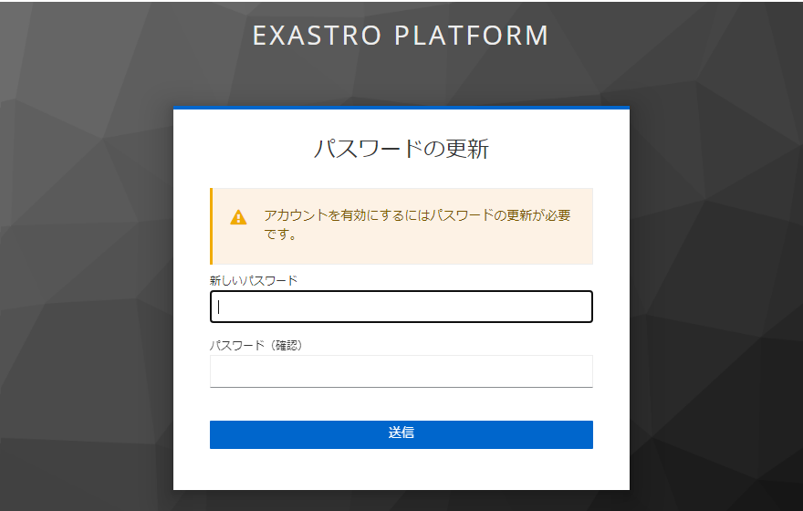
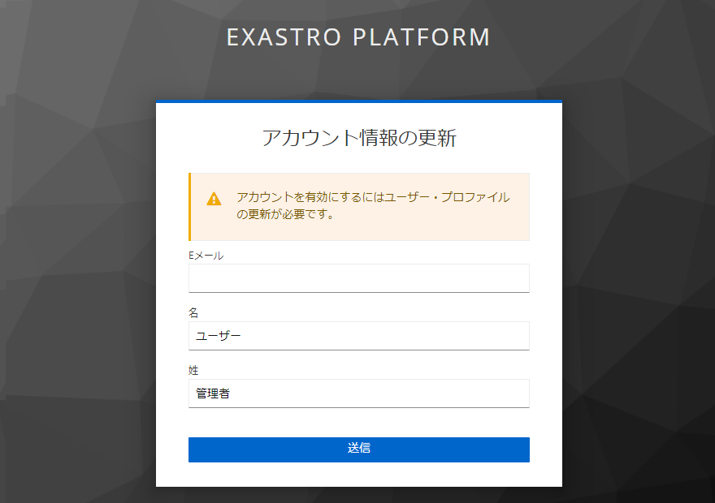
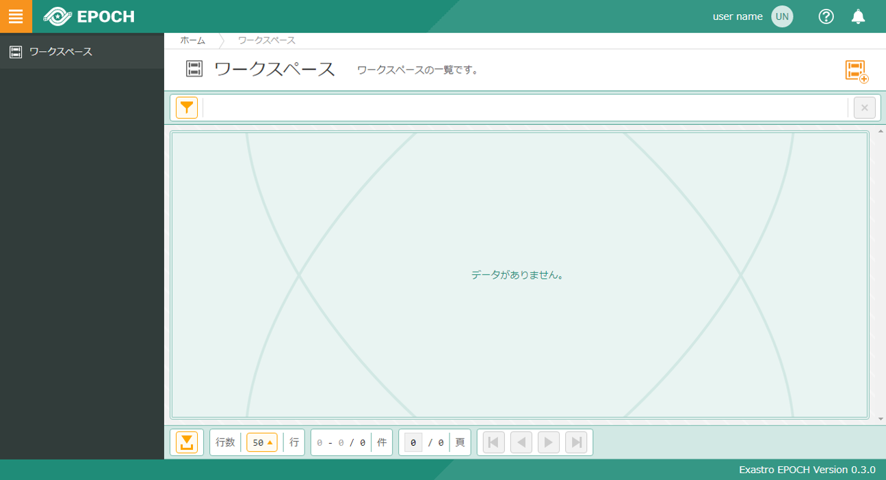

## はじめに
### 本資料の概要
本書は Exastro EPOCH(以後EPOCHと表記) をインストールする手順を扱ったガイドです。<br>

- Kubernetesの構築についての情報は本資料に含まれません。
  
### コンポーネントについて
EPOCHはKubernetes上に各種リソースを展開してインストールします。EPOCHをインストールした直後の構成(概要)は、下図の通りです。

{:width="1725" height="745"}
 

### インストール要件
kubernetesにEPOCHをインストールする前に、下記の事項を満たしていることを確認してください。

- v1.18 ～ v1.21のKubernetes環境が構築されていること。
- Kubernetesで使用するServiceAccountにcluster-adminロールが付与されていること。
- Kubernetesから外部インターネットに接続できること。
- WorkerノードのLinuxの設定について、次の条件(SonarQubeのホスト要件)を満たしていること。

    | kernelパラメータ | 条件 |
    | :- | :- |
    | vm.max_map_count | 524288 以上 |
    | fs.file-max | 131072 以上 |


    | ユーザーリソース | 条件 |
    | :- | :- |
    | 同時にオープンできるファイル数 | 131072 以上 |
    | 実行可能なユーザープロセスの最大数 | 8192 以上 |

    SonarQubeのホスト要件については以下のサイトで確認できます。<br/>
    [https://hub.docker.com/_/sonarqube](https://hub.docker.com/%5F/sonarqube)

- kubernetesが下記のポート番号を利用できること。
  - 30443
  - 31182
  - 31183

ポート番号は後述するepoch-install.yamlに定義されています。ポート番号を変更する場合は、ファイルを変更した後にインストールを実行してください。
{: .info}


**参考)最小要件**

EPOCHをインストールするKubernetesクラスタの、サーバスペックの参考値です。<br>
**Masterノード1台、Workerノード1台の場合**の値を記載しています。

- Masterノード

|:--|:--|
|CPU数|2 Core (3.0 GHz)|
|メモリ|8GB|
|ディスク容量|10GB|

- Workerノード

|:--|:--|
|CPU数|2 Core (3.0 GHz)|
|メモリ|8GB|
|ディスク容量|40GB|

これらは参考値です。最終的なスペック値はEPOCHを利用して構築するシステムの要件や、展開先のKubernetesがEPOCHと別のものになるか否か、等の要素を検討して決定してください。
{: .info}


## インストール手順
### インストール手順の概要
EPOCHのインストールは、Kubernetes上に各種リソースを展開して進めます。

#### マニフェストファイル一覧
リソース展開に利用するマニフェストファイルの一覧です。

|利用するマニフェストファイルのURL|概要|
|:--|:--|
|[https://github.com/exastro-suite/epoch/releases/latest/download/epoch-install.yaml](https://github.com/exastro-suite/epoch/releases/latest/download/epoch-install.yaml)|EPOCHのAPI群やTektonを展開します。<br>EPOCHのリポジトリから取得します。|
|[https://github.com/argoproj/argo-rollouts/releases/latest/download/install.yaml](https://github.com/argoproj/argo-rollouts/releases/latest/download/install.yaml)|Argo Rolloutsを展開します。<br>Argo Project公式リポジトリから取得します。|

### EPOCHのインストール手順
#### EPOCHのインストール

##### ① kubectlが実行できる環境にSSHログインし、下記のコマンドを実行してEPOCHをインストールします。

```bash
kubectl apply -f https://github.com/exastro-suite/epoch/releases/latest/download/epoch-install.yaml
```
{: .line .d}

##### ② 下記のコマンドで(tekton-installer以外の)PodがRunning状態になっていることを確認します(EPOCH)
ctrl + c で監視を終了できます。

```bash
kubectl get pod -n epoch-system --watch
```
{: .line .d}

###### 出力例
``` sh
NAME                                                READY   STATUS              RESTARTS        AGE
authentication-infra-setting-**********-*****       1/1     Running             0               **s
epoch-control-argocd-api-*********-*****            1/1     Running             0               **s
epoch-control-github-api-*********-*****            1/1     Running             0               **s
epoch-control-inside-gitlab-api-*********-*****     1/1     Running             0               **s
epoch-control-ita-api-*********-*****               1/1     Running             0               **s
epoch-control-tekton-api-*********-*****            1/1     Running             0               **s
epoch-control-workspace-api-*********-*****         1/1     Running             0               **s
epoch-rs-ci-result-api-*********-*****              1/1     Running             0               **s
epoch-rs-logs-api-*********-*****                   1/1     Running             0               **s
epoch-rs-workspace-api-*********-*****              1/1     Running             0               **s
epoch-service-api2-*********-*****                  1/1     Running             0               **s
epoch-ui-*********-*****                            1/1     Running             0               **s
rs-logs-db-*********-*****                          1/1     Running             0               **s
tekton-installer-*********-*****                    0/1     Completed           0               **s
tekton-pipeline-db-*********-*****                  1/1     Running             0               **s
tekton-pipelinerun-db-*********-*****               1/1     Running             0               **s
workspace-db-*********-*****                        1/1     Running             0               **s  
```

##### ③ 下記のコマンドですべてのPodがRunning状態になっていることを確認します(Tekton)
ctrl + c で監視を終了できます。

``` bash
kubectl get pod -n tekton-pipelines --watch
```
{: .line .d}

###### 出力例
``` sh
NAME                                                READY   STATUS              RESTARTS        AGE
tekton-pipelines-controller-*********-*****         1/1     Running             0               **s
tekton-pipelines-webhook-*********-*****            1/1     Running             0               **s
tekton-triggers-controller-*********-*****          1/1     Running             0               **s
tekton-triggers-core-interceptors-*********-*****   1/1     Running             0               **s
tekton-triggers-webhook-*********-*****             1/1     Running             0               **s
```

【正常にリソースを作成できなかった場合】<br>
ポート番号の重複などで正しくリソースを作成できなかった場合、<br>
下記コマンドでリソースを削除し、原因を取り除いたうえで再度 ① を実行してください。
{: .warning}

###### 正常にリソースを作成できなかった場合
``` bash
kubectl delete -f https://github.com/exastro-suite/epoch/releases/latest/download/epoch-install.yaml
```
{: .line .d}


#### EPOCHの初期設定

##### 下記のコマンドを実行し、EPOCHの初期設定を行います。

```bash
kubectl run -i --rm set-host -n epoch-system --restart=Never --image=exastro/epoch-setting:0.3_5 --pod-running-timeout=30m -- set-host [your-host]
```
{: .line .d}

`[your-host]`には、ご自身のホストに接続するためのサーバー名またはIPアドレスを指定してください。
{: .info}

###### 出力例（初期設定が正常に完了した場合）
```bash
[INFO] Call set-host command
[INFO] START : set-host.sh
[INFO] **** set-host.sh completed successfully ****
  ...
[INFO] Call set-host-gitlab command
job.batch/set-host-gitlab created
****  completed successfully ****
```

EPOCHがインストール中の場合、以下のエラーとなることがあります。その際は再度コマンドを実行してください。
{: .warning}

```bash
error: timed out waiting for the condition
```
{: .line .d}


#### ArgoRolloutのインストール

##### ① 下記のコマンドを実行し、ArgoRolloutをインストールします。

```bash
kubectl create namespace argo-rollouts
kubectl apply -n argo-rollouts -f https://github.com/argoproj/argo-rollouts/releases/latest/download/install.yaml
```
{: .line .d}

##### ② 下記のコマンドでマニフェストファイルが反映されていることを確認します。

```bash
kubectl get pod -n argo-rollouts --watch
```
{: .line .d}

###### 出力例
```sh
NAME                             READY   STATUS    RESTARTS   AGE
argo-rollouts-xxxxxxxxxx-xxxxx   1/1     Running   0          **m
```


【正常にリソースを作成できなかった場合】<br>
正しくリソースを作成できなかった場合、
下記コマンドでリソースを削除し、原因を取り除いた上で再度 ① の 「kubectl apply ~」コマンド を実行してください。
{: .warning}

###### 正常にリソースを作成できなかった場合
```bash
kubectl delete -n argo-rollouts -f https://github.com/argoproj/argo-rollouts/releases/latest/download/install.yaml
```
{: .line .d}

### 接続確認
インストール作業終了後、次のURLをブラウザに入力してアクセスしてください。  

https://[your-host]:30443/

`[your-host]`には、ご自身のホストに接続するためのサーバー名またはIPアドレスを指定してください。
{: .info}

以下のサインイン画面が表示されます。

{:width="880" height="540"}


ユーザ名に```epoch-admin```、パスワードに```password```を指定して「ログイン」ボタンを押下してください。

パスワードの変更画面が表示されます。

{:width="880" height="560"}

新しいパスワードを指定して「送信」ボタンを押下してください。

アカウント情報の更新画面が表示されます。
{:width="880" height="620"}

以下の情報を入力し「送信」ボタンを押下してください。
  - Eメール
  - 名
  - 姓

以下の画面が表示されることを確認します。
{:width="994" height="550"}


以上でEPOCHのインストール手順は終了です。
{: .check}