## はじめに
### QuickStartについて
#### はじめに

本書は、Exastro EPOCH(以降、EPOCHと表記する)の導入方法ならびに簡単な使い方をチュートリアルを用いて説明します。

以降の説明および手順は、EPOCH_v0.3.0に準拠した内容であることに留意ください。
{: .warning}

#### QuickStartの全体図

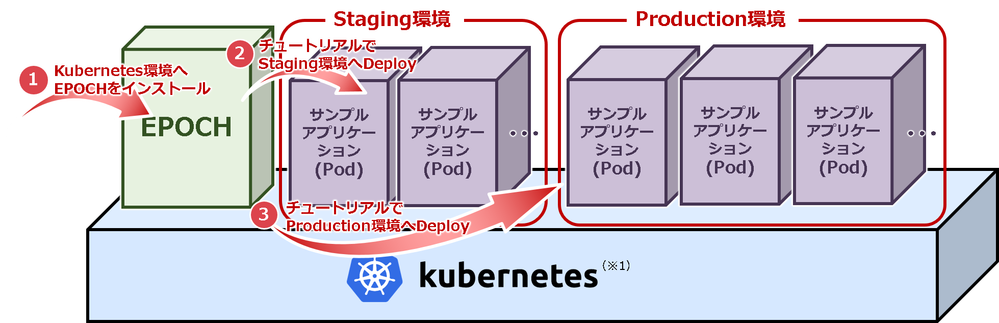{:width="1959" height="633"}

（※1）本クイックスタートでは手順を簡素化するため1つのKubernetesクラスタ上で構成します。

### QuickStartを実施するPC環境ついて

QuickStartの手順を実施するにあたってのPCのソフトウェアは以下の通りです。

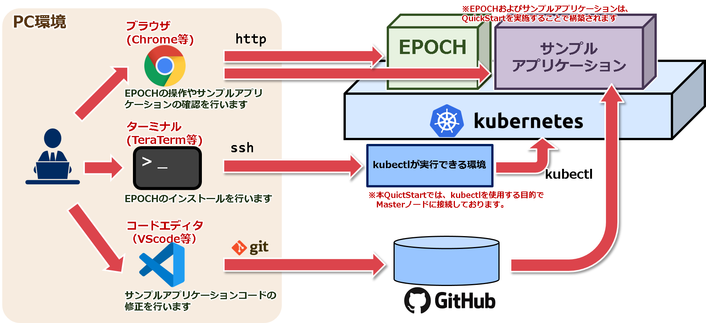{:width="1864" height="855"}


#### 前提条件
##### 環境

- Kubernetes環境が構築されていること
- PC環境から外部インターネットに接続できること
- PC環境にGit for Windowsがインストールされていること

##### アカウント

- アプリケーションコードを登録するGitHubのアカウントが準備されていること
- Kubernetes Manifestを登録するGitHubのアカウントが準備されていること
- コンテナイメージを登録するDockerHubのアカウントが準備されていること


#### EPOCHインストール

[Learn 導入手順 Install編の手順](../installation_guide/installation_guide_ja.html)でインストールを実施します。

### リポジトリ準備
#### 使用するリポジトリについて
##### 本クイックスタートで使用するリポジトリは以下の通り

- アプリケーションコード用リポジトリ
- IaC用リポジトリ(Staging環境用)
- IaC用リポジトリ(Production環境用)

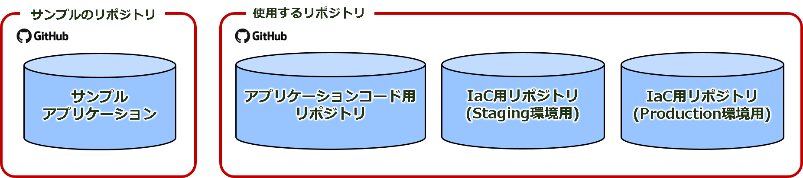{:width="1889" height="541"}


#### アプリケーションコード用リポジトリの準備

サンプルアプリケーションのリポジトリをforkして使用します。

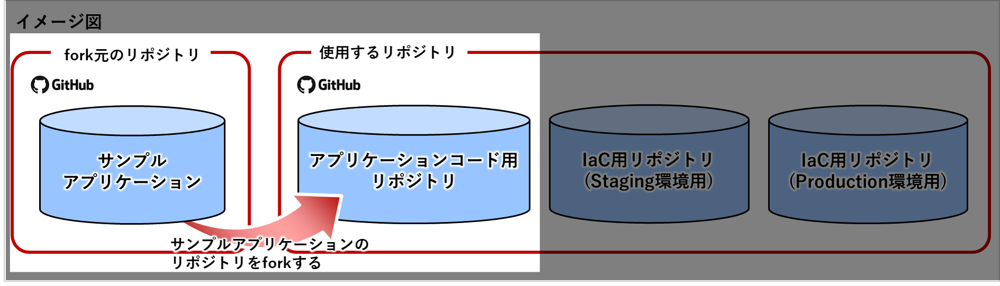{:width="1889" height="541"}

##### ブラウザにてサンプルアプリケーションのURLを表示する

[https://github.com/exastro-suite/epoch-sample-app](https://github.com/exastro-suite/epoch-sample-app)


##### サンプルアプリケーションの画面から「Fork」を押下して、アプリケーションコード用リポジトリを作成する

{:width="1868" height="411"}


「Fork」押下後にGitHubのサインインを求められたときはご自身のGitHubアカウントでサインインしてください。

##### アプリケーションコード用リポジトリをcloneする
アプリケーションコード用リポジトリをPC環境にcloneします。
例としてコマンドプロンプトでは、以下の通りとなります。

```
cd "[clone先のフォルダ]"
git clone https://github.com/[Githubのアカウント名]/epoch-sample-app.git
cd epoch-sample-app
git config user.name "[GitHubのユーザ名]"
git config user.email "[GitHubのemailアドレス]"
```
{: .line .g}

ここでcloneしたローカルリポジトリを使って、チュートリアルを行います。


#### IaCリポジトリの準備

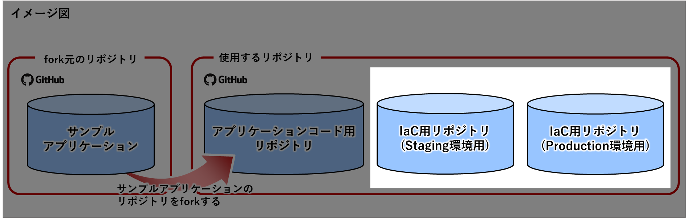{:width="1889" height="603"}

##### Manifestを格納するGitリポジトリを２つ用意

1. ブラウザにて自身のGitHubのアカウントでGitHubにサインインします。
2. アカウントメニューから「Your Repositries」を選択します。
3. 「New」を押下、以下の値を入力し「Create repositry」を押下します。

- Repositry name
   - epoch-sample-staging-manifest
   - epoch-sample-production-manifest


{:width="1442" height="651"}

#### 使用するリポジトリができたことを確認

自身のGitHubのアカウントに以下の3つのリポジトリが作成されたことを確認します。
- epoch-sample-app
- epoch-sample-staging-manifest
- epoch-sample-production-manifest

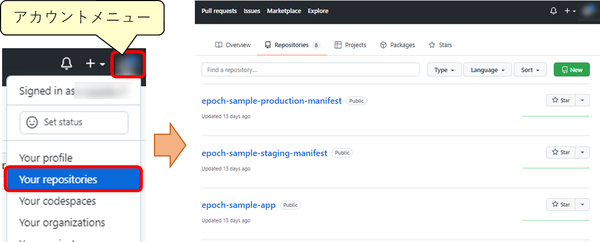{:width="1130" height="457"}


#### Gitトークンの払い出し

後述する[チュートリアル（アプリケーションコードリポジトリの登録）](#アプリケーションコードリポジトリ)で使用するため、   Gitトークンの払い出しを行います。

1. ブラウザにて自身のGitHubのアカウントでGitHubにサインインします。
2. アカウントメニューから「Settings」を選択します。
3. Account settings画面から「Developer settings」を選択します。
4. Developer settings画面から「Personal access tokens」を選択し、「Generate new token」ボタンを押下します。
5. New personal access token画面でNote（任意の名称）、Select scopesを全て選択し「Generate token」ボタンを押下します。
6. 表示されたトークン (ghp_***) を後に使用しますので控えてください。

{:width="1912" height="513"}


### Manifestテンプレートファイルの準備
#### Manifestテンプレートファイルのダウンロード

EPOCHにアップロードする2つのManifestテンプレートファイル（「api-app.yaml」と「ui-app.yaml」）をダウンロードします。

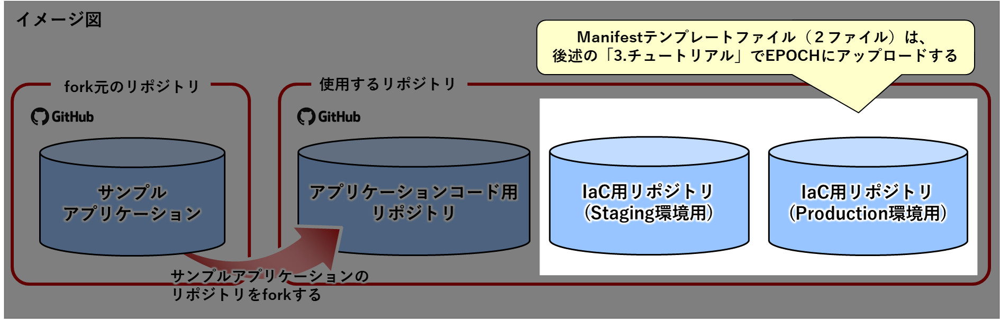{:width="1890" height="603"}


##### ブラウザで以下のURLを表示する

- ファイル1：
 [https://raw.githubusercontent.com/exastro-suite/epoch-sample-app/master/manifest-template/api-app.yaml](https://raw.githubusercontent.com/exastro-suite/epoch-sample-app/master/manifest-template/api-app.yaml)
- ファイル2：
 [https://raw.githubusercontent.com/exastro-suite/epoch-sample-app/master/manifest-template/ui-app.yaml](https://raw.githubusercontent.com/exastro-suite/epoch-sample-app/master/manifest-template/ui-app.yaml)

##### ブラウザに表示されたManifestテンプレートを操作しているPCに保存する

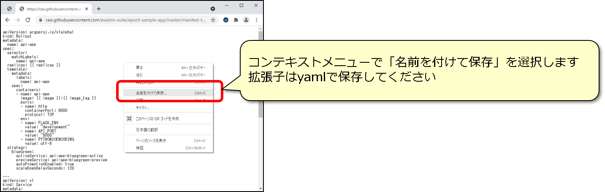{:width="1433" height="456"}

##### IaC 用リポジトリとダウンロードする Manifest の関係

- ダウンロードしたManifestテンプレートファイルは、環境差異の部分をパラメーター化しています。
- EPOCH にて環境ごとの値をパラメーターに設定、 IaC リポジトリに commit & pushします。
（後述する[Manifestパラメータ入力](#manifestパラメータ入力)で実際に設定します。）

{:width="1705" height="839"}

後述する[チュートリアル](#チュートリアル)では5つのパラメータを編集していきます。
編集対象となるパラメータは[Manifestテンプレートファイルについて](#manifestテンプレートファイルについて)を参照ください。


以上で事前準備は完了しました  
ワークスペース作成へ進みましょう！
{: .check}

## ワークスペース作成

ワークスペースを作成し、CI/CDの準備をしましょう。

### ワークスペース
#### ワークスペース

EPOCHでは、１つの開発環境をワークスペースという単位で管理します。  
ワークスペース作成では、画面から入力された情報をもとに、各アプリケーションへ必要な情報を登録し、CI/CDの準備を行ないます。

{:width="1702" height="717"}

### CI/CDについて
#### CI/CDとは

アプリケーションの開発～リリースまでの一連の作業を自動化し、アプリケーション提供の頻度を高める手法です。

##### CI（継続的インテグレーション）

アプリケーションコードの変更を起点に、ビルドやテストの実行といった開発者の作業を自動化する手法を指します。

##### CD（継続的デリバリー）

実行環境へのリリースまでを自動化する手法を指します。

##### CI/CDのイメージ

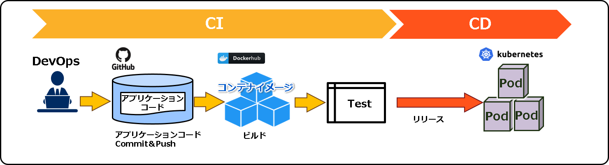{:width="1480" height="404"}

DevOpsとは、ソフトウェアの開発担当と導入・運用担当が密接に協力する体制を構築し、ソフトウェアの導入や更新を迅速に進めること。  
“Development”（開発）と“Operations”（運用）の略語を組み合わせた造語。  
出典：[IT用語辞典](https://e-words.jp/w/DevOps.html)
{: .info}

### EPOCHのCI/CD
#### EPOCHのCI/CD

EPOCHのCI/CDの流れを、下図に示します。    
本QuickStartでは、「staging環境」と「production環境」の2つの環境を使用します。

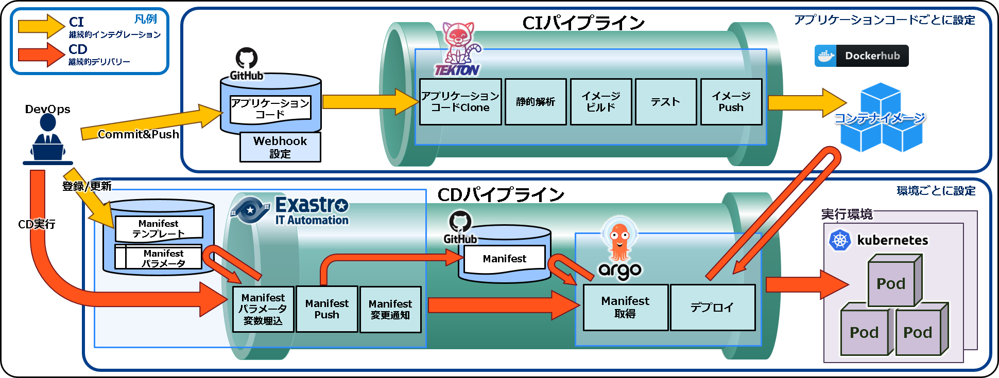{:width="1940" height="735"}

※1：「Staging環境」or「Production環境」を選択して実行（後述する[Staging環境へのDeploy実行](#staging環境へのdeploy実行)および[Production環境へのDeploy実行](#production環境へのdeploy実行)）  
※2：選択した環境に沿ったパラメータをテンプレートにセット  
※3：テンプレートに環境ごとのパラメータをセットしたもの  
※4：実行環境（StagingまたはProduction
）へデプロイ


### EPOCH起動
#### ブラウザで以下のURLに接続する

```
https://[インストール先のIPアドレスまたはホスト名]:30443/
```

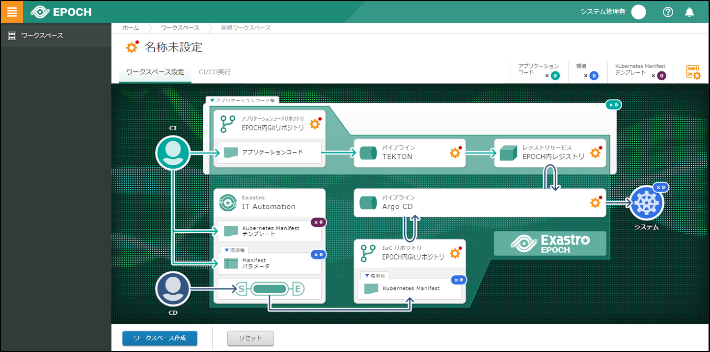{:width="1446" height="680"}

画面右上のアイコンを押下し、新しいワークスペースを作製します。
{: .check}

### ワークスペース作成
#### ワークスペース基本情報

ワークスペース名を入力します。

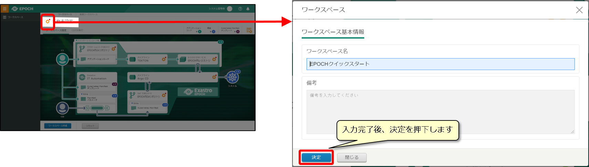{:width="1819" height="487"}

| 項目 | 入力・選択内容 | 説明 |
| --- | --- | --- |
| ワークスペース名 | EPOCHクイックスタート | 作成するワークスペース名 |
| 備考 | なし | 作成するワークスペースの説明や備考 |

#### アプリケーションコードリポジトリ

アプリケーションコードリポジトリの情報を入力します。

{:width="1478" height="777"}

| 項目 | 入力・選択内容 | 説明 |
| --- | --- | --- |
| ユーザ名 | (自身のGitHubのアカウント名) | GitHubのアカウント名 |
| トークン | (自身のGitHubのトークン) | GitHubのトークン<br>（事前準備 Gitトークンの払い出しを参照） |
| GitリポジトリURL | https://github.com/_\[GitHubのアカウント名]_/epoch-sample-app.git | アプリケーションコードをforkしたリポジトリのURL |
{: .row-h1}

#### パイプラインTEKTON

TEKTONに設定するパイプライン情報を入力します。

{:width="1183" height="516"}

| 項目 | 入力・選択内容 | 説明 |
| --- | --- | --- |
| ビルドブランチ | main,master | ビルド対象のアプリケーションのGitHubのブランチ |
| ビルドDockerファイルパス | ./api-app/Dockerfile | アプリケーションのDockerfileのパス |

#### レジストリサービス

ビルド後のイメージ登録先（レジストリ）情報を入力します。

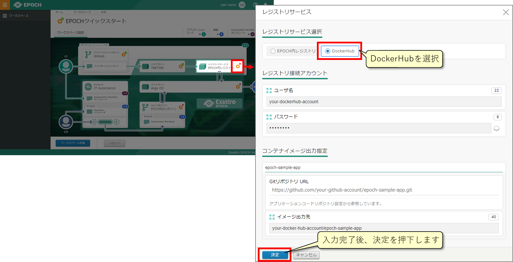{:width="1771" height="905"}

| 項目 | 入力・選択内容 | 説明 |
| --- | --- | --- |
| ユーザ名 | （自身のDockerHubのアカウント名） | DockerHubのアカウント名 |
| パスワード | （自身のDockerHubのパスワード） | DockerHubのパスワード |
| イメージ出力先 | _\[DockerHubのアカウント名]_/epoch-sample-**api**<br>_※ユーザ名入力後に表示される内容を修正してください。_ | DockerHubのイメージ出力先のパス |

#### パイプラインArgo CD

ArgoCDに設定するDeploy先の情報を入力します。

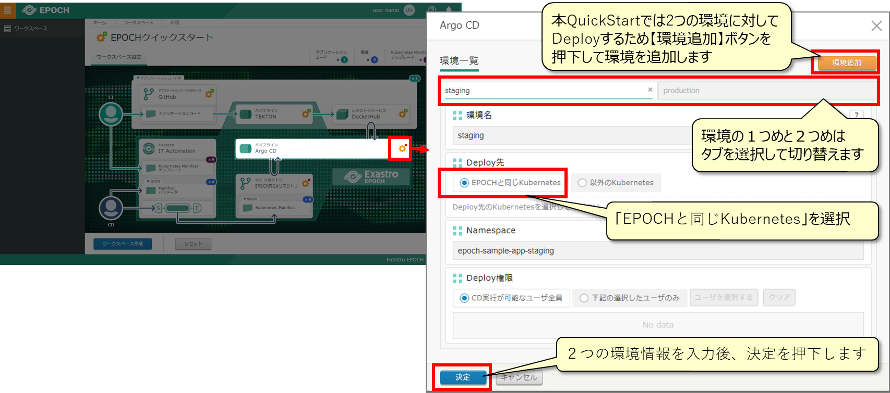{:width="1706" height="755"}

#####  環境1：Staging環境

| 項目 | 入力・選択内容 | 説明 |
| --- | --- | --- |
| 環境名 | staging | デプロイ環境の名前 |
| Namespace | epoch-sample-app-staging | デプロイ先のNamespace |

##### 環境2：Production環境

| 項目 | 入力・選択内容 | 説明 |
| --- | --- | --- |
| 環境名 | production | デプロイ環境の名前 |
| Namespace | epoch-sample-app-production | デプロイ先のNamespace |

#### IaCリポジトリ

マニフェストの登録先となるリポジトリ情報を入力します。

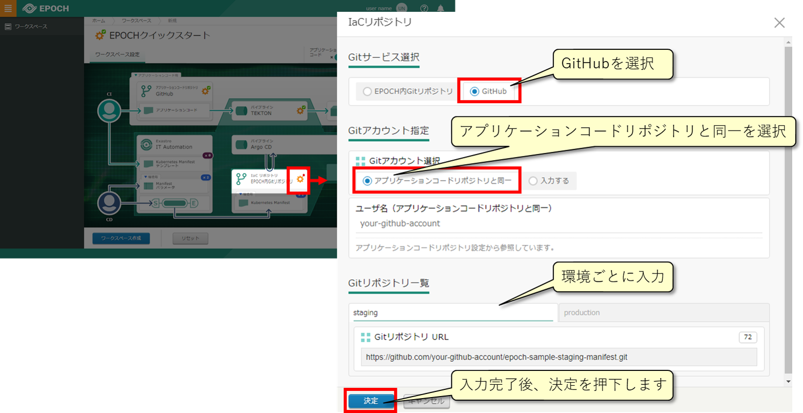{:width="1564" height="805"}

| 項目 | 入力・選択内容 | 説明 |
| --- | --- | --- |
| GitリポジトリURL | https://github.com/_\[GitHubのアカウント名]_/_\[各環境のリポジトリ]_.git | 各環境のmanifestリポジトリのURL<br>（事前準備 IaC用リポジトリの準備を参照） |

#### ワークスペース作成

すべての入力が完了しましたら【ワークスペース作成】ボタンを押下します。

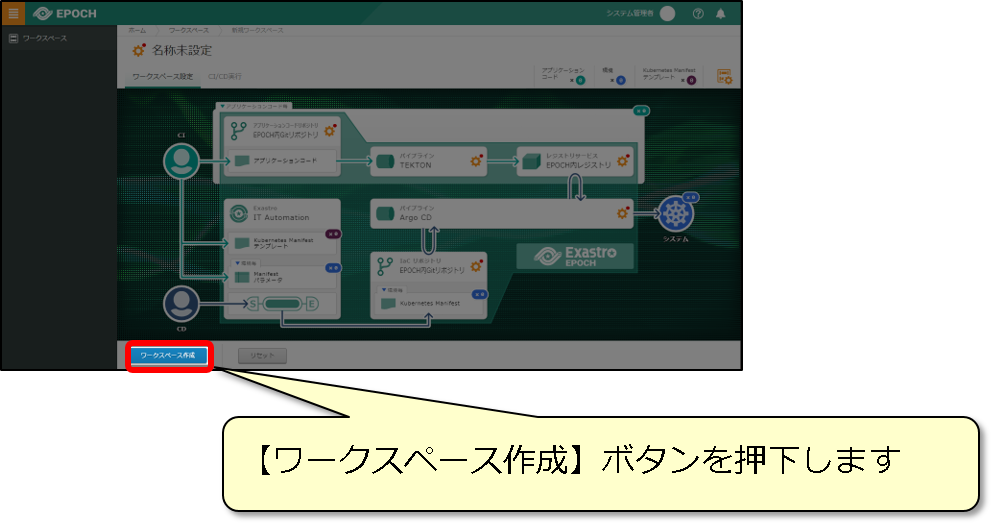{:width="993" height="525"}

これでCI/CDパイプラインが構築されました  
チュートリアルを実践してCI/CDパイプラインを体験してみましょう！
{: .check}

## チュートリアル

CI/CDの流れを体験してみましょう。

### チュートリアルの概要

#### CI/CD開発シナリオ

チュートリアルでは以下のシナリオに沿って、CI/CDの手順を実施していきます。
本QuickStartで作成するECサイトは、サンプルアプリケーションを用いてコード修正からデプロイまで実施していきます。

{:width="1936" height="1013"}


{:width="1932" height="992"}


### サンプルアプリの構成
#### サンプルアプリの構成

サンプルアプリケーションは、UIとAPIの2つで構成されております。

{:width="1940" height="860"}


### チュートリアルの流れ
#### CI/CDの流れ

本説明では、サンプルアプリケーションをStaging環境、Production環境へDeploy、その後アプリケーションコードの修正
を行い、Staging環境、Production環境へのDeployする手順を説明していきます。

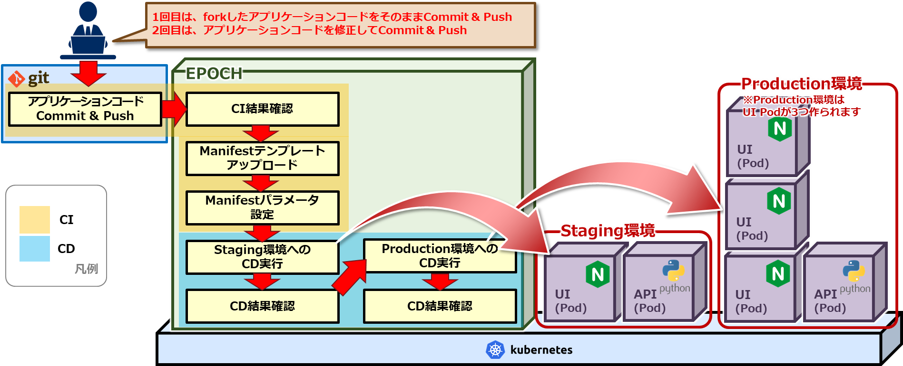{:width="1898" height="771"}


### Manifestテンプレートファイルについて
#### Manifestテンプレートファイル

サンプルアプリケーションのManifestテンプレートファイルは、UIとAPI用の2つが用意されています。
環境一致を考慮した上での可変部分を変数化したテンプレート形式となっています。
可変部分は後述する[Manifestパラメータ](#manifestパラメータ)で値を設定します。

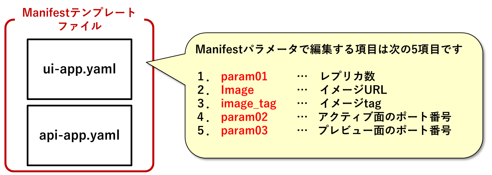{:width="1454" height="518"}

※変数名は、image、image_tag、param01~param20で設定できます。

それでは1回目のCI/CDの手順を実行してみましょう！
{: .check}

### 1回目のCI/CDの流れ
#### Staging環境へのDeploy

1回目のCI/CDの流れとして、アプリケーションコードのCommit＆PushからStaging環境へのDeploy、CD結果確認までの手順は以下の通りとなります。


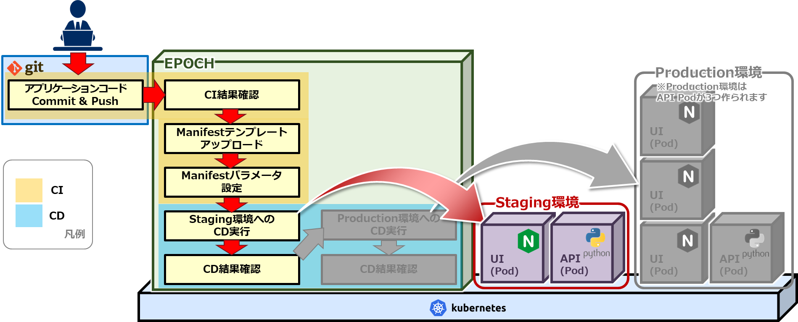{:width="1940" height="835"}


#### アプリケーションコード Commit & Push

git commit & push により 初回デプロイするコンテナイメージを作るための CI パイプラインを実行します。

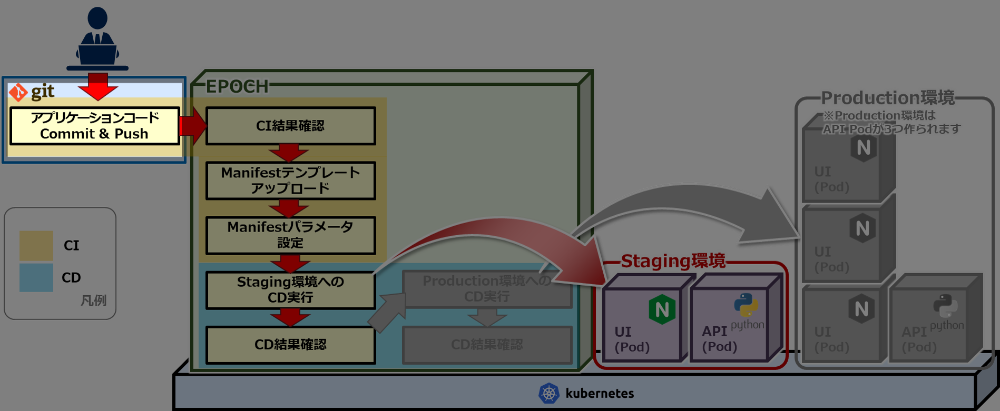{:width="1898" height="780"}


##### PC環境にcloneしたアプリケーションコード用リポジトリでCommit & Pushする

例としてコマンドプロンプトでは、以下の通りとなります。
```
cd "[clone先のフォルダ]"
cd epoch-sample-app
echo "first build" > dummy.txt
git add .
git commit -m "first build"
git push origin master
```
{: .line .g}

※ git push時に認証情報を求められた場合は、自身のGitHubアカウント情報を入力してください。

Pushが完了すると、パイプラインTEKTONで設定されたCIパイプラインが自動的に動き出します。

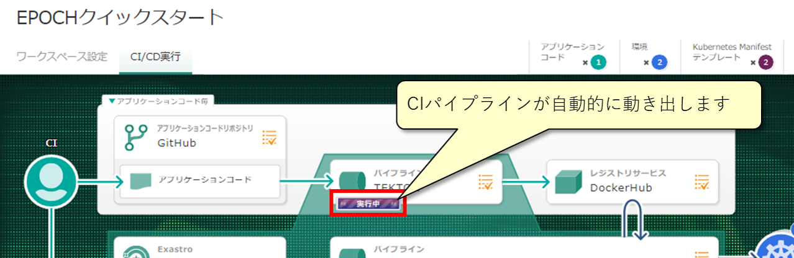{:width="1278" height="416"}

　CIパイプラインの結果を確認していきましょう
{: .check}


#### CI/CD実行画面の表示
ワークスペース画面のCI/CD実行タブを選択し、CI/CD実行画面を表示します。

{:width="1655" height="933"}


 【POINT】  
 ・高速開発に必要なCI/CD環境を一元的に提供する  
 ・アプリケーションコードのコミット＆プッシュだけで、CI/CDパイプラインを実行可能（GitOps）
{: .info}

#### CI結果確認

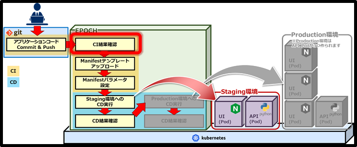{:width="1898" height="780"}

##### アプリケーションコードのビルド結果を確認

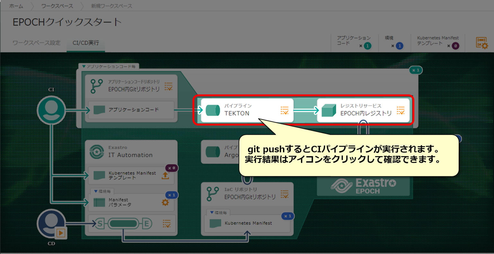{:width="1940" height="980"}

それでは実際にCI結果を確認してみましょう
{: .check}

#### パイプラインTEKTONの結果確認
##### TEKTONのパイプラインを実際に確認し、ビルドが正常に終了したか確認する

{:width="1879" height="771"}

【POINT】  
・CI/CDのステータスを各CI/CDツールを介さずに一括で確認可能  
・スムーズな状況確認・DevOpsを実施
{: .info}

#### コンテナイメージのタグ名の確認
##### レジストリサービスの画面を開き、ビルドしたコンテナイメージのTagを確認する

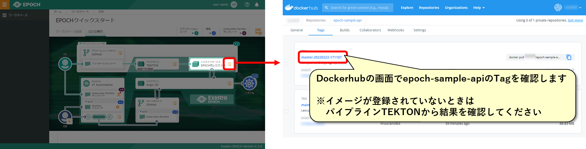{:width="1826" height="466"}


ここで確認したイメージのTagは、次の手順で,
Manifestパラメータ(api-app.yamlのimage_tag)に手入力が必要になるため控えておいてください
{: .warning}


※今後、パイプラインで生成されたimage_tagは選択できるように変更する予定です


#### Manifestテンプレートアップロード

{:width="1898" height="780"}

##### ダウンロードしたManifestテンプレートをアップロードする

{:width="1656" height="935"}


##### Manifestテンプレートファイルの準備でダウンロードしたManifestテンプレートファイルをアップロードする

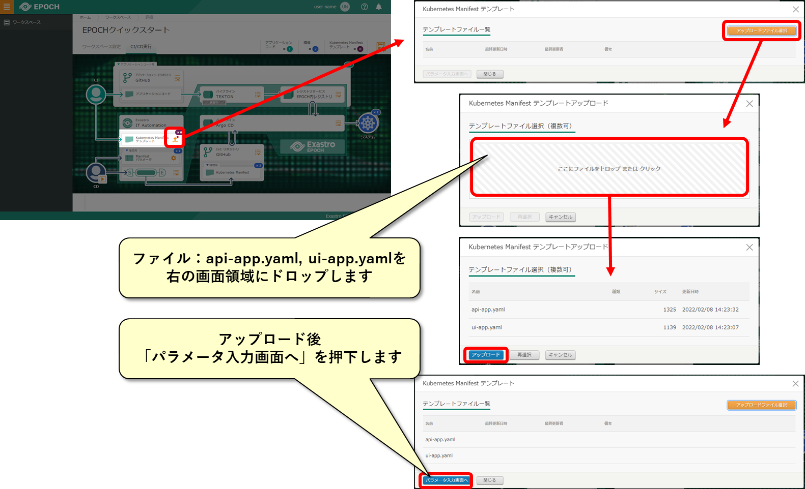{:width="1581" height="962"}


#### Manifestパラメータ

{:width="1898" height="780"}


##### Deployに必要なManifestパラメータを入力

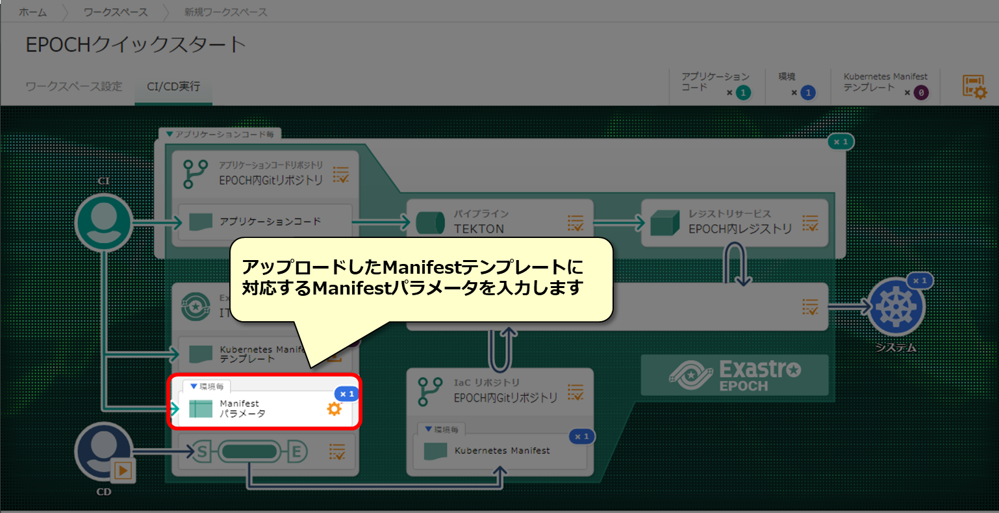{:width="1940" height="1000"}


#### Manifestパラメータ入力
##### 入力内容に従って、Manifestパラメータを入力

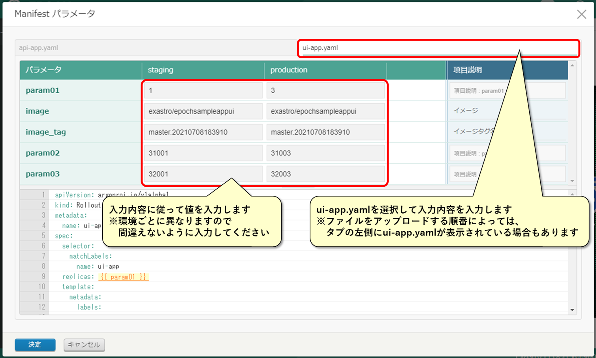{:width="1509" height="907"}

###### ui-app.yaml

| 項目 | 入力内容(staging) |入力内容(production)| 説明 |
| --- | --- | --- | --- |
| \{\{ param01 \}\} | 1 | 3 | レプリカ数 |
| \{\{ image \}\}  | exastro/epochsampleappui | exastro/epochsampleappui | コンテナイメージ |
| \{\{ image_tag \}\} | master.20210708183910 | master.20210708183910 | コンテナイメージのタグ |
| \{\{ param02 \}\} | 31001 | 31003 | ブルーグリーンデプロイ用のブルー面のポート番号 |
| \{\{ param03 \}\} | 32001 | 32003 | ブルーグリーンデプロイ用のグリーン面のポート番号 |

※ui-app.yamlのimage_tagは事前にビルドしたコンテナイメージのものを使用しています。  
※今後、image、image_tagの入力については選択項目に変更する予定です。

【POINT】  
・宣言的IaCの環境依存パラメータをシステム上で管理  
・CD時に自動的にパラメータ反映したIaCをコミットする
{: .info}


##### タブを切り替えてapi-app.yamlにも入力する

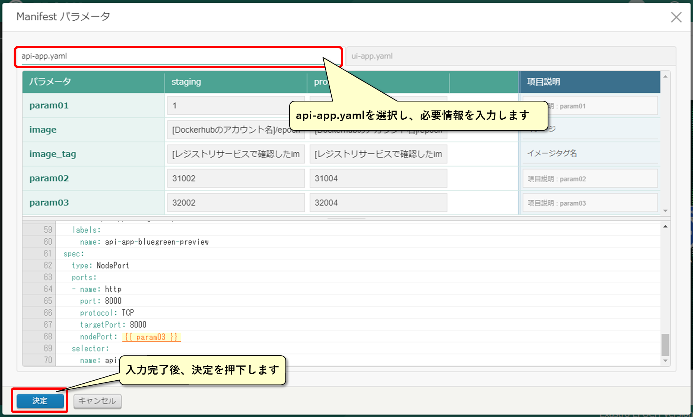{:width="1826" height="1101"}

###### api-app.yaml

| 項目 | 入力内容(staging) |入力内容(production)| 説明 |
| --- | --- | --- | --- |
| \{\{ param01 \}\} | 1 | 1 | レプリカ数 |
| \{\{ image \}\} | [Dockerhubのアカウント名]/epoch-sample-api | [Dockerhubのアカウント名]/epoch-sample-api | コンテナイメージ |
| \{\{ image_tag \}\} | [レジストリサービスで確認したimageのタグ名] | [レジストリサービスで確認したimageのタグ名] | コンテナイメージのタグ |
| \{\{ param02 \}\}  | 31002 | 31004 | ブルーグリーンデプロイ用のブルー面のポート番号 |
| \{\{ param03 \}\}  | 32002 | 32004 | ブルーグリーンデプロイ用のグリーン面のポート番号|

#### Staging環境へのCD実行

{:width="1898" height="780"}
##### CD実行で、Staging環境へDeployを実行

{:width="1182" height="669"}

##### Deploy先の環境を選択して実行する

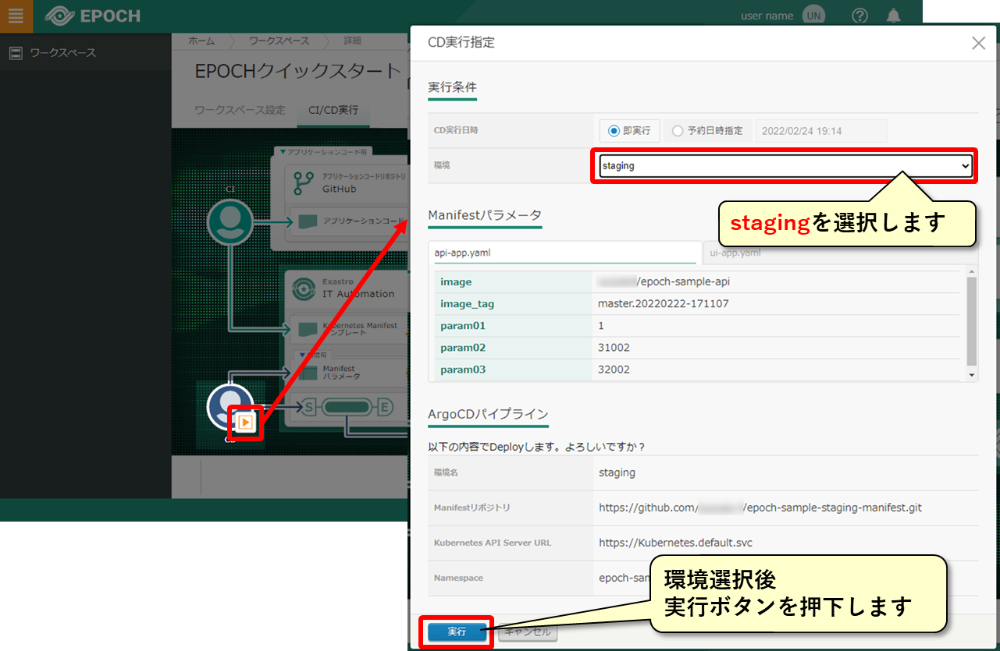{:width="1281" height="834"}


Staging環境へのCD実行が完了しました  
CD実行結果を確認してみましょう
{: .check}


#### Staging環境のCD結果確認

{:width="1940" height="800"}

##### CDの実行結果をExastro IT-Automation、ArgoCDより確認

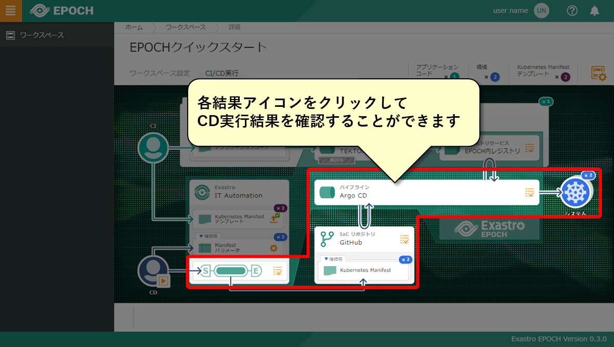{:width="1181" height="669"}

##### CD の流れは以下の通り

-  IT-Automation
   - manifestのパラメータ部分に[Manifestパラメータ入力](#manifestパラメータ入力)で入力した環境ごとの値をセットしたmanifest (IaC) を生成
   - github へ commit & push

-  ArgoCD
   - IaC をもとにしてデプロイ

##### 各ツールのログインに必要なユーザ情報を確認
CDの実行結果は、Exastro IT-Automation、ArgoCDより確認できます。
###### 以下のコマンドを実行する

```
kubectl exec -it -n epoch-system deploy/workspace-db -- mysql -N -B -u root -ppassword workspace_db -e'select workspace_id, info from workspace_access\G;'
```
{: .line .g}

以降、必要に応じて以下の情報を用い各ツールにログインします。

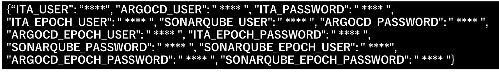{:width="1779" height="261"}


#### Manifestファイルの生成確認(Staging環境)
##### Exastro IT-Automationから、IaCリポジトリへManifestファイルを登録するまでの状況を確認

###### IT-Automationにログインして状況を確認

[前述のコマンド](#各ツールのユーザ情報を確認)で表示した"ITA_EPOCH_USER","ITA_EPOCH_PASSWORD"の内容で、IT-Automationにログインします。

{:width="1779" height="261"}

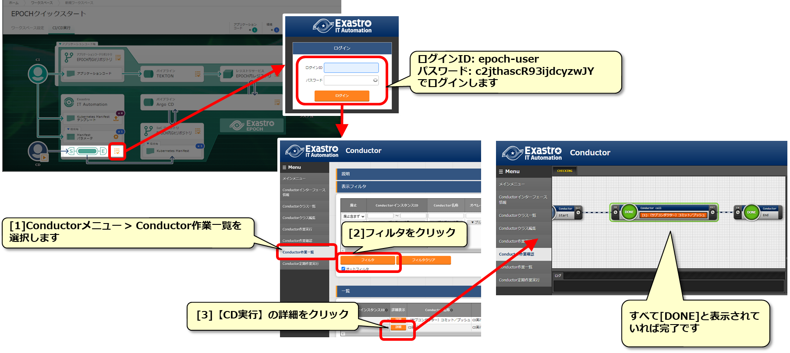{:width="1755" height="991"}


#### パイプラインArgoCDの結果確認(Staging環境)
##### Manifestがkubernetesに反映されるまでの状況を確認

###### ArgoCDにサインインして状況を確認

[前述のコマンド](#各ツールのユーザ情報を確認)で表示した"ARGOCD_USER","ARGOCD_PASSWORD"の内容で、ArgoCDにサインインします。

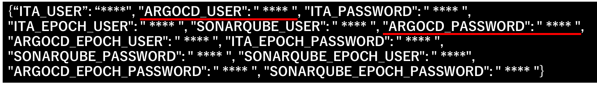{:width="1779" height="261"}

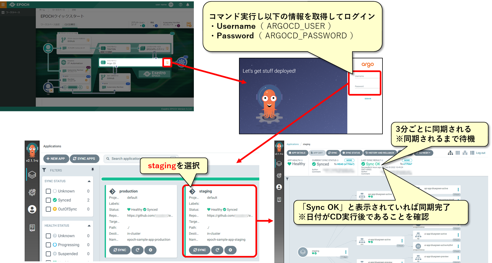{:width="1797" height="960"}


設定値に誤りがある場合、以下のようなアイコンが表示されます。
{: .warning}

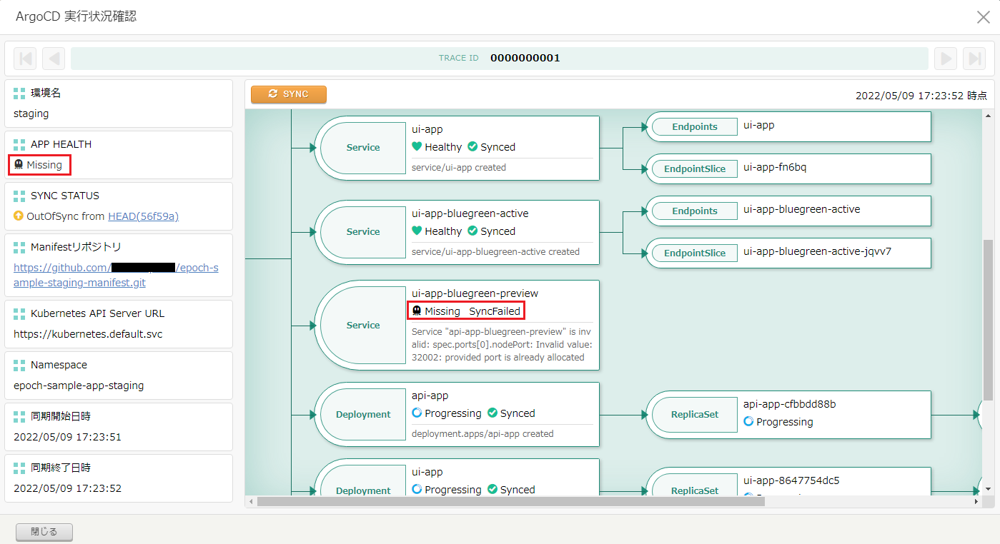{:width="1940" height="1100"}


Deployされたサンプルアプリケーションを確認してみましょう
{: .check}


#### Staging環境のサンプルアプリケーション確認
##### ブラウザで以下のURLに接続し、デプロイしたサンプルアプリケーションを表示する

```
http://[Kubernetes masterノードのIPアドレスまたはホスト名]:31001/front-end.html
```

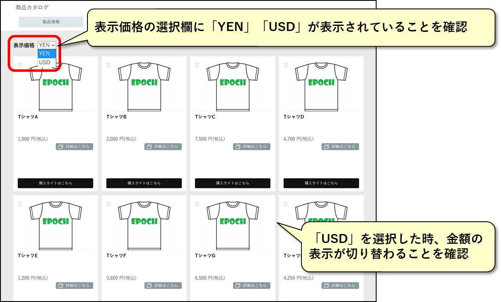{:width="1180" height="711"}


続いてProduction環境へDeployしてみましょう
{: .check}


#### Production環境へのDeploy
Staging環境へDeploy後、以下の内容でProduction環境へDeployします。

{:width="1940" height="800"}


#### Production環境へのCD実行

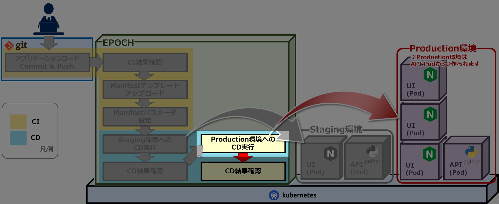{:width="1898" height="780"}

##### CD実行で、Production環境へDeployを実行する

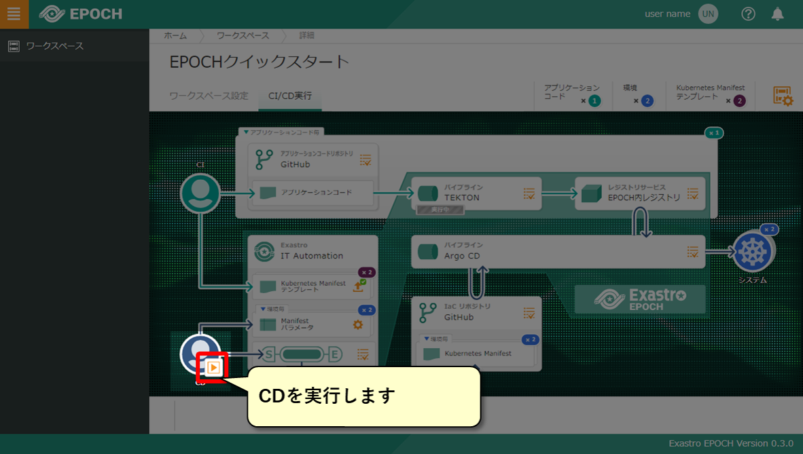{:width="1182" height="669"}


##### Deploy先の環境を選択して実行

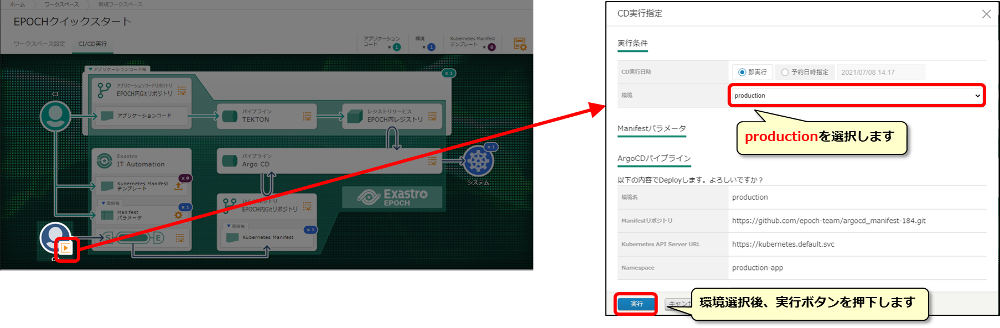{:width="1281" height="835"}

Production環境へのCD実行が完了しました  
CD実行結果を確認してみましょう
{: .check}


#### Production環境のCD結果確認

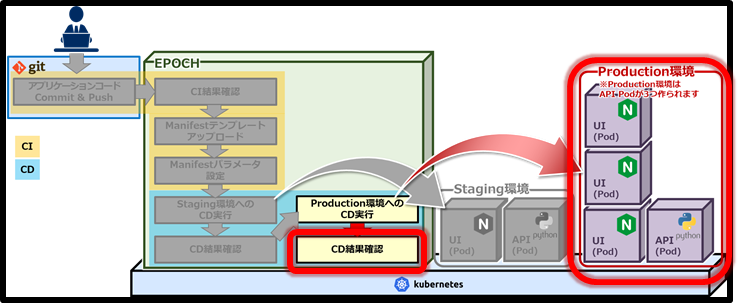{:width="1940" height="800"}

##### CDの実行結果をExastro IT-Automation、ArgoCDより確認

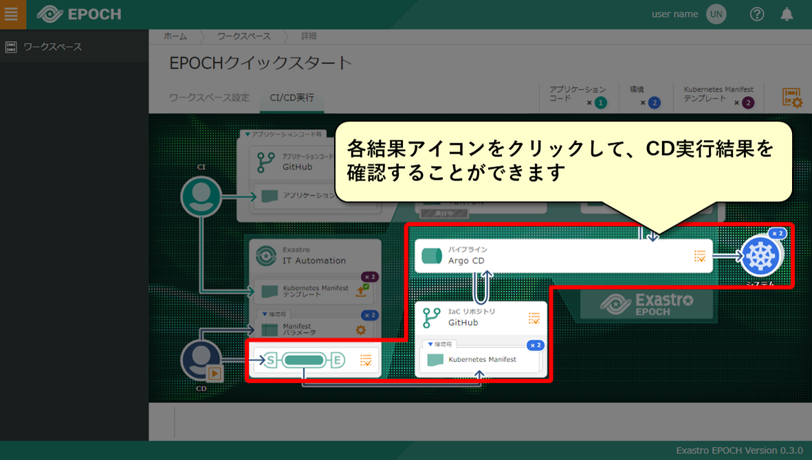{:width="1940" height="1000"}


#### Manifestファイルの生成確認(Production環境)

##### Exastro IT-Automationから、IaCリポジトリへManifestファイルを登録するまでの状況を確認

###### IT-Automationにログインして状況を確認

[前述のコマンド](#各ツールのユーザ情報を確認)で表示した"ITA_EPOCH_USER","ITA_EPOCH_PASSWORD"の内容で、IT-Automationにログインします。

{:width="1779" height="261"}

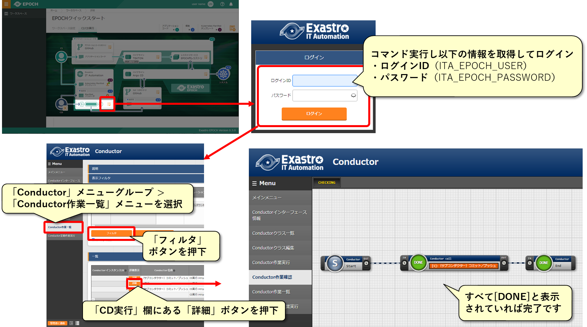{:width="1755" height="980"}


#### パイプラインArgoCDの結果確認(Production環境)

##### Manifestがkubernetesに反映されるまでの状況を確認

###### ArgoCDにサインインして状況を確認

[前述のコマンド](#各ツールのユーザ情報を確認)で表示した"ARGOCD_USER","ARGOCD_PASSWORD"の内容で、ArgoCDにサインインします。

{:width="1779" height="261"}

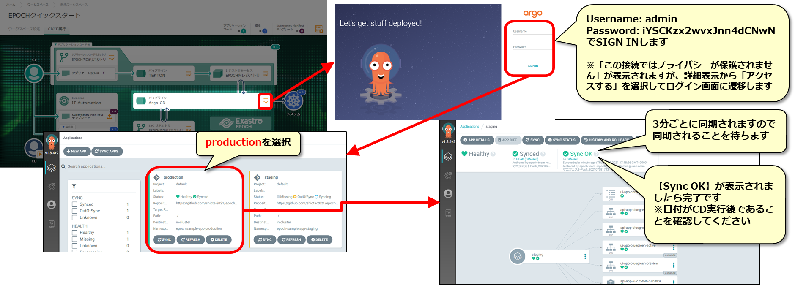{:width="1788" height="953"}


Deployされたサンプルアプリケーションを確認してみましょう
{: .check}

#### Production環境のサンプルアプリケーション確認
##### ブラウザで以下のURLに接続し、デプロイしたサンプルアプリケーションを表示する

```
http://[Kubernetes masterノードのIPアドレスまたはホスト名]:31003/front-end.html
```

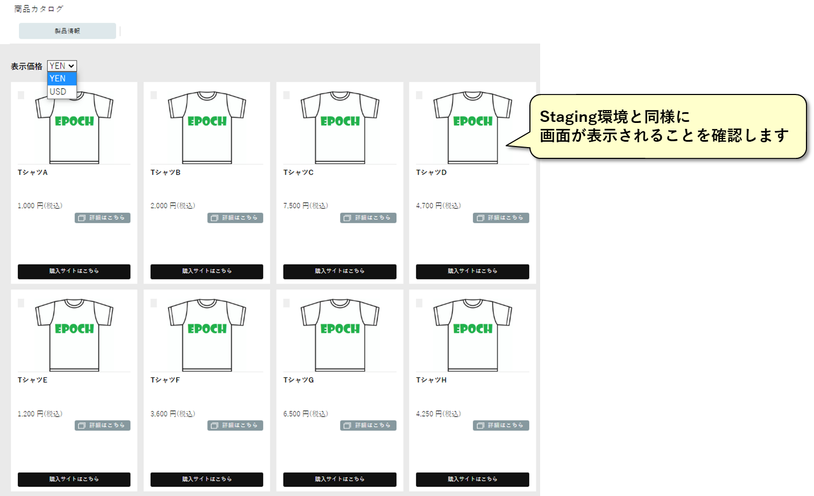{:width="1513" height="924"}


1回目のCI/CDの流れはここで完了です  
続いて実際にアプリケーションコードを修正しDeployされるまでの2回目のCI/CDの流れを実行してみましょう！
{: .check}


### 2回目のCI/CDの流れ

#### Staging環境へのDeploy
2回目のCI/CDの流れとして、アプリケーションコードを修正してCommit＆PushからStaging環境へのDeploy、CD結果確認までの手順を説明します。


{:width="1940" height="800"}


#### アプリケーションコードの修正

アプリケーションコードを修正して、2回目のCI/CDを実行していきます。
チュートリアルでは、画面に通貨（ユーロ）の表示追加を行います。

PC環境にcloneしたアプリケーションコード用リポジトリの、以下のファイルをコードエディタで修正します。

##### 修正対象①：api-app/data/currency.json
```js
    "USD": {
        "symbol"    :   "$",
        "formatter" :   "{symbol} {price:,.2f} (Tax Included)"
    },
    "EUR": {
        "symbol"    :   "€",
        "formatter" :   "{symbol} {price:,.2f}"
    }
}
```
{: .line .g}

{:width="1298" height="504"}


##### 修正対象②：api-app/data/rate.json
```js
{
    "USD": 110.56,
    "EUR": 134.15
}
```
{: .line .g}

{:width="1298" height="191"}


#### アプリケーションコード Commit & Push
修正した内容をCommit&Pushします。

{:width="1940" height="800"}

例としてコマンドプロンプトでは、以下の通りとなります。
```
cd "[clone先のフォルダ]"
cd epoch-sample-app
git add .
git commit -m "通貨追加(EUR)"
git push origin master
```
{: .line .g}

※ git push時に認証情報を求められた場合は、自身のGitHubアカウント情報を入力してください。


#### CI結果確認

{:width="1898" height="780"}

##### アプリケーションコードのビルド結果を確認

{:width="1648" height="931"}


#### パイプラインTEKTONの結果確認
##### TEKTONのパイプラインを実際に確認し、ビルドが正常に終了したか確認する

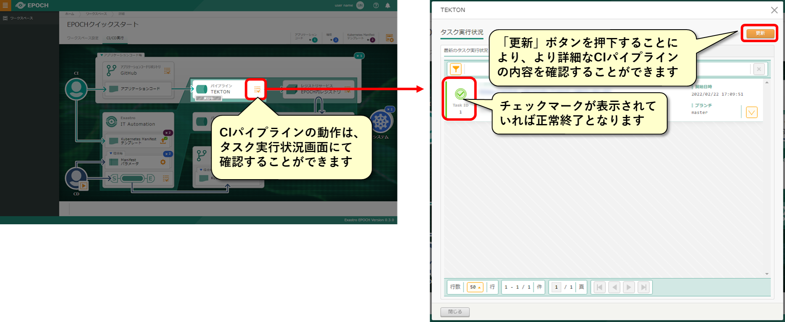{:width="1880" height="771"}


#### コンテナイメージのタグ名の確認
##### レジストリサービスの画面を開き、ビルドしたコンテナイメージのTagを確認する

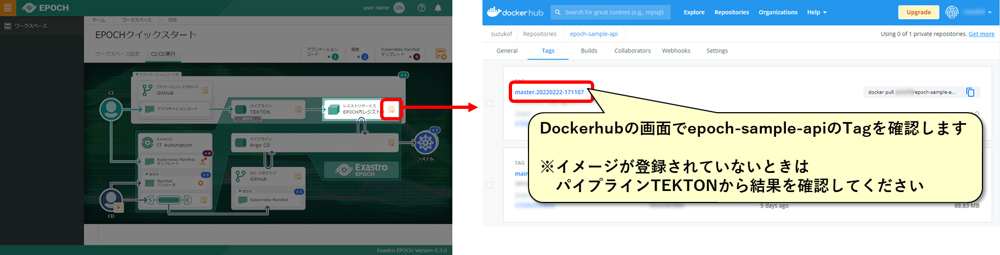{:width="1826" height="466"}

ここで確認したイメージのTagは、次の手順で,
Manifestパラメータ(api-app.yamlのimage_tag)に手入力が必要になるため控えておいてください
{: .warning}

※今後、パイプラインで生成されたimage_tagは選択できるように変更する予定です

#### Manifestパラメータ設定
#####  Manifestパラメータの設定のイメージタグを更新する

{:width="1898" height="780"}

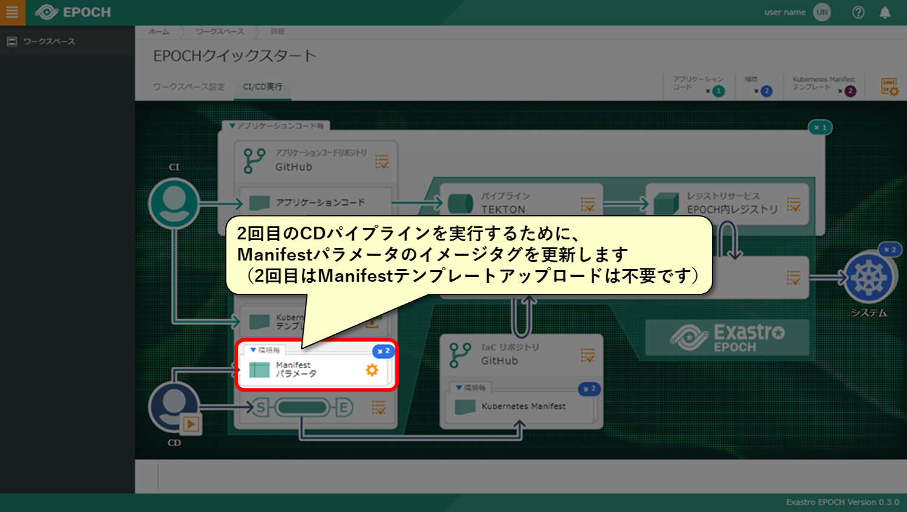{:width="1499" height="847"}


#### Manifestパラメータ(image_tag)の修正
##### Manifestパラメータで、staging, production環境のイメージのタグ名を修正する

{:width="1717" height="532"}

###### api-app.yaml

| 項目 | 入力内容(staging) |入力内容(production)| 説明 |
| --- | --- | --- | --- |
| \{\{  image_tag \}\} | [レジストリサービスで確認した最新のイメージのタグ名] | [レジストリサービスで確認した最新のイメージのタグ名] | コンテナイメージのタグ |


#### Staging環境へのCD実行
##### CD実行で、実際にStaging環境へDeployする

{:width="1898" height="780"}

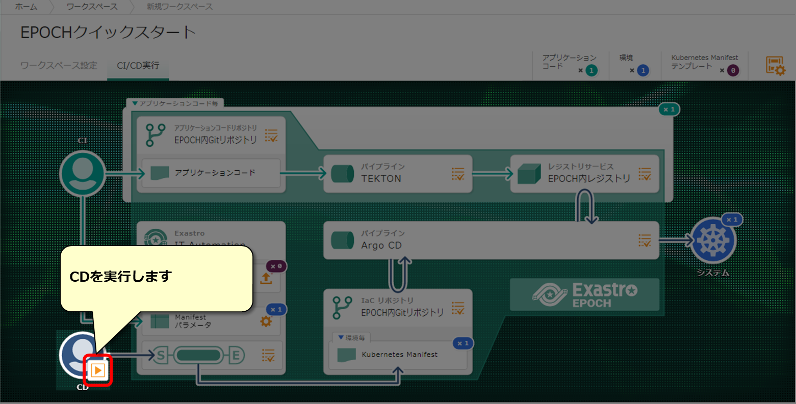{:width="1360" height="767"}


##### Deploy先の環境を選択してDeployを実行

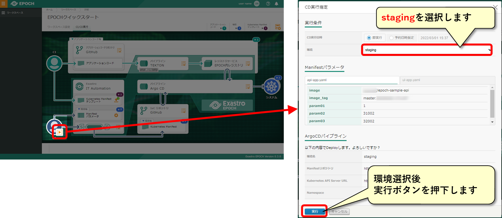{:width="1540" height="671"}


Staging環境へのCD実行が完了しました  
CD実行結果を確認してみましょう
{: .check}


#### Staging環境のCD結果確認

{:width="1940" height="800"}

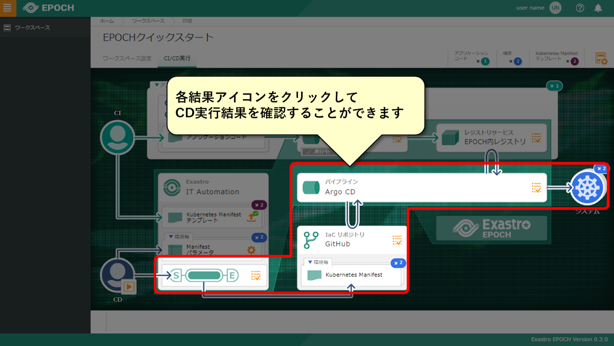{:width="1360" height="768"}


#### Manifestファイルの生成確認(Staging環境)

##### Exastro IT-Automationから、IaCリポジトリへManifestファイルを登録するまでの状況を確認

###### IT-Automationにログインして状況を確認

[前述のコマンド](#各ツールのユーザ情報を確認)で表示した"ITA_EPOCH_USER","ITA_EPOCH_PASSWORD"の内容で、IT-Automationにログインします。

{:width="1779" height="261"}

{:width="1755" height="980"}


#### パイプラインArgoCDの結果確認(Staging環境)

##### Manifestがkubernetesに反映されるまでの状況を確認

###### ArgoCDにサインインして状況を確認

[前述のコマンド](#各ツールのユーザ情報を確認)で表示した"ARGOCD_USER","ARGOCD_PASSWORD"の内容で、ArgoCDにサインインします。

{:width="1779" height="261"}

{:width="1788" height="950"}

Deployされたサンプルアプリケーションを確認してみましょう
{: .check}


#### Staging環境のアプリケーションの確認
##### ブラウザで以下のURLに接続し、デプロイしたサンプルアプリケーションを表示する

```
http://[Kubernetes masterノードのIPアドレスまたはホスト名]:31001/front-end.html
```

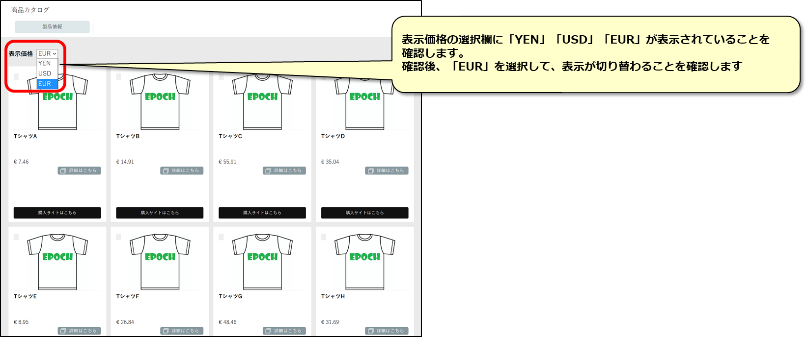{:width="1197" height="704"}


続いてProduction環境へDeployしてみましょう
{: .check}


#### Production環境へのDeploy
Staging環境へDeploy後、Production環境へDeployする流れを説明します。

{:width="1940" height="780"}


#### Production環境へのCD実行
##### CD実行で、実際にProduction環境へDeployを実行

{:width="1898" height="780"}


{:width="1357" height="761"}

##### Deploy先の環境を選択してDeployを実行

{:width="1540" height="633"}


Production環境へのCD実行が完了しました  
CD実行結果を確認してみましょう
{: .check}


#### Production環境のCD結果確認
##### CDの実行結果をExastro IT-Automation、ArgoCDより確認


{:width="1940" height="860"}


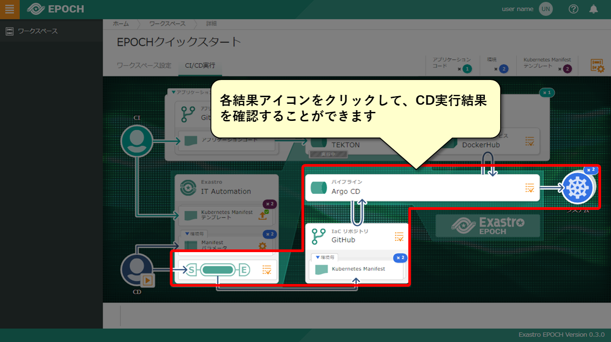{:width="1357" height="761"}

#### Manifestファイルの生成確認(Production環境)

##### Exastro IT-Automationから、IaCリポジトリへManifestファイルを登録するまでの状況を確認

###### IT-Automationにログインして状況を確認

[前述のコマンド](#各ツールのユーザ情報を確認)で表示した"ITA_EPOCH_USER","ITA_EPOCH_PASSWORD"の内容で、IT-Automationにログインします。

{:width="1779" height="261"}

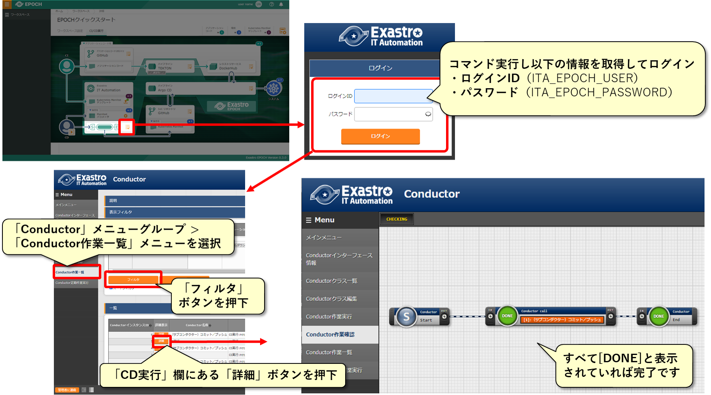{:width="1755" height="977"}


#### パイプラインArgoCDの結果確認(Production環境)

##### Manifestがkubernetesに反映されるまでの状況を確認

###### ArgoCDにサインインして状況を確認

[前述のコマンド](#各ツールのユーザ情報を確認)で表示した"ARGOCD_USER","ARGOCD_PASSWORD"の内容で、ArgoCDにサインインします。

{:width="1779" height="261"}

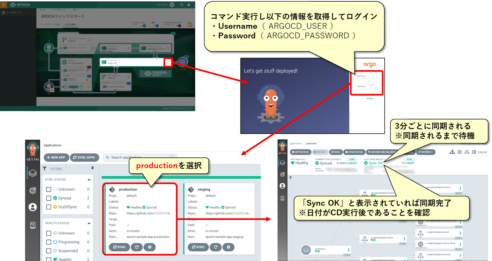{:width="1785" height="950"}


Deployされたサンプルアプリケーションを確認してみましょう
{: .check}


#### Production環境のアプリケーションの確認
##### ブラウザで以下のURLに接続し、デプロイしたサンプルアプリケーションを表示する

```
http://[Kubernetes masterノードのIPアドレスまたはホスト名]:31003/front-end.html
```

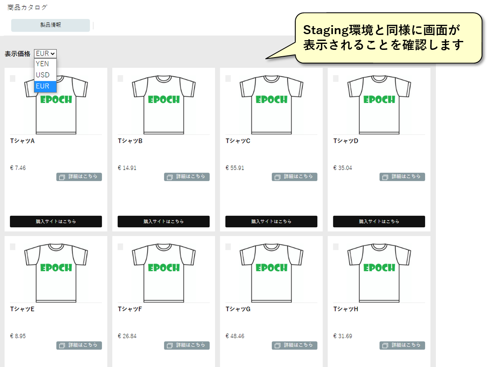{:width="1142" height="861"}


以上でチュートリアルは終了になります。  
お疲れ様でした。
{: .check}


## 付録
本資料中で行った内容の補足をします。

### 注意事項・制限事項
以下、現在のExastro EPOCHのバージョンでの制限事項となります。今後のバージョンで変更される可能性があります。

#### 制限事項（今後対応する予定）
- アプリケーションコードのリポジトリは、現在１つのみ対応となっております。
- 現在は、アプリケーションコード毎のGitアカウントには対応しておりません。
- Gitサービス選択は次バージョン以降で対応予定です。現在は指定されたURLのGitリポジトリの動作となります。
- ビルドブランチは次バージョン以降で対応予定です。現在はPushされた内容でビルドされます。
- レジストリサービスは現在内部のレジストリサービスのみとなっております。
- イメージ出力先以外の項目については次バージョン以降で対応予定です。
- Authentication token, Base64 encoded certificateは次バージョン以降で対応予定です。
- テンプレートで指定できる変数は、現在固定です。詳細は後述の「コラム」を参照してください。


#### 注意事項
- EPOCHをインストールすると、TEKTONもインストールされます。
- 変数は”\{\{ 変数名 \}\}”で指定した内容となります。


#### コラム：Manifestテンプレートと変数名
Manifestテンプレートをアップロードするとファイル内の定義文字が解析され、パラメータ入力できる状態になります。


{:width="1740" height="900"}

\{\{ 変数名 \}\} の形式で記述された文字が変数として認識され、ユーザが入力できるようになります。  
現在、EPOCHで使用できる変数名は以下の通りとなります。


| 変数名 | 説明 |
| --- | --- |
| \{\{ image \}\}  | コンテナイメージ |
| \{\{ image_tag \}\}  | コンテナイメージのタグ |
| \{\{ param01 \}\}  | ユーザが自由に使用できる固定の変数名01 |
| ～ |  |
| \{\{ param20 \}\}  | ユーザが自由に使用できる固定の変数名20（20が上限） |

※ユーザ任意の変数名につきましては、今後対応する予定です


