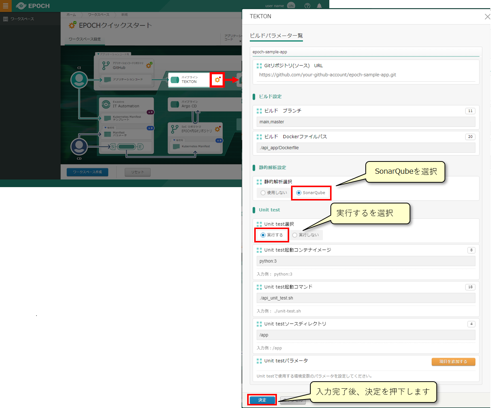
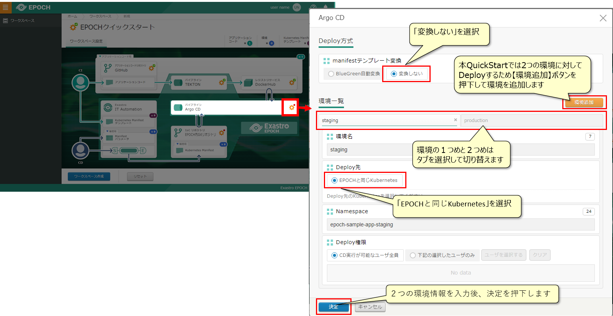
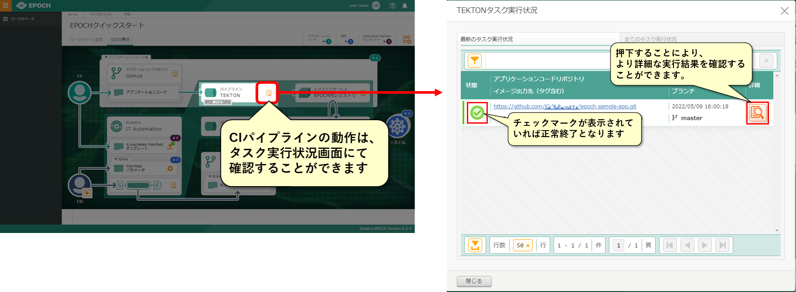
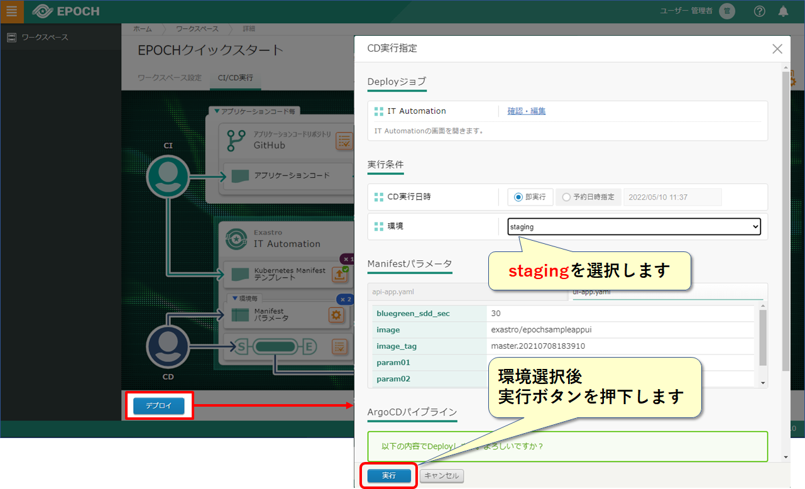
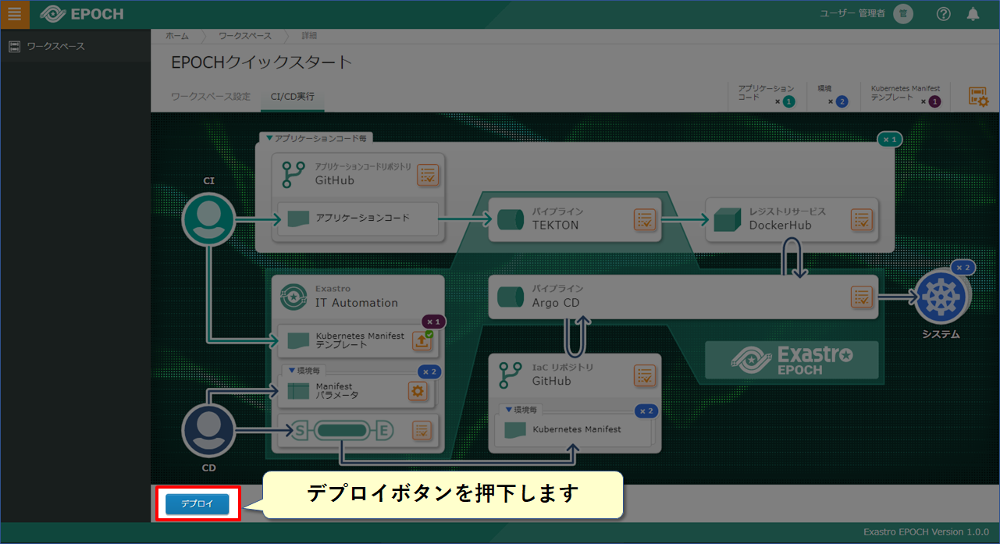
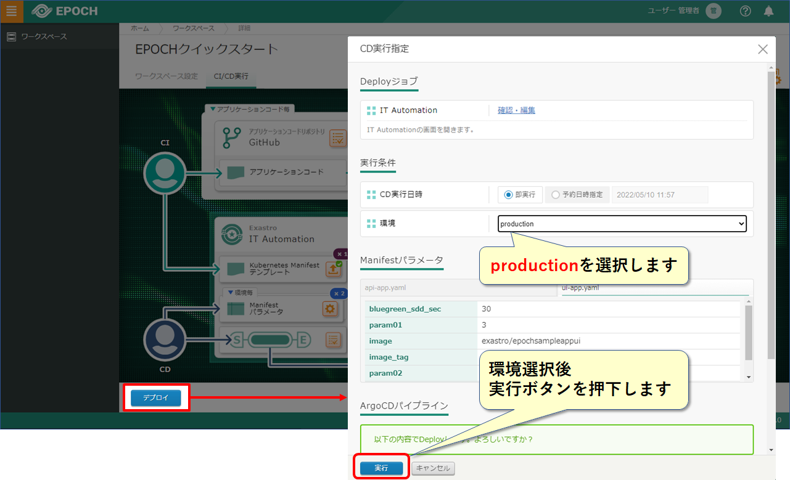
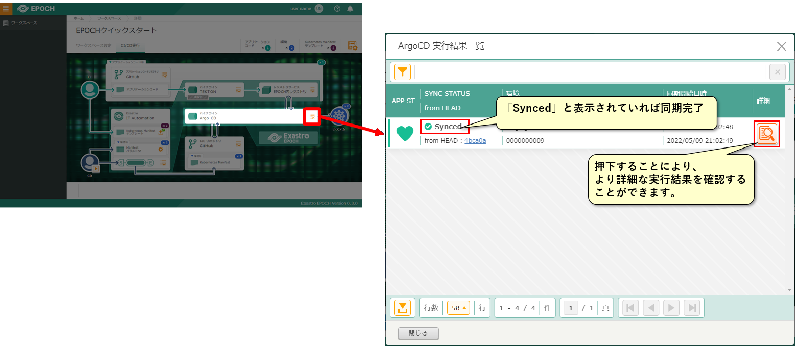
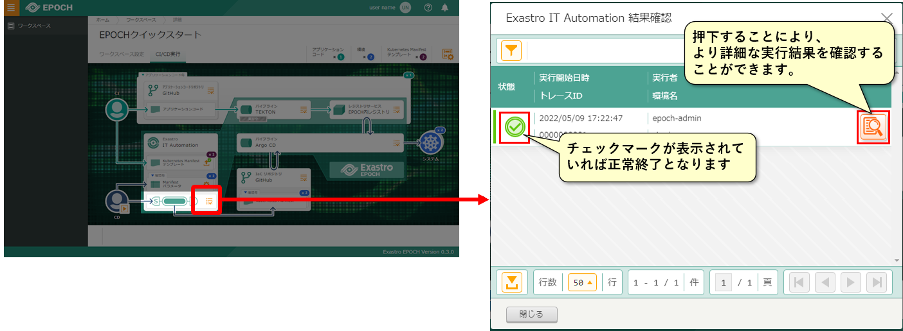

## はじめに
### QuickStartについて
#### はじめに

本書は、Exastro EPOCH(以降、EPOCHと表記する)の導入方法ならびに簡単な使い方をチュートリアルを用いて説明します。

#### QuickStartの全体図

{:width="1959" height="633"}

（※1）本クイックスタートでは手順を簡素化するため1つのKubernetesクラスタ上で構成します。

### QuickStartを実施するPC環境ついて

QuickStartの手順を実施するにあたってのPCのソフトウェアは以下の通りです。

{:width="1864" height="855"}

## インストール

EPOCHをインストールして、CI/CDの環境を準備をしましょう。

### EPOCHのインストール
#### EPOCH全体図

EPOCHをインストールおよびワークスペースを作成した後の構成は、以下の図のようになります。

{:width="1671" height="694"}

##### 前提条件
###### 環境

- Kubernetes環境が構築されていること
- 使用するServiceAccountにcluster-adminロールが付与されていること
- Kubernetes環境から外部インターネットに接続できること
- PC環境から外部インターネットに接続できること
- PC環境にGit for Windowsがインストールされていること
- ポート番号(30080, 30081, 30443, 30801 , 30804, 30805, 30901～30907)が使用できること
(ポート番号はepoch-install.yamlに記述されており、変更する際は編集後インストールを実行する必要があります）

###### アカウント

- アプリケーションコードを登録するGitHubのアカウントが準備されていること
- Kubernetes Manifestを登録するGitHubのアカウントが準備されていること
- コンテナイメージを登録するDockerHubのアカウントが準備されていること

ワークスペースについては後述の
[ワークスペース作成](#ワークスペース作成)
にて記述しています。
{: .check}

#### EPOCHインストール
##### ターミナルでkubectlが実行できる環境にSSHログインし、以下のコマンドを実行してEPOCHをインストールします。

``` sh
kubectl apply -f https://github.com/exastro-suite/epoch/releases/download/v0.1.0/epoch-install.yaml
```
{: .line .d}

以下のコマンドでインストールの進行状況を確認できます。

``` sh
kubectl get pod -n epoch-system
```
{: .line .d}

コマンド結果に表示されているすべてのコンポーネントのSTATUSが “Running” であることを確認します。

###### コマンド結果 イメージ

```
NAME                                        READY   STATUS    RESTARTS   AGE
epoch-cicd-api-*********-*****              1/1     Running   0          **s
epoch-rs-organization-api-*********-*****   1/1     Running   0          **s
epoch-rs-workspace-api- *********-*****     1/1     Running   0          **s
～
```

#### 永続ボリューム設定

パイプライン設定用の永続ボリュームを設定します。

##### 以下のコマンドを実行し、マニフェストをGitHubから取得します。

``` sh
curl -OL https://github.com/exastro-suite/epoch/releases/download/v0.1.0/epoch-pv.yaml
```
{: .line .d}

##### 以下のコマンドを実行し、Workerノードのホスト名を確認します。

``` sh
kubectl get node
```
{: .line .d}

###### コマンド結果 イメージ

```
NAME                      STATUS   ROLES                  AGE   VERSION
epoch-kubernetes-master1  Ready    control-plane,master   **d   v1.**.*
epoch-kubernetes-worker1  Ready    worker                 **d   v1.**.*
```

##### epoch-pv.yamlを修正します。（修正箇所はepoch-pv.yamlの最終行）

「# Please specify the host name of the worker node #」の部分を、先ほど確認したWorkerノードのホスト名に置き換え保存します。

###### 変更前

```
values:
  - # Please specify the host name of the worker node #
```

###### 変更後

```
values:
  - epoch-kubernetes-worker1
```

##### 以下のコマンドでkubernetes環境へ反映します。

``` sh
kubectl apply -f epoch-pv.yaml
```
{: .line .d}

#### ArgoRolloutインストール
##### 以下のコマンドを実行し、ArgoRolloutのインストールします。

``` sh
kubectl create namespace argo-rollouts
```
{: .line .d}

``` sh
kubectl apply -n argo-rollouts -f https://github.com/argoproj/argo-rollouts/releases/latest/download/install.yaml
```
{: .line .d}

以上でEPOCHのインストールは完了しました  
次にチュートリアルを実施するための事前準備を実施しましょう！
{: .check}

### リポジトリ準備
#### 使用するリポジトリについて
##### 本クイックスタートで使用するリポジトリは以下の通りです。

- アプリケーションコード用リポジトリ
- IaC用リポジトリ(Staging環境用)
- IaC用リポジトリ(Production環境用)

###### イメージ図

{:width="1853" height="412"}

#### リポジトリの準備
##### Gitリポジトリを３つ用意します。

1. ブラウザにて自身のGitHubのアカウントでGitHubにサインインします。
2. アカウントメニューからYour Repositriesを選択します。
3. Newを選択し、図で示した値を入力し、Create repositryを選択します。

{:width="1689" height="654"}

#### アプリケーションコード用リポジトリをPC環境へ準備
##### アプリケーションコード用リポジトリのclone

アプリケーションコード用リポジトリをPC環境にcloneします。
例としてコマンドプロンプトでは、以下の通りとなります。

```
cd "[clone先のフォルダ]"
git clone https://github.com/[Githubのアカウント名]/epoch-sample-app.git
cd epoch-sample-app
git config user.name "[GitHubのユーザ名]"
git config user.email "[GitHubのemailアドレス]"
```
{: .line .g}

ここでcloneしたローカルリポジトリを使って、チュートリアルを行います。

#### Gitトークンの払い出し

1. ブラウザにて自身のGitHubのアカウントでGitHubにサインインします。
2. アカウントメニューからSettingsを選択します。
3. Account settings画面からDeveloper settingsメニューを選択します。
4. Developer settings画面からPersonal access tokensメニューを選択し、Generate new tokenボタンを選択します。
5. New personal access token画面でNote（任意の名称）、Select scopesを全て選択し、Generate tokenボタンを選択します。
6. 表示されたトークン (ghp_***) を後に使用しますので控えてください。

{:width="1912" height="513"}

### Manifestテンプレートファイルの準備
#### Manifestテンプレートファイルのダウンロード

EPOCHにアップロードするManifestテンプレートファイル（２ファイル）をダウンロードします。

##### ブラウザで以下のURLを表示します。

1. [https://raw.githubusercontent.com/exastro-suite/epoch-sample-app/master/manifest-template/api-app.yaml](https://raw.githubusercontent.com/exastro-suite/epoch-sample-app/master/manifest-template/api-app.yaml)
2. [https://raw.githubusercontent.com/exastro-suite/epoch-sample-app/master/manifest-template/ui-app.yaml](https://raw.githubusercontent.com/exastro-suite/epoch-sample-app/master/manifest-template/ui-app.yaml)

##### ブラウザにManifestテンプレートが表示されますので、操作しているPCに保存します。

{:width="1433" height="456"}

以上で事前準備は完了しました  
ワークスペース作成へ進みましょう！
{: .check}

## ワークスペース作成

ワークスペースを作成し、CI/CDの準備をしましょう。

### ワークスペース
#### ワークスペース

EPOCHでは、１つの開発環境をワークスペースという単位で管理します。
ワークスペース作成は、画面から入力された情報をもとに、各アプリケーションへ必要な情報を登録し、CI/CDの準備を行ないます。

{:width="1702" height="717"}

### CI/CDについて
#### CI/CDとは

アプリケーションの開発～リリースまでの一連の作業を自動化し、アプリケーション提供の頻度を高める手法です。

##### CI（継続的インテグレーション）

アプリケーションコードの変更を起点に、ビルドやテストの実行といった開発者の作業を自動化する手法を指します。

##### CD（継続的デリバリー）

実行環境へのリリースまでを自動化する手法を指します。

##### CI/CDのイメージ

{:width="1480" height="404"}

DevOpsとは、ソフトウェアの開発担当と導入・運用担当が密接に協力する体制を構築し、ソフトウェアの導入や更新を迅速に進めること。  
“Development”（開発）と“Operations”（運用）の略語を組み合わせた造語。  
出典：[IT用語辞典](https://e-words.jp/w/DevOps.html)
{: .check}

### EPOCHのCI/CD
#### EPOCHのCI/CD

EPOCHのCI/CDの流れを、下図に示します。

{:width="1940" height="735"}

### EPOCH起動
#### ブラウザより以下のURLで接続します。

```
https://[インストール先のIPアドレスまたはホスト名]:30443/workspace.html
```

{:width="1446" height="720"}

続いて必要な情報を入力してワークスペースを作成してみましょう！
{: .check}

### ワークスペース作成
#### ワークスペース基本情報

ワークスペース名を入力します。

{:width="1710" height="488"}

| 項目 | 入力・選択内容 | 説明 |
| --- | --- | --- |
| ワークスペース名 | EPOCHクイックスタート | 作成するワークスペース名 |
| 備考 | なし | 作成するワークスペースの説明や備考 |

#### アプリケーションコードリポジトリ

アプリケーションコードリポジトリの情報を入力します。

{:width="1075" height="517"}

| 項目 | 入力・選択内容 | 説明 |
| --- | --- | --- |
| ユーザ名 | (自身のGitHubのアカウント名) | GitHubのアカウント名 |
| トークン | (自身のGitHubのトークン) | GitHubのトークン<br>（事前準備 Gitトークンの払い出しを参照） |
| GitリポジトリURL | https://github.com/_\[GitHubのアカウント名]_/epoch-sample-app.git | 準備で作成したアプリケーションコード用リポジトリのURL |
{: .row-h1}

#### パイプラインTEKTON

TEKTONに設定するパイプライン情報を入力します。

{:width="1183" height="516"}

| 項目 | 入力・選択内容 | 説明 |
| --- | --- | --- |
| ビルドブランチ | main,master | ビルド対象のアプリケーションのGitHubのブランチ |
| ビルドDockerファイルパス | ./api-app/Dockerfile | アプリケーションのDockerfileのパス |

#### レジストリサービス

ビルド後のイメージ登録先（レジストリ）情報を入力します。

{:width="1265" height="562"}

| 項目 | 入力・選択内容 | 説明 |
| --- | --- | --- |
| ユーザ名 | （自身のDockerHubのアカウント名） | DockerHubのアカウント名 |
| パスワード | （自身のDockerHubのパスワード） | DockerHubのパスワード |
| イメージ出力先 | _\[DockerHubのアカウント名]_/epoch-sample-**api**<br>_※ユーザ名入力後に表示される内容を修正してください。_ | DockerHubのイメージ出力先のパス |

#### パイプラインArgo CD

ArgoCDに設定するDeploy先の情報を入力します。

{:width="1637" height="512"}

#####  環境1：Staging環境

| 項目 | 入力・選択内容 | 説明 |
| --- | --- | --- |
| 環境名 | staging | デプロイ環境の名前 |
| Namespace | epoch-sample-app-staging | デプロイ先のNamespace |

##### 環境2：Production環境

| 項目 | 入力・選択内容 | 説明 |
| --- | --- | --- |
| 環境名 | production | デプロイ環境の名前 |
| Namespace | epoch-sample-app-production | デプロイ先のNamespace |

#### IaCリポジトリ

マニフェストの登録先となるリポジトリ情報を入力します。

{:width="1450" height="553"}

| 項目 | 入力・選択内容 | 説明 |
| --- | --- | --- |
| GitリポジトリURL | https://github.com/_\[GitHubのアカウント名]_/_\[各環境のリポジトリ]_.git | 各環境のmanifestリポジトリのURL<br>（事前準備 IaC用リポジトリの準備を参照） |

#### ワークスペース作成

すべての入力が完了しましたら【ワークスペース作成】ボタンを押下します。

{:width="993" height="525"}

これでCI/CDパイプラインが構築されました  
チュートリアルを実践してCI/CDパイプラインを体験してみましょう！
{: .check}

## チュートリアル

CI/CDの流れを体験してみましょう。

### チュートリアルの概要

#### CI/CD開発シナリオ

チュートリアルでは以下のシナリオに沿って、CI/CDの手順を実施していきます。
本QuickStartで作成するECサイトは、サンプルアプリケーションを用いて実施していきます。

{:width="1940" height="800"}


{:width="1940" height="800"}


### サンプルアプリの構成
#### サンプルアプリの構成

サンプルアプリケーションは、UIとAPIの2つで構成されております。

{:width="1940" height="860"}


### チュートリアルの流れ
#### CI/CDの流れ

本説明では、サンプルアプリケーションをStaging環境、Production環境へDeploy、その後アプリケーションコードの修正
を行い、Staging環境、Production環境へのDeployする手順を説明していきます。

{:width="1940" height="830"}


### Manifestテンプレートファイルについて
#### Manifestテンプレートファイル

サンプルアプリケーションのManifestテンプレートファイルは、UIとAPI用の2つが用意されています。
環境一致を考慮した上での可変部分を変数化したテンプレート形式となっています。

{:width="1940" height="635"}

※変数名は、image、image_tag、param01~param20で設定できます。

それでは1回目のCI/CDの手順を実行してみましょう！
{: .check}

### 1回目のCI/CDの流れ
#### Staging環境へのDeploy

1回目のCI/CDの流れとして、アプリケーションコードのCommit＆PushからStaging環境へのDeploy、CD結果確認までの手順は以下の通りとなります。

{:width="1940" height="835"}


#### アプリケーションコード Commit & Push
初回デプロイするコンテナイメージを作るためCIパイプラインを実行します。

{:width="1940" height="835"}


##### ブラウザにてサンプルアプリケーションのURLを表示します。
[https://github.com/exastro-suite/epoch-sample-app](https://github.com/exastro-suite/epoch-sample-app)

##### サンプルアプリケーションの画面から「Code」を押下して、「Download ZIP」からコードを取得します。

{:width="1940" height="835"}


##### ダウンロードしたZIPファイルを展開し、cloneしたアプリケーションコード用リポジトリにコピーします。

{:width="1940" height="335"}

##### PC環境にcloneしたアプリケーションコード用リポジトリでCommit & Pushします。
例としてコマンドプロンプトでは、以下の通りとなります。
```
git add .
git commit -m "first build"
git push origin main
```
{: .line .g}

※ git push時に認証情報を求められた場合は、自身のGitHubアカウント情報を入力してください。

Pushが完了すると、パイプラインTEKTONで設定されたCIパイプラインが自動的に動き出します。
　CIパイプラインの結果を確認していきましょう。


#### CI/CD実行画面の表示
ワークスペース画面のCI/CD実行タブを選択し、CI/CD実行画面を表示します。

{:width="1940" height="980"}


#### CI結果確認

{:width="1940" height="880"}

##### アプリケーションコードのビルド結果を確認します。

{:width="1940" height="980"}

それでは実際にCI結果を確認してみましょう
{: .check}

#### パイプラインTEKTONの結果確認
##### TEKTONのパイプラインを実際に確認し、ビルドが正常に終了したか確認します。

{:width="1940" height="580"}


#### コンテナイメージのタグ名の確認
##### レジストリサービスの画面を開き、ビルドしたコンテナイメージのTagを確認します。

{:width="1940" height="780"}

※今後、パイプラインで生成されたimage_tagは選択できるように変更する予定です


#### Manifestテンプレートアップロード

{:width="1940" height="880"}

##### ダウンロードしたManifestテンプレートをアップロードします。

{:width="1940" height="1000"}


##### Manifestテンプレートファイルの準備でダウンロードしたManifestテンプレートファイルをアップロードします。

{:width="1940" height="900"}


#### Manifestパラメータ

{:width="1940" height="800"}


##### Deployに必要なManifestパラメータを入力します。

{:width="1940" height="1000"}


#### Manifestパラメータ入力
##### 入力内容に従って、Manifestパラメータを入力します。

{:width="1940" height="1000"}

{:width="1240" height="800"}

###### ui-app.yaml

| 項目 | 入力内容(staging) |入力内容(production)| 説明 |
| --- | --- | --- | --- |
| \{\{ param01 \}\} | 1 | 3 | レプリカ数 |
| \{\{ image \}\}  | exastro/epochsampleappui | exastro/epochsampleappui | コンテナイメージ |
| \{\{ image_tag \}\} | master.20210708183910 | master.20210708183910 | コンテナイメージのタグ |
| \{\{ param02 \}\} | 31001 | 31003 | ブルーグリーンデプロイ用のブルー面のポート番号 |
| \{\{ param03 \}\} | 32001 | 32003 | ブルーグリーンデプロイ用のグリーン面のポート番号 |

※ui-app.yamlのimage_tagは事前にビルドしたコンテナイメージのものを使用しています。  
※今後、image、image_tagの入力については選択項目に変更する予定です。

##### タブを切り替えてapi-app.yamlにも入力します。

{:width="1040" height="700"}

###### api-app.yaml

| 項目 | 入力内容(staging) |入力内容(production)| 説明 |
| --- | --- | --- | --- |
| \{\{ param01 \}\} | 1 | 1 | レプリカ数 |
| \{\{ image \}\} | [Dockerhubのアカウント名]/epoch-sample-api | [Dockerhubのアカウント名]/epoch-sample-api | コンテナイメージ |
| \{\{ image_tag \}\} | [レジストリサービスで確認したimageのタグ名] | [レジストリサービスで確認したimageのタグ名] | コンテナイメージのタグ |
| \{\{ param02 \}\}  | 31002 | 31004 | ブルーグリーンデプロイ用のブルー面のポート番号 |
| \{\{ param03 \}\}  | 32002 | 32004 | ブルーグリーンデプロイ用のグリーン面のポート番号|

#### Staging環境へのDeploy実行

{:width="1940" height="800"}
##### CD実行で、Staging環境へDeployを実行します。

{:width="1940" height="1000"}


#### Staging環境のCD実行
##### Deploy先の環境を選択して実行します。

{:width="1940" height="700"}


Staging環境へのCD実行が完了しました  
CD実行結果を確認してみましょう
{: .check}


#### Staging環境のCD結果確認

{:width="1940" height="800"}

##### CDの実行結果は、Exastro IT-Automation、ArgoCDより確認できます。

{:width="1940" height="1000"}

#### Manifestファイルの生成確認(Staging環境)
##### Exastro IT-Automationから、IaCリポジトリへManifestファイルを登録するまでの状況を確認します。

{:width="1940" height="900"}


#### パイプラインArgoCDの結果確認(Staging環境)
##### Manifestがkubernetesに反映されるまでの状況を確認します。

{:width="1940" height="750"}


設定値に誤りがある場合、以下のようなアイコンが表示されます。
{: .warning}

{:width="1940" height="1100"}


Deployされたサンプルアプリケーションを確認してみましょう
{: .check}


#### Staging環境のサンプルアプリケーション確認
##### 次のURLでデプロイしたサンプルアプリケーションを表示します。

```
http://[Kubernetes masterノードのIPアドレスまたはホスト名]:31001/front-end.html
```

{:width="1940" height="800"}


続いてProduction環境へDeployしてみましょう
{: .check}


#### Production環境へのDeploy
Staging環境へDeploy後、以下の内容でProduction環境へDeployします。

{:width="1940" height="800"}


#### Production環境へのDeploy実行

{:width="1940" height="800"}

##### CD実行で、Production環境へDeployを実行します。

{:width="1940" height="1000"}


#### Production環境のCD実行
##### Deploy先の環境を選択して実行します。

{:width="1940" height="700"}

Production環境へのCD実行が完了しました  
CD実行結果を確認してみましょう
{: .check}


#### Production環境のCD結果確認

{:width="1940" height="800"}

##### CDの実行結果は、Exastro IT-Automation、ArgoCDより確認できます。

{:width="1940" height="1000"}


#### Manifestファイルの生成確認(Production環境)
##### Exastro IT-Automationから、IaCリポジトリへManifestファイルを登録するまでの状況を確認します。

{:width="1940" height="900"}


#### パイプラインArgoCDの結果確認(Production環境)
##### Manifestがkubernetesに反映されるまでの状況を確認します。

{:width="1940" height="750"}


Deployされたサンプルアプリケーションを確認してみましょう
{: .check}

#### Production環境のサンプルアプリケーション確認
##### 次のURLでデプロイしたサンプルアプリケーションを表示します。

```
http://[Kubernetes masterノードのIPアドレスまたはホスト名]:31003/front-end.html
```

{:width="1940" height="900"}


1回目のCI/CDの流れはここで完了です  
続いて実際にアプリケーションコードを修正しDeployされるまでの2回目のCI/CDの流れを実行してみましょう！
{: .check}


### 2回目のCI/CDの流れ

#### Staging環境へのDeploy
2回目のCI/CDの流れとして、アプリケーションコードを修正してCommit＆PushからStaging環境へのDeploy、CD結果確認までの手順を説明します。


{:width="1940" height="800"}


#### アプリケーションコードの修正

アプリケーションコードを修正して、2回目のCI/CDを実行していきます。
チュートリアルでは、画面に通貨（ユーロ）の表示追加を行います。

PC環境にcloneしたアプリケーションコード用リポジトリの、以下のファイルをコードエディタで修正します。

##### 修正対象①：api-app/data/currency.json
```js
    "USD": {
        "symbol"    :   "$",
        "formatter" :   "{symbol} {price:,.2f} (Tax Included)"
    },
    "EUR": {
        "symbol"    :   "€",
        "formatter" :   "{symbol} {price:,.2f}"
    }
}
```
{: .line .g}

9~12行目を追加
{: .check}


##### 修正対象②：api-app/data/rate.json
```js
{
    "USD": 110.56,
    "EUR": 134.15
}
```
{: .line .g}

2行目の末尾にカンマを追加し、3行目を追加
{: .check}


#### アプリケーションコード Commit & Push
修正した内容をCommit&Pushします。

{:width="1940" height="800"}

コマンドプロンプトで、以下の様に実行します。
```
cd "[clone先のフォルダ]"
cd epoch-sample-app
git add .
git commit -m "通貨追加(EUR)"
git push origin main
```
{: .line .g}

※ git push時に認証情報を求められた場合は、自身のGitHubアカウント情報を入力してください。


#### CI結果確認

{:width="1940" height="800"}

##### アプリケーションコードのビルド結果を確認します。

{:width="1940" height="1000"}


#### パイプラインTEKTONの結果確認
##### TEKTONのパイプラインを実際に確認し、ビルドが正常に終了したか確認します。

{:width="1940" height="580"}


#### コンテナイメージのタグ名の確認
##### レジストリサービスの画面を開き、ビルドしたコンテナイメージのTagを確認します。

{:width="1940" height="830"}

※今後、パイプラインで生成されたimage_tagは選択できるように変更する予定です

#### Manifestパラメータ設定
#####  Manifestパラメータの設定のイメージタグを更新します。

{:width="1940" height="830"}

{:width="1940" height="1000"}


#### Manifestパラメータ(image_tag)の修正
##### Manifestパラメータで、staging, production環境のイメージのタグ名を修正します。

{:width="1940" height="580"}

###### api-app.yaml

| 項目 | 入力内容(staging) |入力内容(production)| 説明 |
| --- | --- | --- | --- |
| \{\{  image_tag \}\} | [レジストリサービスで確認した最新のイメージのタグ名] | [レジストリサービスで確認した最新のイメージのタグ名] | コンテナイメージのタグ |


#### Staging環境へのCD実行
##### CD実行で、実際にStaging環境へDeployします。

{:width="1940" height="830"}

{:width="1940" height="980"}


#### CD実行指定
##### Deploy先の環境を選択してDeployを実行します。

{:width="1940" height="680"}


Staging環境へのCD実行が完了しました  
CD実行結果を確認してみましょう
{: .check}


#### Staging環境のCD結果確認

{:width="1940" height="800"}

{:width="1940" height="1000"}


#### Manifestファイルの生成確認(Staging環境)
##### Exastro IT-Automationから、IaCリポジトリへManifestファイルを登録するまでの状況を確認します。

{:width="1940" height="880"}


#### パイプラインArgoCDの結果確認(Staging環境)
##### Manifestがkubernetesに反映されるまでの状況を確認します。


{:width="1940" height="780"}


Deployされたサンプルアプリケーションを確認してみましょう
{: .check}


#### Staging環境のアプリケーションの確認
##### ブラウザで以下のURLに接続し、デプロイしたサンプルアプリケーションを表示します。

```
http://[Kubernetes masterノードのIPアドレスまたはホスト名]:31001/front-end.html
```

{:width="1940" height="780"}


続いてProduction環境へDeployしてみましょう
{: .check}


#### Production環境へのDeploy
Staging環境へDeploy後、Production環境へDeployする流れを説明します。

{:width="1940" height="780"}


#### Production環境へのCD実行
##### CD実行で、実際にProduction環境へDeployを実行します。

{:width="1940" height="860"}


{:width="1940" height="960"}


#### CD実行指定
##### Deploy先の環境を選択してDeployを実行します。

{:width="1940" height="660"}


Production環境へのCD実行が完了しました  
CD実行結果を確認してみましょう
{: .check}


#### Production環境のCD結果確認
##### CDの実行結果は、Exastro IT-Automation、ArgoCDより確認できます。


{:width="1940" height="860"}


{:width="1940" height="1000"}

#### Manifestファイルの生成確認(Production環境)
##### Exastro IT-Automationから、IaCリポジトリへManifestファイルを登録するまでの状況を確認します。

{:width="1940" height="900"}


#### パイプラインArgoCDの結果確認(Production環境)
##### Manifestがkubernetesに反映されるまでの状況を確認します。

{:width="1940" height="800"}


Deployされたサンプルアプリケーションを確認してみましょう
{: .check}


#### Production環境のアプリケーションの確認
##### ブラウザで以下のURLに接続し、デプロイしたサンプルアプリケーションを表示します。

```
http://[Kubernetes masterノードのIPアドレスまたはホスト名]:31003/front-end.html
```

{:width="1940" height="900"}


以上でチュートリアルは終了になります。  
お疲れ様でした。
{: .check}


## 付録
本資料中で行った内容の補足をします。

### 注意事項・制限事項
以下、現在のExastro EPOCHのバージョンでの制限事項となります。今後のバージョンで変更される可能性があります。

#### 制限事項（今後対応する予定）
- アプリケーションコードのリポジトリは、現在１つのみ対応となっております。
- 現在は、アプリケーションコード毎のGitアカウントには対応しておりません。
- Gitサービス選択は次バージョン以降で対応予定です。現在は指定されたURLのGitリポジトリの動作となります。
- ビルドブランチは次バージョン以降で対応予定です。現在はPushされた内容でビルドされます。
- 静的解析は次バージョン以降で対応予定です。現在はSonarQubeを選択した場合に動作しません。
- レジストリサービスは現在内部のレジストリサービスのみとなっております。
- イメージ出力先以外の項目については次バージョン以降で対応予定です。
- Authentication token, Base64 encoded certificateは次バージョン以降で対応予定です。
- テンプレートで指定できる変数は、現在固定です。詳細は後述の「コラム」を参照してください。


#### 注意事項
- EPOCHをインストールすると、TEKTONもインストールされます。
- 変数は”\{\{ 変数名 \}\}”で指定した内容となります。


#### コラム：Manifestテンプレートと変数名
Manifestテンプレートをアップロードするとファイル内の定義文字が解析され、パラメータ入力できる状態になります。


{:width="1740" height="900"}

\{\{ 変数名 \}\} の形式で記述された文字が変数として認識され、ユーザが入力できるようになります。  
現在、EPOCHで使用できる変数名は以下の通りとなります。


| 変数名 | 説明 |
| --- | --- |
| \{\{ image \}\}  | コンテナイメージ |
| \{\{ image_tag \}\}  | コンテナイメージのタグ |
| \{\{ param01 \}\}  | ユーザが自由に使用できる固定の変数名01 |
| ～ |  |
| \{\{ param20 \}\}  | ユーザが自由に使用できる固定の変数名20（20が上限） |

※ユーザ任意の変数名につきましては、今後対応する予定です


