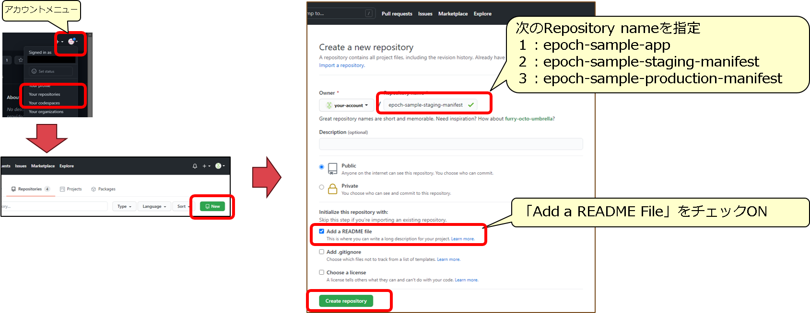
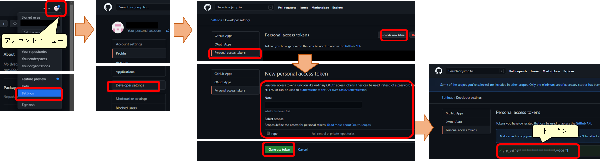

## はじめに
### QuickStartについて
#### はじめに

本書は、Exastro EPOCH(以降、EPOCHと表記する)の導入方法ならびに簡単な使い方をチュートリアルを用いて説明します。

#### QuickStartの全体図

{:width="1959" height="633"}

（※1）本クイックスタートでは手順を簡素化するため1つのKubernetesクラスタ上で構成します。

### QuickStartを実施するPC環境ついて

QuickStartの手順を実施するにあたってのPCのソフトウェアは以下の通りです。

{:width="1864" height="855"}

## インストール

EPOCHをインストールして、CI/CDの環境を準備をしましょう。

### EPOCHのインストール
#### EPOCH全体図

EPOCHをインストールおよびワークスペースを作成した後の構成は、以下の図のようになります。

{:width="1671" height="694"}

##### 前提条件
###### 環境

- Kubernetes環境が構築されていること
- 使用するServiceAccountにcluster-adminロールが付与されていること
- Kubernetes環境から外部インターネットに接続できること
- PC環境から外部インターネットに接続できること
- PC環境にGit for Windowsがインストールされていること
- ポート番号(30080, 30081, 30443, 30801 , 30804, 30805, 30901～30907)が使用できること
(ポート番号はepoch-install.yamlに記述されており、変更する際は編集後インストールを実行する必要があります）

###### アカウント

- アプリケーションコードを登録するGitHubのアカウントが準備されていること
- Kubernetes Manifestを登録するGitHubのアカウントが準備されていること
- コンテナイメージを登録するDockerHubのアカウントが準備されていること

#### EPOCHインストール
##### ターミナルでkubectlが実行できる環境にSSHログインし、以下のコマンドを実行してEPOCHをインストールします。

``` sh
kubectl apply -f https://github.com/exastro-suite/epoch/releases/download/v0.1.0/epoch-install.yaml
```
{: .line .d}

以下のコマンドでインストールの進行状況を確認できます。

``` sh
kubectl get pod -n epoch-system
```
{: .line .d}

コマンド結果に表示されているすべてのコンポーネントのSTATUSが “Running” であることを確認します。

###### コマンド結果 イメージ

```
NAME                      STATUS   ROLES                  AGE   VERSION
epoch-kubernetes-master1  Ready    control-plane,master   **d   v1.**.*
epoch-kubernetes-worker1  Ready    worker                 **d   v1.**.*
```

#### 永続ボリューム設定

パイプライン設定用の永続ボリュームを設定します。

##### 以下のコマンドを実行し、マニフェストをGitHubから取得します。

``` sh
curl -OL https://github.com/exastro-suite/epoch/releases/download/v0.1.0/epoch-pv.yaml
```
{: .line .d}

##### 以下のコマンドを実行し、Workerノードのホスト名を確認します。

``` sh
kubectl get node
```
{: .line .d}

###### コマンド結果 イメージ

```
NAME                      STATUS   ROLES                  AGE   VERSION
epoch-kubernetes-master1  Ready    control-plane,master   **d   v1.**.*
epoch-kubernetes-worker1  Ready    worker                 **d   v1.**.*
```

##### epoch-pv.yamlを修正します。（修正箇所はepoch-pv.yamlの最終行）

「# Please specify the host name of the worker node #」の部分を、先ほど確認したWorkerノードのホスト名に置き換え保存します。

###### 変更前

```
values:
  - # Please specify the host name of the worker node #
```

###### 変更後

```
values:
  - epoch-kubernetes-worker1
```

##### 以下のコマンドでkubernetes環境へ反映します。

``` sh
kubectl apply -f epoch-pv.yaml
```
{: .line .d}

#### ArgoRolloutインストール
##### 以下のコマンドを実行し、ArgoRolloutのインストールします。

``` sh
kubectl create namespace argo-rollouts
```
{: .line .d}

``` sh
kubectl apply -n argo-rollouts -f https://github.com/argoproj/argo-rollouts/releases/latest/download/install.yaml
```
{: .line .d}

以上でEPOCHのインストールは完了しました。
次にチュートリアルを実施するための事前準備を実施しましょう！
{: .check}

### リポジトリ準備
#### 使用するリポジトリについて
##### 本クイックスタートで使用するリポジトリは以下の通りです。

- アプリケーションコード用リポジトリ
- IaC用リポジトリ(Staging環境用)
- IaC用リポジトリ(Production環境用)

###### イメージ図

{:width="1853" height="412"}

#### リポジトリの準備
##### Gitリポジトリを３つ用意します。

- ブラウザにて自身のGitHubのアカウントでGitHubにサインインします。
- アカウントメニューからYour Repositriesを選択します。
- Newを選択し、図で示した値を入力し、Create repositryを選択します。

{:width="1689" height="654"}

#### アプリケーションコード用リポジトリをPC環境へ準備
##### アプリケーションコード用リポジトリのclone

アプリケーションコード用リポジトリをPC環境にcloneします。
例としてコマンドプロンプトでは、以下の通りとなります。

```
cd "[clone先のフォルダ]"
git clone https://github.com/[Githubのアカウント名]/epoch-sample-app.git
cd epoch-sample-app
git config user.name "[GitHubのユーザ名]"
git config user.email "[GitHubのemailアドレス]"
```
{: .line .g}

ここでcloneしたローカルリポジトリを使って、チュートリアルを行います。

#### Gitトークンの払い出し

- ブラウザにて自身のGitHubのアカウントでGitHubにサインインします。
- アカウントメニューからSettingsを選択します。
- Account settings画面からDeveloper settingsメニューを選択します。
- Developer settings画面からPersonal access tokensメニューを選択し、Generate new tokenボタンを選択します。
- New personal access token画面でNote（任意の名称）、Select scopesを全て選択し、Generate tokenボタンを選択します。
- 表示されたトークン (ghp_***) を後に使用しますので控えてください。

{:width="1912" height="513"}

### Manifestテンプレートファイルの準備
#### Manifestテンプレートファイルのダウンロード

EPOCHにアップロードするManifestテンプレートファイル（２ファイル）をダウンロードします。

##### ブラウザで以下のURLを表示します。

| :--- | :--- |
| ファイル１ | [https://raw.githubusercontent.com/exastro-suite/epoch-sample-app/master/manifest-template/api-app.yaml](https://raw.githubusercontent.com/exastro-suite/epoch-sample-app/master/manifest-template/api-app.yaml) |
| ファイル２ | [https://raw.githubusercontent.com/exastro-suite/epoch-sample-app/master/manifest-template/ui-app.yaml](https://raw.githubusercontent.com/exastro-suite/epoch-sample-app/master/manifest-template/ui-app.yaml) |

##### ブラウザにManifestテンプレートが表示されますので、操作しているPCに保存します。

{:width="1433" height="456"}

以上で事前準備は完了しました。
ワークスペース作成へ進みましょう！
{: .check}