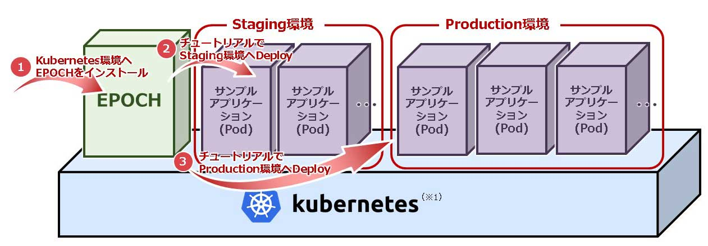
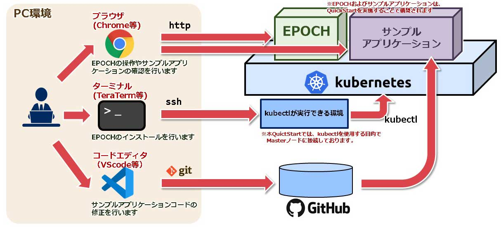
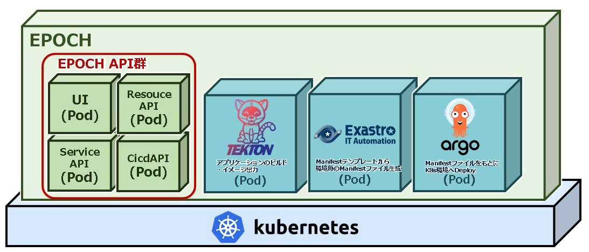

## はじめに
### QuickStartについて
#### はじめに

本書は、Exastro EPOCH(以降、EPOCHと表記する)の導入方法ならびに簡単な使い方をチュートリアルを用いて説明します。

#### QuickStartの全体図



（※1）本クイックスタートでは手順を簡素化するため1つのKubernetesクラスタ上で構成します。

### QuickStartを実施するPC環境ついて

QuickStartの手順を実施するにあたってのPCのソフトウェアは以下の通りです。



## インストール

EPOCHをインストールして、CI/CDの環境を準備をしましょう。

### EPOCHのインストール
#### EPOCH全体図

EPOCHをインストールおよびワークスペースを作成した後の構成は、以下の図のようになります。



##### 前提条件
###### 環境

- Kubernetes環境が構築されていること
- 使用するServiceAccountにcluster-adminロールが付与されていること
- Kubernetes環境から外部インターネットに接続できること
- PC環境から外部インターネットに接続できること
- PC環境にGit for Windowsがインストールされていること
- ポート番号(30080, 30081, 30443, 30801 , 30804, 30805, 30901～30907)が使用できること
(ポート番号はepoch-install.yamlに記述されており、変更する際は編集後インストールを実行する必要があります）

###### アカウント

- アプリケーションコードを登録するGitHubのアカウントが準備されていること
- Kubernetes Manifestを登録するGitHubのアカウントが準備されていること
- コンテナイメージを登録するDockerHubのアカウントが準備されていること

#### EPOCHインストール
##### ターミナルでkubectlが実行できる環境にSSHログインし、以下のコマンドを実行してEPOCHをインストールします。

```
$ kubectl apply -f https://github.com/exastro-suite/epoch/releases/download/v0.1.0/epoch-install.yaml
```

以下のコマンドでインストールの進行状況を確認できます。

```
$ kubectl get pod -n epoch-system
```

コマンド結果に表示されているすべてのコンポーネントのSTATUSが “Running” であることを確認します。

###### コマンド結果 イメージ

```
NAME                      STATUS   ROLES                  AGE   VERSION
epoch-kubernetes-master1  Ready    control-plane,master   **d   v1.**.*
epoch-kubernetes-worker1  Ready    worker                 **d   v1.**.*
```

#### 永続ボリューム設定

パイプライン設定用の永続ボリュームを設定します。

##### 以下のコマンドを実行し、マニフェストをGitHubから取得します。

``` sh
curl -OL https://github.com/exastro-suite/epoch/releases/download/v0.1.0/epoch-pv.yaml
```

##### 以下のコマンドを実行し、Workerノードのホスト名を確認します。

```
kubectl get node
```

## TEST 

{test: テスト}テスト

--test

## Code

```
cd c:\
```

```sh
curl -OL https://github.com/exastro-suite/epoch/releases/download/v0.1.0/epoch-pv.yaml
```
{: .line .d}

```sh
curl -OL https://github.com/exastro-suite/epoch/releases/download/v0.1.0/epoch-pv.yaml
```
{: .line .ｓ}

```sh
curl -OL https://github.com/exastro-suite/epoch/releases/download/v0.1.0/epoch-pv.yaml
```
{: .line .g}

```html
<div class="language-plaintext highlighter-rouge">
  <div class="highlight">
      <pre class="highlight">
          <code>curl -OL https://github.com/exastro-suite/epoch/releases/download/v0.1.0/epoch-pv.yaml</code>
      </pre>
  </div>
</div>
```
{: .line .n126}

```js
function test( b ){
  const a = b;
  return a;
}
```
{: .line}

```ruby
# Ruby code with syntax highlighting
GitHubPages::Dependencies.gems.each do |gem, version|
  s.add_dependency(gem, "= #{version}")
end
```
